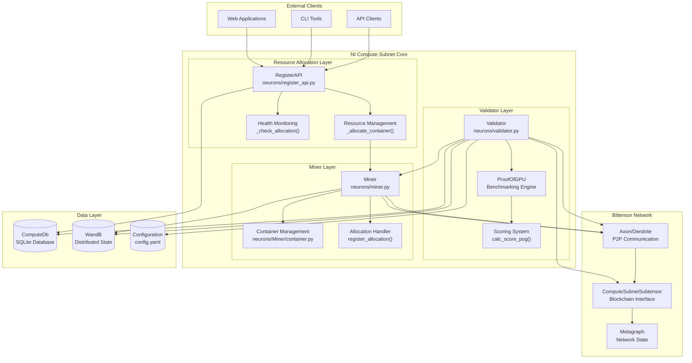
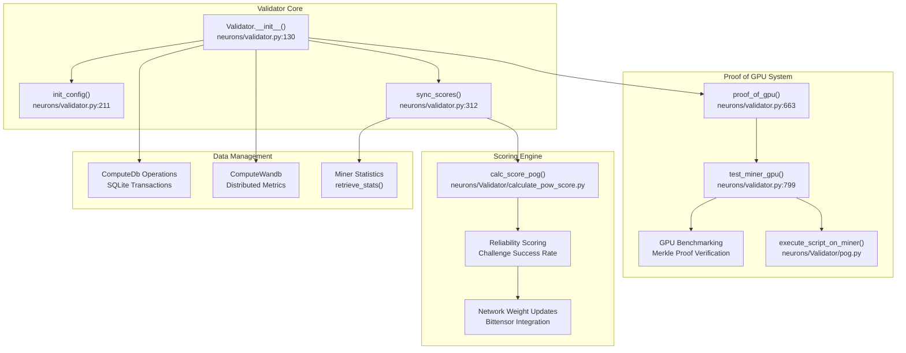
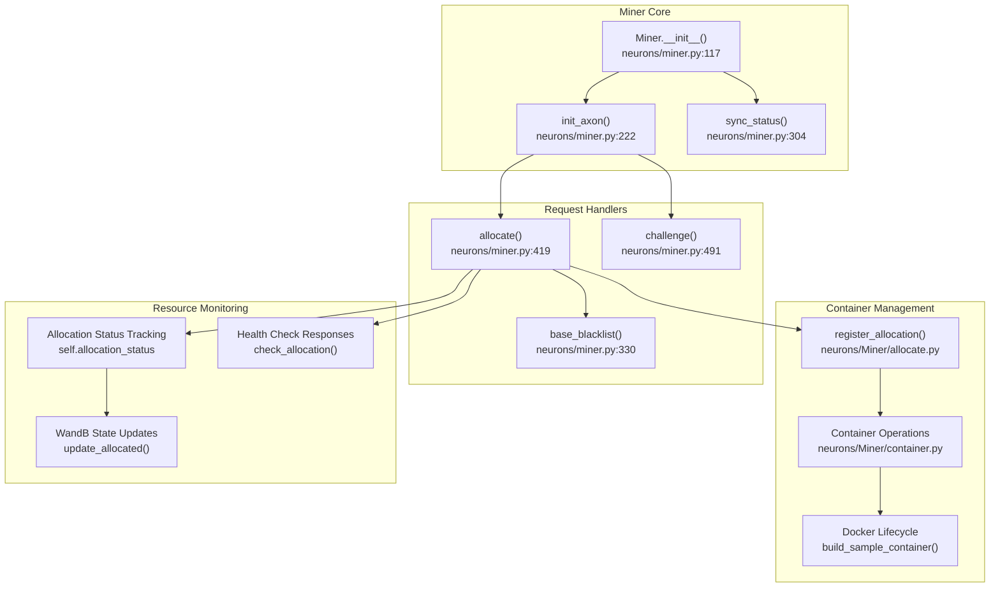
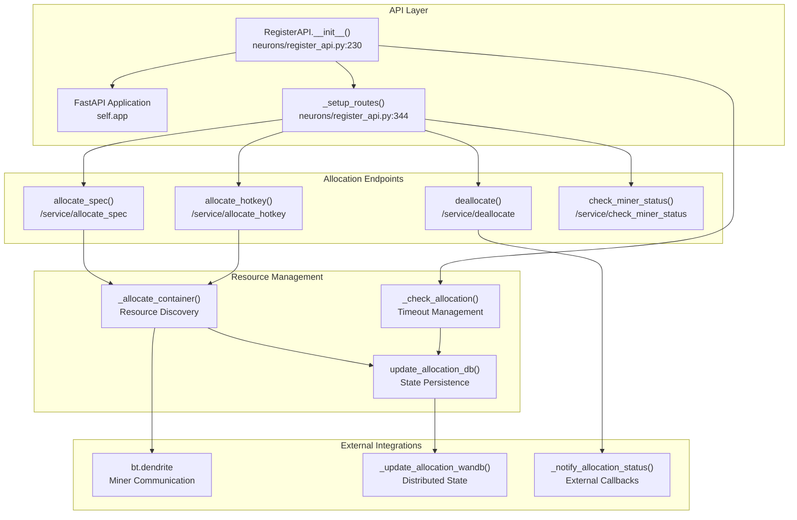
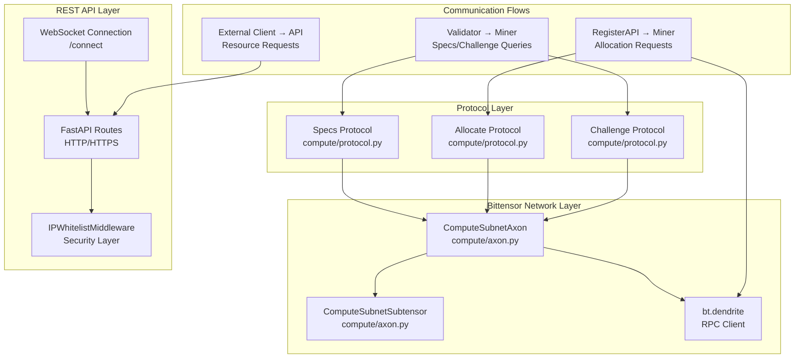
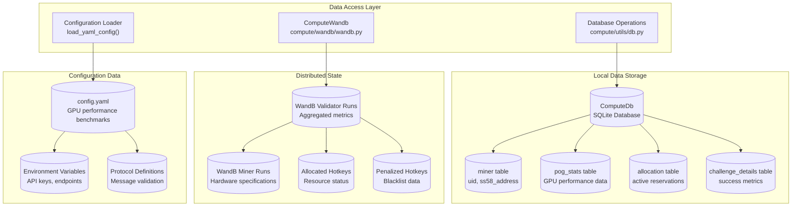

---

title: "Architecture"

---

import CollapsibleAside from '@components/CollapsibleAside.astro';

import SourceLink from '@components/SourceLink.astro';

<CollapsibleAside title="Relevant Source Files">

  <SourceLink text="README.md" href="https://github.com/neuralinternet/SN27/blob/6261c454/README.md" />

  <SourceLink text="compute/utils/parser.py" href="https://github.com/neuralinternet/SN27/blob/6261c454/compute/utils/parser.py" />

  <SourceLink text="neurons/miner.py" href="https://github.com/neuralinternet/SN27/blob/6261c454/neurons/miner.py" />

  <SourceLink text="neurons/register_api.py" href="https://github.com/neuralinternet/SN27/blob/6261c454/neurons/register_api.py" />

  <SourceLink text="neurons/validator.py" href="https://github.com/neuralinternet/SN27/blob/6261c454/neurons/validator.py" />

</CollapsibleAside>

## Purpose and Scope

This document describes the high-level system architecture of the NI Compute Subnet, a decentralized GPU compute marketplace built on the Bittensor network. It covers the core system components, their interactions, communication protocols, and data flow patterns that enable validators to evaluate miner capabilities and allocate GPU resources to clients.

For detailed protocol specifications, see [Communication Protocols](/communication-protocols#5). For database schema and operations, see [Database Operations](/validator-system/database-operations#2.3). For installation and deployment procedures, see [Installation and Setup](/installation-and-setup#1.2).

## System Overview

The NI Compute Subnet implements a three-tier architecture consisting of validators that assess miner performance, miners that provide GPU resources, and a resource allocation API that manages client requests. The system operates on Bittensor's peer-to-peer network while providing traditional REST API access for external clients.

Sources: <SourceLink text="neurons/validator.py:70-89" href="https://github.com/neuralinternet/SN27/blob/6261c454/neurons/validator.py#L70-L89" />, <SourceLink text="neurons/miner.py:79-94" href="https://github.com/neuralinternet/SN27/blob/6261c454/neurons/miner.py#L79-L94" />, <SourceLink text="neurons/register_api.py:229-303" href="https://github.com/neuralinternet/SN27/blob/6261c454/neurons/register_api.py#L229-L303" />, <SourceLink text="compute/axon.py" href="https://github.com/neuralinternet/SN27/blob/6261c454/compute/axon.py" />, <SourceLink text="compute/protocol.py" href="https://github.com/neuralinternet/SN27/blob/6261c454/compute/protocol.py" />

## Core Components

### Validator System

The `Validator` class implements the core validation logic that maintains network integrity by evaluating miner performance and setting network weights.

The validator operates on a continuous cycle, performing hardware verification every 360 blocks and updating scores based on GPU performance benchmarks and challenge response reliability.

Sources: <SourceLink text="neurons/validator.py:70-200" href="https://github.com/neuralinternet/SN27/blob/6261c454/neurons/validator.py#L70-L200" />, <SourceLink text="neurons/Validator/pog.py" href="https://github.com/neuralinternet/SN27/blob/6261c454/neurons/Validator/pog.py" />, <SourceLink text="neurons/Validator/calculate_pow_score.py" href="https://github.com/neuralinternet/SN27/blob/6261c454/neurons/Validator/calculate_pow_score.py" />, <SourceLink text="neurons/Validator/database/" href="https://github.com/neuralinternet/SN27/blob/6261c454/neurons/Validator/database/" />

### Miner System

The `Miner` class provides GPU compute resources to the network and handles allocation requests from validators and clients.

The miner continuously monitors for allocation opportunities while maintaining containerized environments for client workloads.

Sources: <SourceLink text="neurons/miner.py:79-200" href="https://github.com/neuralinternet/SN27/blob/6261c454/neurons/miner.py#L79-L200" />, <SourceLink text="neurons/Miner/allocate.py" href="https://github.com/neuralinternet/SN27/blob/6261c454/neurons/Miner/allocate.py" />, <SourceLink text="neurons/Miner/container.py" href="https://github.com/neuralinternet/SN27/blob/6261c454/neurons/Miner/container.py" />, <SourceLink text="compute/wandb/wandb.py" href="https://github.com/neuralinternet/SN27/blob/6261c454/compute/wandb/wandb.py" />

### Resource Allocation API

The `RegisterAPI` class exposes REST endpoints for external clients to allocate and manage GPU resources.

The API maintains allocation state in both local SQLite database and distributed WandB storage for cross-validator synchronization.

Sources: <SourceLink text="neurons/register_api.py:229-350" href="https://github.com/neuralinternet/SN27/blob/6261c454/neurons/register_api.py#L229-L350" />, <SourceLink text="neurons/register_api.py:407-850" href="https://github.com/neuralinternet/SN27/blob/6261c454/neurons/register_api.py#L407-L850" />, <SourceLink text="neurons/Validator/database/allocate.py" href="https://github.com/neuralinternet/SN27/blob/6261c454/neurons/Validator/database/allocate.py" />

## Communication Architecture

The system implements a hybrid communication model combining Bittensor's peer-to-peer protocols with traditional REST APIs.

**Protocol Message Flow:**
1. **Specs Query**: Validator requests hardware specifications from miners
2. **Allocation Request**: RegisterAPI or Validator requests resource allocation 
3. **Challenge Response**: Validator sends proof-of-work challenges to miners
4. **Health Check**: Periodic status verification of allocated resources

Sources: <SourceLink text="compute/protocol.py" href="https://github.com/neuralinternet/SN27/blob/6261c454/compute/protocol.py" />, <SourceLink text="compute/axon.py" href="https://github.com/neuralinternet/SN27/blob/6261c454/compute/axon.py" />, <SourceLink text="neurons/register_api.py:344-406" href="https://github.com/neuralinternet/SN27/blob/6261c454/neurons/register_api.py#L344-L406" />, <SourceLink text="neurons/validator.py:594-662" href="https://github.com/neuralinternet/SN27/blob/6261c454/neurons/validator.py#L594-L662" />

## Data Architecture

The system uses a multi-tier data storage approach combining local SQLite databases with distributed state management.

**Data Synchronization Patterns:**
- Local database stores operational state and query results
- WandB provides cross-validator state synchronization
- Configuration files define GPU performance baselines and system parameters

Sources: <SourceLink text="compute/utils/db.py" href="https://github.com/neuralinternet/SN27/blob/6261c454/compute/utils/db.py" />, <SourceLink text="compute/wandb/wandb.py" href="https://github.com/neuralinternet/SN27/blob/6261c454/compute/wandb/wandb.py" />, <SourceLink text="neurons/Validator/database/" href="https://github.com/neuralinternet/SN27/blob/6261c454/neurons/Validator/database/" />, <SourceLink text="config.yaml" href="https://github.com/neuralinternet/SN27/blob/6261c454/config.yaml" />, <SourceLink text="neurons/validator.py:178-181" href="https://github.com/neuralinternet/SN27/blob/6261c454/neurons/validator.py#L178-L181" />

## Deployment Architecture

The system supports distributed deployment across multiple validator and miner nodes with centralized API services.

```mermaid
graph TB
    subgraph "Validator Nodes"
        V1["Validator Instance 1<br/>neurons/validator.py"]
        V2["Validator Instance 2<br/>neurons/validator.py"]
        VN["Validator Instance N<br/>neurons/validator.py"]
    end
    
    subgraph "Miner Nodes"
        M1["Miner Instance 1<br/>neurons/miner.py + Docker"]
        M2["Miner Instance 2<br/>neurons/miner.py + Docker"]
        MN["Miner Instance N<br/>neurons/miner.py + Docker"]
    end
    
    subgraph "API Services"
        API1["RegisterAPI Instance 1<br/>neurons/register_api.py"]
        API2["RegisterAPI Instance 2<br/>neurons/register_api.py"]
        LB["Load Balancer<br/>Optional"]
    end
    
    subgraph "Infrastructure Services"
        BT_NETWORK["Bittensor Network<br/>Subtensor/Metagraph"]
        WANDB_SERVICE["WandB Service<br/>Distributed State"]
        MONITORING["System Monitoring<br/>PM2/Prometheus"]
    end
    
    subgraph "Network Configuration"
        FIREWALL["UFW Firewall<br/>Ports 4444, 8091"]
        SSH_ACCESS["SSH Access<br/>Container Management"]
        DOCKER_RUNTIME["Docker + NVIDIA Runtime<br/>GPU Containers"]
    end
    
    V1 --> BT_NETWORK
    V2 --> BT_NETWORK
    VN --> BT_NETWORK
    
    M1 --> BT_NETWORK
    M2 --> BT_NETWORK
    MN --> BT_NETWORK
    
    API1 --> BT_NETWORK
    API2 --> BT_NETWORK
    LB --> API1
    LB --> API2
    
    V1 --> WANDB_SERVICE
    V2 --> WANDB_SERVICE
    API1 --> WANDB_SERVICE
    
    M1 --> DOCKER_RUNTIME
    M2 --> DOCKER_RUNTIME
    MN --> DOCKER_RUNTIME
    
    FIREWALL --> SSH_ACCESS
    SSH_ACCESS --> DOCKER_RUNTIME
    
    MONITORING --> V1
    MONITORING --> M1
    MONITORING --> API1
```

**Deployment Requirements:**
- **Validators**: Require access to Subtensor endpoint and sufficient computational resources for GPU benchmarking
- **Miners**: Need NVIDIA GPUs, Docker runtime, and open ports (4444 for SSH, 8091 for axon)
- **RegisterAPI**: Can run on dedicated servers with database persistence and WandB integration

Sources: <SourceLink text="README.md:110-340" href="https://github.com/neuralinternet/SN27/blob/6261c454/README.md#L110-L340" />, <SourceLink text="compute/utils/parser.py:159-165" href="https://github.com/neuralinternet/SN27/blob/6261c454/compute/utils/parser.py#L159-L165" />, <SourceLink text="neurons/miner.py:154-167" href="https://github.com/neuralinternet/SN27/blob/6261c454/neurons/miner.py#L154-L167" />, <SourceLink text="neurons/register_api.py:86-95" href="https://github.com/neuralinternet/SN27/blob/6261c454/neurons/register_api.py#L86-L95" />