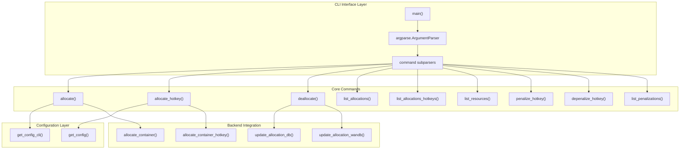
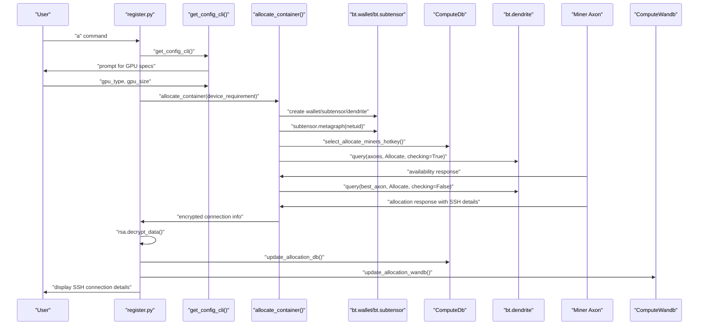
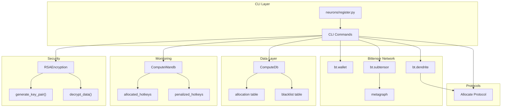

---

title: "CLI Tools"

---


import CollapsibleAside from '@components/CollapsibleAside.astro';

import SourceLink from '@components/SourceLink.astro';


<CollapsibleAside title="Relevant Source Files">

  <SourceLink text="neurons/register.py" href="https://github.com/neuralinternet/SN27/blob/6261c454/neurons/register.py" />

</CollapsibleAside>


This document covers the command-line utilities provided by the NI Compute Subnet for interacting with the compute resource marketplace. The primary CLI tool is the Registration CLI, which enables users to allocate, deallocate, and manage compute resources on the network.

For information about the underlying Resource Allocation API that these tools interact with, see [Resource Allocation API](/resource-allocation-api#4). For details about the communication protocols used, see [Communication Protocols](/communication-protocols#5).

## Registration CLI Tool

The main CLI tool is implemented in `neurons/register.py` and provides a comprehensive interface for managing compute resources on the subnet. This tool serves as the primary user interface for validators and resource consumers to interact with the decentralized compute marketplace.

### CLI Command Architecture

The Registration CLI follows a command-driven architecture with the following components:



Sources: <SourceLink text="neurons/register.py:781-854" href="https://github.com/neuralinternet/SN27/blob/6261c454/neurons/register.py#L781-L854" />

### Available Commands

The CLI provides the following commands for resource management:

| Command | Function | Description |
|---------|----------|-------------|
| `a` | `allocate()` | Allocate resource via device requirements (GPU) |
| `a_hotkey` | `allocate_hotkey()` | Allocate resource via specific hotkey |
| `d` | `deallocate()` | De-allocate resource(s) |
| `list_a` | `list_allocations()` | List allocated resources |
| `list_ah` | `list_allocations_hotkeys()` | List allocated resource hotkeys |
| `list_r` | `list_resources()` | List available resources |
| `p_hotkey` | `penalize_hotkey()` | Penalize resource via hotkey |
| `dp_hotkey` | `depenalize_hotkey()` | De-penalize resource via hotkey |
| `list_p` | `list_penalizations()` | List penalized hotkeys |

Sources: <SourceLink text="neurons/register.py:790-827" href="https://github.com/neuralinternet/SN27/blob/6261c454/neurons/register.py#L790-L827" />

## Resource Allocation Flow

The allocation process involves several steps from CLI input to resource provisioning:



Sources: <SourceLink text="neurons/register.py:230-288" href="https://github.com/neuralinternet/SN27/blob/6261c454/neurons/register.py#L230-L288" />, <SourceLink text="neurons/register.py:117-180" href="https://github.com/neuralinternet/SN27/blob/6261c454/neurons/register.py#L117-L180" />

## System Integration

The CLI tool integrates with multiple system components to provide comprehensive resource management:



Sources: <SourceLink text="neurons/register.py:27-39" href="https://github.com/neuralinternet/SN27/blob/6261c454/neurons/register.py#L27-L39" />, <SourceLink text="neurons/register.py:118-135" href="https://github.com/neuralinternet/SN27/blob/6261c454/neurons/register.py#L118-L135" />

## Configuration and Setup

The CLI tool supports two configuration modes:

### Command-line Configuration
The `get_config()` function provides standard configuration parsing for non-interactive use:

```python
# Key configuration parameters
--netuid         # Subnet UID (default: 1)
--gpu_type       # Required GPU type
--gpu_size       # Required GPU memory in MB
--wallet.*       # Wallet configuration
--subtensor.*    # Subtensor configuration
--logging.*      # Logging configuration
```

### Interactive Configuration
The `get_config_cli()` function provides interactive prompts for user-friendly operation:

- Prompts for GPU type if not provided
- Prompts for GPU memory in GB (converted to MB)
- Sets up logging directory structure

Sources: <SourceLink text="neurons/register.py:43-75" href="https://github.com/neuralinternet/SN27/blob/6261c454/neurons/register.py#L43-L75" />, <SourceLink text="neurons/register.py:79-113" href="https://github.com/neuralinternet/SN27/blob/6261c454/neurons/register.py#L79-L113" />

## Resource Management Operations

### Allocation Operations
The CLI provides two allocation methods:

1. **Device-based allocation** (`allocate()`): Searches for resources matching specific hardware requirements
2. **Hotkey-based allocation** (`allocate_hotkey()`): Allocates resources from a specific miner hotkey

Both methods return SSH connection details for accessing allocated resources.

### Deallocation Operations
The `deallocate()` function supports:
- Single or multiple hotkey deallocation
- Database state updates before network communication
- Graceful error handling for offline miners

### Resource Listing Operations
The CLI provides multiple listing commands:
- `list_allocations()`: Detailed view of allocated resources
- `list_allocations_hotkeys()`: Simplified hotkey-only view
- `list_resources()`: Comprehensive network resource overview with availability status

Sources: <SourceLink text="neurons/register.py:230-288" href="https://github.com/neuralinternet/SN27/blob/6261c454/neurons/register.py#L230-L288" />, <SourceLink text="neurons/register.py:350-445" href="https://github.com/neuralinternet/SN27/blob/6261c454/neurons/register.py#L350-L445" />, <SourceLink text="neurons/register.py:446-643" href="https://github.com/neuralinternet/SN27/blob/6261c454/neurons/register.py#L446-L643" />