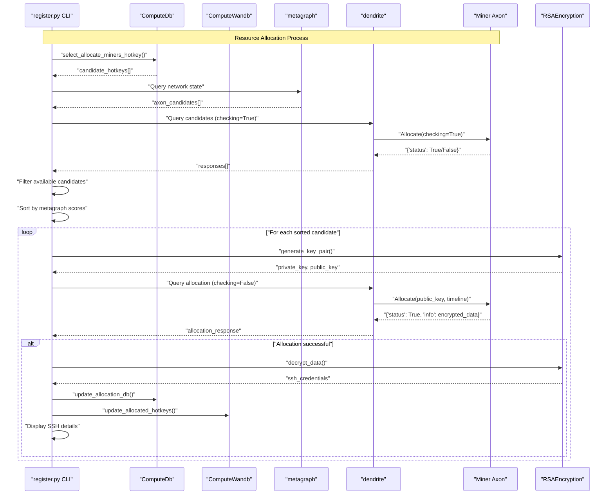

---

title: "Registration CLI"

---


import CollapsibleAside from '@components/CollapsibleAside.astro';

import SourceLink from '@components/SourceLink.astro';


<CollapsibleAside title="Relevant Source Files">

  <SourceLink text="neurons/register.py" href="https://github.com/neuralinternet/SN27/blob/6261c454/neurons/register.py" />

</CollapsibleAside>


The Registration CLI is a command-line interface tool for interacting with the NI Compute Subnet resource allocation system. It provides commands for allocating compute resources from miners, deallocating them when finished, and managing the penalty system for network validators.

This tool is primarily used by network participants who need to allocate GPU compute resources from miners on the subnet. For information about the underlying Resource Allocation API that this CLI interacts with, see [Resource Allocation API](/resource-allocation-api#4). For details about the validator system that manages resource scoring, see [Validator System](/validator-system#2).

## Overview

The Registration CLI (`neurons/register.py`) serves as the primary user interface for resource allocation operations on the NI Compute Subnet. It connects to the Bittensor network to discover available miners, negotiate resource allocation, and manage the lifecycle of compute allocations.

### CLI Command Structure

The CLI operates in an interactive loop, accepting single-letter commands for different operations:

| Command | Function | Description |
|---------|----------|-------------|
| `a` | `allocate()` | Allocate resources by GPU requirements |
| `a_hotkey` | `allocate_hotkey()` | Allocate resources by specific miner hotkey |
| `d` | `deallocate()` | Deallocate resources |
| `list_a` | `list_allocations()` | List currently allocated resources |
| `list_ah` | `list_allocations_hotkeys()` | List allocated resource hotkeys |
| `list_r` | `list_resources()` | List all available resources on network |
| `p_hotkey` | `penalize_hotkey()` | Add miner to penalty blacklist |
| `dp_hotkey` | `depenalize_hotkey()` | Remove miner from penalty blacklist |
| `list_p` | `list_penalizations()` | List penalized miners |

Sources: <SourceLink text="neurons/register.py:790-830" href="https://github.com/neuralinternet/SN27/blob/6261c454/neurons/register.py#L790-L830" />

## System Architecture

### CLI Integration with Network Components

```mermaid
graph TD
    CLI["`register.py`<br/>CLI Interface"]
    CONFIG["`get_config()`<br/>Configuration Parser"]
    WALLET["`bt.wallet`<br/>Bittensor Wallet"]
    SUBTENSOR["`bt.subtensor`<br/>Blockchain Connection"]
    DENDRITE["`bt.dendrite`<br/>RPC Client"]
    METAGRAPH["`metagraph`<br/>Network State"]
    
    subgraph "Local State Management"
        COMPUTEDB["`ComputeDb`<br/>SQLite Database"]
        WANDB["`ComputeWandb`<br/>Distributed State"]
    end
    
    subgraph "Network Communication" 
        ALLOCATE_PROTOCOL["`Allocate`<br/>Protocol Messages"]
        RSA["`RSAEncryption`<br/>Secure Communication"]
    end
    
    subgraph "Miner Network"
        MINERS["`Miners`<br/>Resource Providers"]
        CONTAINERS["`Docker Containers`<br/>Allocated Resources"]
    end
    
    CLI --> CONFIG
    CLI --> WALLET
    CLI --> SUBTENSOR
    CLI --> DENDRITE
    CLI --> COMPUTEDB
    CLI --> WANDB
    
    SUBTENSOR --> METAGRAPH
    DENDRITE --> ALLOCATE_PROTOCOL
    ALLOCATE_PROTOCOL --> RSA
    
    DENDRITE --> MINERS
    MINERS --> CONTAINERS
    
    COMPUTEDB --> WANDB
```

Sources: <SourceLink text="neurons/register.py:43-75" href="https://github.com/neuralinternet/SN27/blob/6261c454/neurons/register.py#L43-L75" />, <SourceLink text="neurons/register.py:117-180" href="https://github.com/neuralinternet/SN27/blob/6261c454/neurons/register.py#L117-L180" />, <SourceLink text="neurons/register.py:784-787" href="https://github.com/neuralinternet/SN27/blob/6261c454/neurons/register.py#L784-L787" />

### Resource Allocation Flow



Sources: <SourceLink text="neurons/register.py:117-180" href="https://github.com/neuralinternet/SN27/blob/6261c454/neurons/register.py#L117-L180" />, <SourceLink text="neurons/register.py:230-288" href="https://github.com/neuralinternet/SN27/blob/6261c454/neurons/register.py#L230-L288" />

## Core Functions

### Resource Allocation Functions

#### `allocate_container()`
Primary allocation function that finds and allocates resources based on device requirements.

**Key Operations:**
- Queries `ComputeDb` using `select_allocate_miners_hotkey()` to find candidate miners
- Filters candidates through availability check (`checking=True`)
- Sorts candidates by metagraph scores
- Attempts allocation with highest-scored available miner
- Returns encrypted SSH connection details

**Parameters:**
- `device_requirement`: Hardware specifications (GPU type, memory, CPU, RAM, disk)
- `timeline`: Allocation duration in minutes
- `public_key`: RSA public key for secure communication

Sources: <SourceLink text="neurons/register.py:117-180" href="https://github.com/neuralinternet/SN27/blob/6261c454/neurons/register.py#L117-L180" />

#### `allocate_container_hotkey()`
Direct allocation to a specific miner by hotkey, bypassing candidate selection.

**Key Differences:**
- Targets specific miner hotkey directly
- Uses fixed device requirements structure
- Includes `docker_requirement` for container specifications

Sources: <SourceLink text="neurons/register.py:184-227" href="https://github.com/neuralinternet/SN27/blob/6261c454/neurons/register.py#L184-L227" />

### Deallocation Functions

#### `deallocate()`
Handles resource deallocation for multiple hotkeys simultaneously.

**Process Flow:**
1. Query local database for allocation details by hotkey
2. Update database and WandB to mark as deallocated
3. Send deallocation request to miner via `Allocate` protocol
4. Handle batch processing for multiple hotkeys

**Key Features:**
- Supports comma-separated multiple hotkeys
- Immediate database update before network communication
- Error handling for missing hotkeys or network failures

Sources: <SourceLink text="neurons/register.py:350-445" href="https://github.com/neuralinternet/SN27/blob/6261c454/neurons/register.py#L350-L445" />

### Information Display Functions

#### `list_resources()`
Displays comprehensive network resource overview with GPU specifications and availability status.

**Display Components:**
- Tabular format with hotkey, GPU details, CPU, RAM, storage
- Resource availability status (Available/Reserved)
- Summary statistics for GPU instances and total counts
- Integration with WandB allocated hotkeys for status updates

Sources: <SourceLink text="neurons/register.py:531-643" href="https://github.com/neuralinternet/SN27/blob/6261c454/neurons/register.py#L531-L643" />

#### `list_allocations()`
Shows detailed information about currently allocated resources including SSH connection details.

**Information Displayed:**
- Allocation ID, hotkey, resource type
- SSH credentials (username, password, port, IP)
- Ready-to-use SSH commands

Sources: <SourceLink text="neurons/register.py:446-488" href="https://github.com/neuralinternet/SN27/blob/6261c454/neurons/register.py#L446-L488" />

### Penalty Management Functions

#### `penalize_hotkey()` and `depenalize_hotkey()`
Administrative functions for managing miner penalties through blacklist system.

**Penalty Process:**
- Validates hotkeys against network miner details
- Updates local `blacklist` table via `update_blacklist_db()`
- Synchronizes penalty status with WandB distributed state
- Supports batch operations for multiple hotkeys

Sources: <SourceLink text="neurons/register.py:671-762" href="https://github.com/neuralinternet/SN27/blob/6261c454/neurons/register.py#L671-L762" />

## Configuration and Setup

### Configuration Parsers

The CLI provides two configuration modes:

#### `get_config()`
Standard argument parsing for programmatic usage with command-line parameters.

#### `get_config_cli()`
Interactive configuration that prompts for missing GPU requirements when not provided via command line.

**Interactive Prompts:**
- GPU type selection
- GPU memory specification (converted from GB to MB)
- Automatic logging directory setup

Sources: <SourceLink text="neurons/register.py:43-113" href="https://github.com/neuralinternet/SN27/blob/6261c454/neurons/register.py#L43-L113" />

### Database Integration

The CLI integrates with multiple data persistence layers:

#### Local Database Operations
- **ComputeDb**: SQLite database for allocation tracking
- **Tables Used**: `allocation`, `blacklist`, `miner`, `stats`
- **Key Operations**: Resource queries, allocation updates, penalty management

#### Distributed State Management
- **ComputeWandb**: Synchronization with distributed validator state
- **Functions**: `update_allocated_hotkeys()`, `update_penalized_hotkeys()`
- **Purpose**: Cross-validator consistency for resource allocation status

Sources: <SourceLink text="neurons/register.py:35" href="https://github.com/neuralinternet/SN27/blob/6261c454/neurons/register.py#L35" />, <SourceLink text="neurons/register.py:644-670" href="https://github.com/neuralinternet/SN27/blob/6261c454/neurons/register.py#L644-L670" />

## Security and Communication

### RSA Encryption Integration
All resource allocation communications use RSA encryption for secure credential exchange:

```mermaid
graph LR
    CLI["`CLI`<br/>register.py"]
    RSA_GEN["`generate_key_pair()`<br/>RSA Key Generation"]
    MINER["`Miner`<br/>Resource Provider"]
    RSA_DECRYPT["`decrypt_data()`<br/>RSA Decryption"]
    
    CLI --> RSA_GEN
    RSA_GEN --> CLI
    CLI -->|"public_key"| MINER
    MINER -->|"encrypted credentials"| CLI
    CLI --> RSA_DECRYPT
    RSA_DECRYPT --> CLI
```

**Security Features:**
- Unique key pair generation for each allocation
- Encrypted SSH credential transmission
- Base64 encoding for network transport

Sources: <SourceLink text="neurons/register.py:31" href="https://github.com/neuralinternet/SN27/blob/6261c454/neurons/register.py#L31" />, <SourceLink text="neurons/register.py:237" href="https://github.com/neuralinternet/SN27/blob/6261c454/neurons/register.py#L237" />, <SourceLink text="neurons/register.py:244" href="https://github.com/neuralinternet/SN27/blob/6261c454/neurons/register.py#L244" />

### Protocol Communication
Uses Bittensor's `Allocate` protocol for standardized miner communication:

**Protocol Parameters:**
- `timeline`: Allocation duration
- `device_requirement`: Hardware specifications
- `checking`: Boolean flag for availability check vs actual allocation
- `public_key`: RSA public key for encryption
- `docker_requirement`: Container specifications (optional)

Sources: <SourceLink text="neurons/register.py:32" href="https://github.com/neuralinternet/SN27/blob/6261c454/neurons/register.py#L32" />, <SourceLink text="neurons/register.py:144" href="https://github.com/neuralinternet/SN27/blob/6261c454/neurons/register.py#L144" />, <SourceLink text="neurons/register.py:168-170" href="https://github.com/neuralinternet/SN27/blob/6261c454/neurons/register.py#L168-L170" />