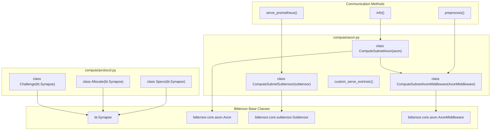
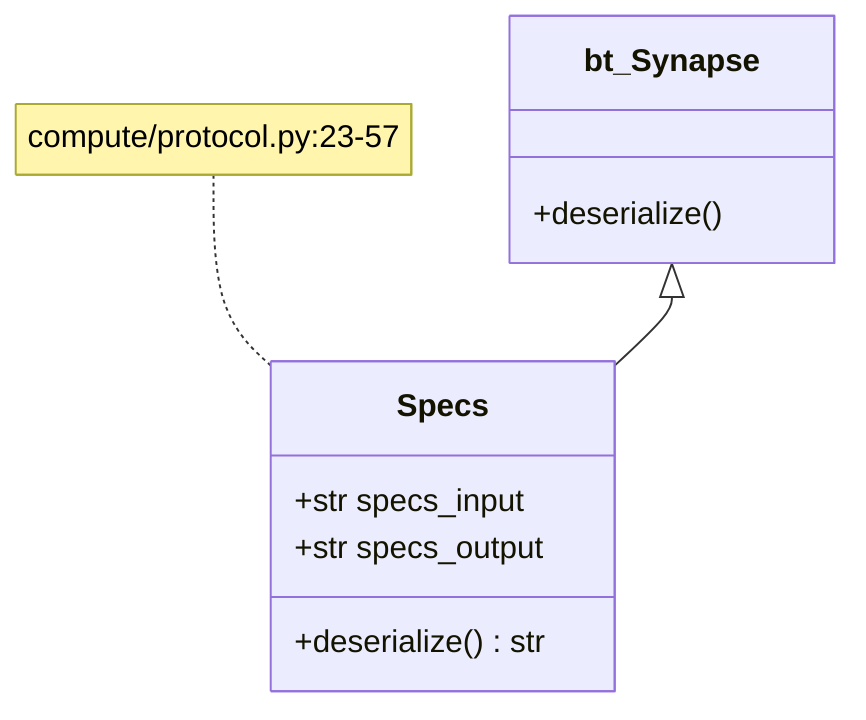
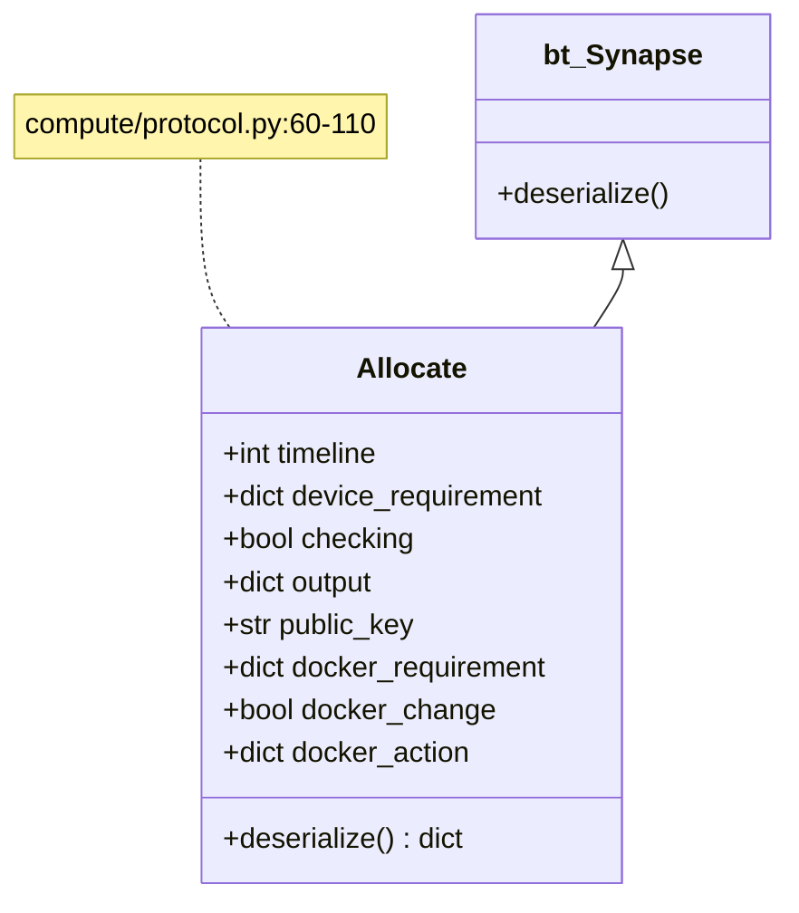
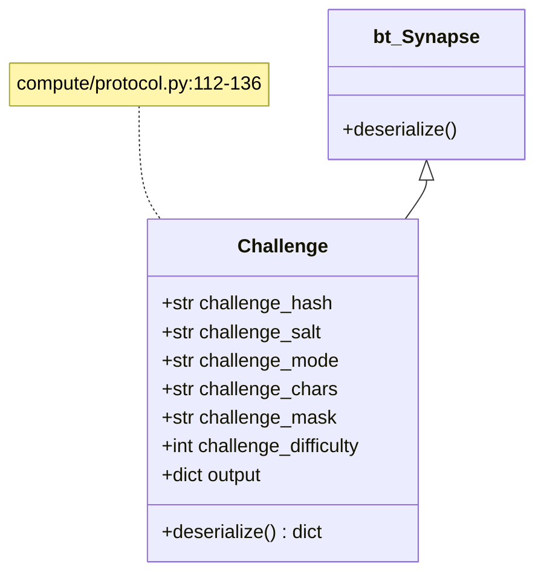
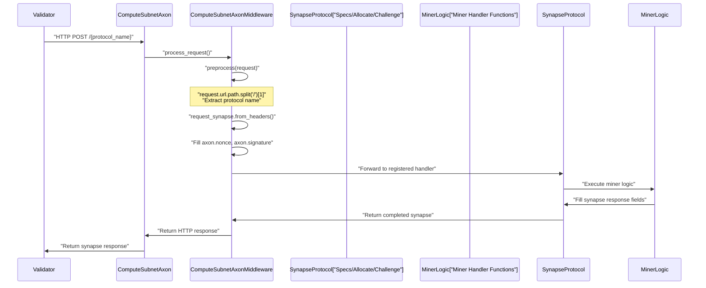
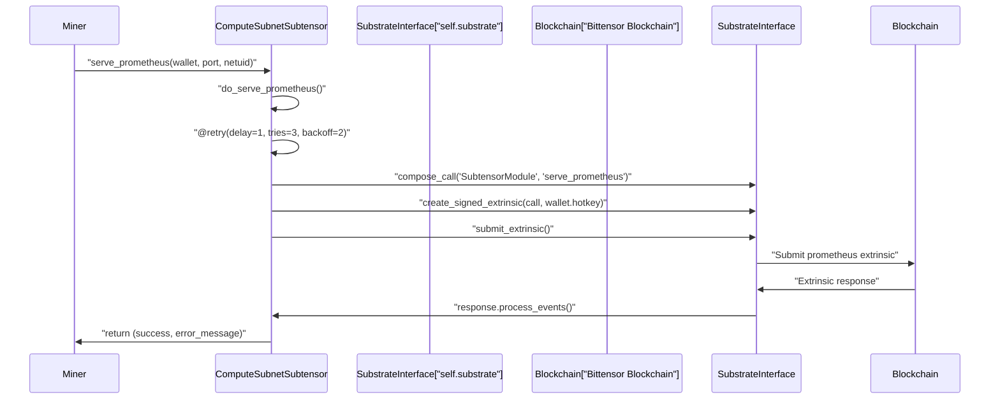
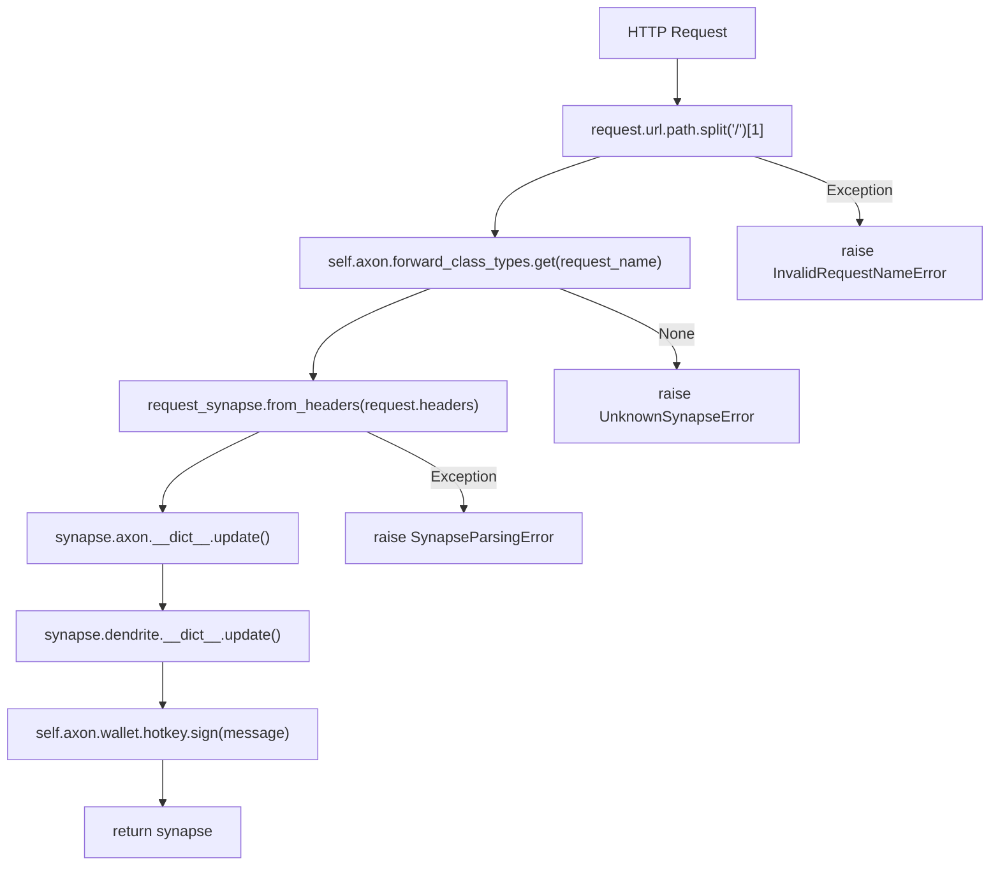
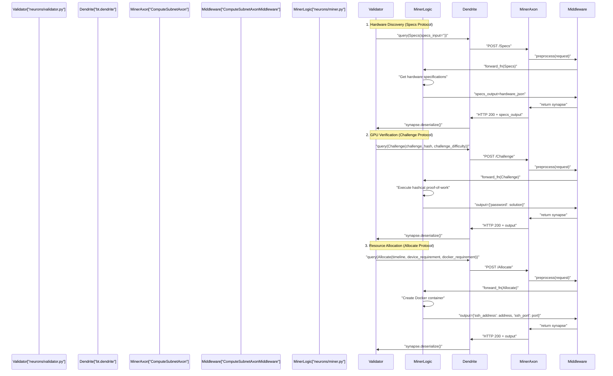
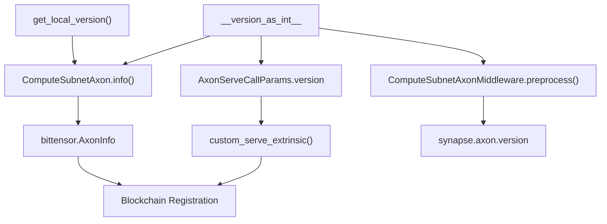
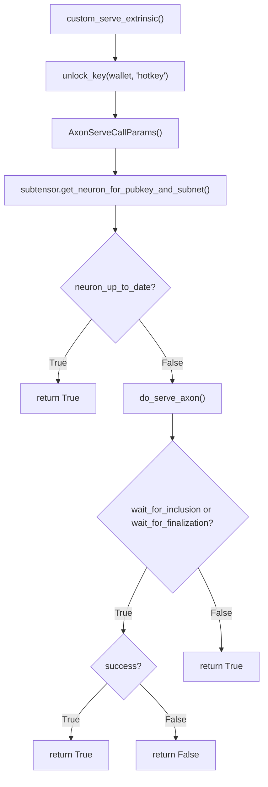

---

title: "Communication Protocols"

---


import CollapsibleAside from '@components/CollapsibleAside.astro';

import SourceLink from '@components/SourceLink.astro';


<CollapsibleAside title="Relevant Source Files">

  <SourceLink text="compute/axon.py" href="https://github.com/neuralinternet/SN27/blob/6261c454/compute/axon.py" />

  <SourceLink text="compute/protocol.py" href="https://github.com/neuralinternet/SN27/blob/6261c454/compute/protocol.py" />

</CollapsibleAside>


## Overview

This page documents the network communication protocols and message formats used between system components in the NI Compute subnet. The system implements three core Bittensor synapse protocols (`Specs`, `Allocate`, `Challenge`) and custom extensions to Bittensor's communication infrastructure (`ComputeSubnetAxon`, `ComputeSubnetSubtensor`, `ComputeSubnetAxonMiddleware`).

These protocols enable hardware specification discovery, resource allocation, and cryptographic validation challenges between validators and miners. For information about the HTTP API endpoints, see [Resource Allocation API](/resource-allocation-api#4).

Sources: <SourceLink text="compute/protocol.py:1-136" href="https://github.com/neuralinternet/SN27/blob/6261c454/compute/protocol.py#L1-L136" />, <SourceLink text="compute/axon.py:1-487" href="https://github.com/neuralinternet/SN27/blob/6261c454/compute/axon.py#L1-L487" />

## Protocol Stack

NI Compute extends Bittensor's communication infrastructure with custom protocols specific to the GPU compute marketplace. The system implements three main synapse protocols and uses customized versions of Bittensor's Axon and Subtensor components.

**Protocol Stack Architecture**


Sources: <SourceLink text="compute/protocol.py:23-136" href="https://github.com/neuralinternet/SN27/blob/6261c454/compute/protocol.py#L23-L136" />, <SourceLink text="compute/axon.py:152-487" href="https://github.com/neuralinternet/SN27/blob/6261c454/compute/axon.py#L152-L487" />

## Core Synapse Protocols

NI Compute defines three primary protocols for communication between validators and miners, all extending Bittensor's Synapse base class.

### Specs Protocol

The `Specs` class enables validators to query hardware specifications from miners, providing detailed information about CPU, GPU, RAM, and storage resources.

**Specs Class Definition**


| Attribute | Type | Description |
|-----------|------|-------------|
| `specs_input` | `str` | Input parameter (typically empty string) |
| `specs_output` | `str` | JSON response containing detailed hardware specifications |

The `deserialize()` method returns `self.specs_output` containing hardware details in the format:
```
{"CPU":{'count' : 4, 'vendor_id_raw' : 'AuthenticAMD', ...}}
```

Sources: <SourceLink text="compute/protocol.py:23-57" href="https://github.com/neuralinternet/SN27/blob/6261c454/compute/protocol.py#L23-L57" />

### Allocate Protocol

The `Allocate` class facilitates resource allocation requests from validators to miners, including parameters for container configuration, access credentials, and resource requirements.

**Allocate Class Definition**


| Attribute | Type | Default | Description |
|-----------|------|---------|-------------|
| `timeline` | `int` | `0` | Duration of allocation in seconds |
| `device_requirement` | `dict` | `{}` | Hardware requirements specification |
| `checking` | `bool` | `True` | Flag: `True` for availability check, `False` for actual allocation |
| `public_key` | `str` | `""` | Public key for secure communication |
| `output` | `dict` | `{}` | Response containing allocation details from miner |
| `docker_requirement` | `dict` | Default config | Container configuration with `base_image`, `ssh_key`, `ssh_port`, `volume_path`, `dockerfile` |
| `docker_change` | `bool` | `False` | Flag indicating Docker configuration changes |
| `docker_action` | `dict` | Action config | Docker actions with `action`, `ssh_key`, `key_type` |

The `deserialize()` method returns `self.output` containing the allocation response from the miner.

Sources: <SourceLink text="compute/protocol.py:60-110" href="https://github.com/neuralinternet/SN27/blob/6261c454/compute/protocol.py#L60-L110" />

### Challenge Protocol

The `Challenge` class enables validators to verify miner GPU capabilities through cryptographic proof-of-work challenges, ensuring that miners have the claimed GPU resources.

**Challenge Class Definition**


| Attribute | Type | Default | Description |
|-----------|------|---------|-------------|
| `challenge_hash` | `str` | `""` | Cryptographic hash to be solved |
| `challenge_salt` | `str` | `""` | Salt value for the challenge |
| `challenge_mode` | `str` | `""` | Challenge type (hashcat mode) |
| `challenge_chars` | `str` | `""` | Character set for brute force |
| `challenge_mask` | `str` | `""` | Mask pattern for challenge |
| `challenge_difficulty` | `int` | `compute.pow_min_difficulty` | Difficulty level of the challenge |
| `output` | `dict` | `{}` | Response containing solution or error |

The `deserialize()` method returns `self.output` which contains either the password solution or error information:
```python
{"password": None, "error": f"Hashcat execution failed with code {process.returncode}: {stderr}"}
```

Sources: <SourceLink text="compute/protocol.py:112-136" href="https://github.com/neuralinternet/SN27/blob/6261c454/compute/protocol.py#L112-L136" />

## Custom Axon and Subtensor

NI Compute extends Bittensor's communication infrastructure with customized components to support the specific needs of the compute subnet.

### ComputeSubnetAxon

The `ComputeSubnetAxon` class extends `bittensor.core.axon.Axon` to provide compute subnet-specific functionality, including customized version tracking and middleware processing.

**ComputeSubnetAxon Request Processing Flow**


**Key Methods and Attributes**:

| Method/Attribute | Description |
|------------------|-------------|
| `__init__()` | Initializes with custom middleware class `ComputeSubnetAxonMiddleware` |
| `info()` | Returns `bittensor.AxonInfo` with `get_local_version()` and compute-specific placeholders |
| `middleware_cls` | Set to `ComputeSubnetAxonMiddleware` |

The `info()` method returns customized axon information including:
- `version`: From `get_local_version()`
- `protocol`: `4`
- `placeholder1`: `1`
- `placeholder2`: `2`

Sources: <SourceLink text="compute/axon.py:285-390" href="https://github.com/neuralinternet/SN27/blob/6261c454/compute/axon.py#L285-L390" />

### ComputeSubnetSubtensor

The `ComputeSubnetSubtensor` class extends `bittensor.core.subtensor.Subtensor` with additional functionality for Prometheus metrics extrinsic submission.

**Key Methods**:

| Method | Parameters | Description |
|--------|------------|-------------|
| `serve_prometheus()` | `wallet`, `port`, `netuid`, `wait_for_inclusion`, `wait_for_finalization` | Serves Prometheus metrics by submitting extrinsic to blockchain |
| `do_serve_prometheus()` | `wallet`, `call_params`, `wait_for_inclusion`, `wait_for_finalization` | Core method for submitting Prometheus extrinsics with retry logic |

**Prometheus Extrinsic Flow**:


The implementation includes retry logic with exponential backoff and comprehensive error handling for substrate communication failures.

Sources: <SourceLink text="compute/axon.py:152-283" href="https://github.com/neuralinternet/SN27/blob/6261c454/compute/axon.py#L152-L283" />

### ComputeSubnetAxonMiddleware

The `ComputeSubnetAxonMiddleware` class extends `bittensor.core.axon.AxonMiddleware` and handles the preprocessing of requests, extracting the appropriate Synapse protocol based on the URL path and preparing it for execution.

**Middleware Processing Implementation**:


**Key `preprocess()` Method Logic**:

1. **Request Name Extraction**: `request.url.path.split("/")[1]`
2. **Synapse Type Resolution**: `self.axon.forward_class_types.get(request_name)`
3. **Synapse Creation**: `request_synapse.from_headers(request.headers)`
4. **Axon Info Population**:
   - `version`: `__version_as_int__`
   - `uuid`: `str(self.axon.uuid)`
   - `nonce`: `time.monotonic_ns()`
   - `status_code`: `"100"`
5. **Dendrite Info Population**: Client `port` and `ip`
6. **Signature Generation**: 
   ```python
   message = f"{synapse.axon.nonce}.{synapse.dendrite.hotkey}.{synapse.axon.hotkey}.{synapse.axon.uuid}"
   synapse.axon.signature = f"0x{self.axon.wallet.hotkey.sign(message).hex()}"
   ```

Sources: <SourceLink text="compute/axon.py:391-487" href="https://github.com/neuralinternet/SN27/blob/6261c454/compute/axon.py#L391-L487" />

## Communication Flow

The following diagram illustrates the end-to-end communication flow between validators and miners using the three core protocols.

**Complete Protocol Communication Flow**


Sources: <SourceLink text="compute/protocol.py:1-136" href="https://github.com/neuralinternet/SN27/blob/6261c454/compute/protocol.py#L1-L136" />, <SourceLink text="compute/axon.py:391-487" href="https://github.com/neuralinternet/SN27/blob/6261c454/compute/axon.py#L391-L487" />

## Protocol Version Management

NI Compute implements version tracking through the `__version_as_int__` global variable and `get_local_version()` function to ensure protocol compatibility between nodes.

**Version Integration Points**


**Version Usage in Communication**:

| Component | Usage | Code Reference |
|-----------|-------|----------------|
| `ComputeSubnetAxonMiddleware.preprocess()` | Sets `synapse.axon.version = __version_as_int__` | <SourceLink text="compute/axon.py:470" href="https://github.com/neuralinternet/SN27/blob/6261c454/compute/axon.py#L470" /> |
| `ComputeSubnetAxon.info()` | Returns `bittensor.AxonInfo(version=get_local_version())` | <SourceLink text="compute/axon.py:379" href="https://github.com/neuralinternet/SN27/blob/6261c454/compute/axon.py#L379" /> |
| `custom_serve_extrinsic()` | Uses `version=__version_as_int__` in `AxonServeCallParams` | <SourceLink text="compute/axon.py:104" href="https://github.com/neuralinternet/SN27/blob/6261c454/compute/axon.py#L104" /> |

The version is encoded as an integer for efficient blockchain storage and comparison, ensuring that all communication includes version information for compatibility checking.

Sources: <SourceLink text="compute/axon.py:47-104" href="https://github.com/neuralinternet/SN27/blob/6261c454/compute/axon.py#L47-L104" />, <SourceLink text="compute/axon.py:376-388" href="https://github.com/neuralinternet/SN27/blob/6261c454/compute/axon.py#L376-L388" />, <SourceLink text="compute/axon.py:470" href="https://github.com/neuralinternet/SN27/blob/6261c454/compute/axon.py#L470" />

## Subtensor Integration

NI Compute extends the standard Bittensor Subtensor to support custom extrinsics required for the compute subnet through the `custom_serve_extrinsic` function and `ComputeSubnetSubtensor` class.

**Custom Serve Extrinsic Implementation**


**Key Customizations**:

1. **Custom Version Integration**: Uses `__version_as_int__` from the compute subnet
2. **Modified Parameters**: Includes compute-specific `placeholder1` and `placeholder2` values
3. **Enhanced Logging**: Custom debug messages for axon serving status
4. **Registration Override**: Replaces `bittensor.core.extrinsics.serving.serve_extrinsic` with custom implementation

**AxonServeCallParams Structure**:
```python
params = AxonServeCallParams(
    version=__version_as_int__,           # Compute subnet version
    ip=net.ip_to_int(ip),                # IP address as integer
    port=port,                           # Port number
    ip_type=net.ip_version(ip),          # IP version (4 or 6)
    netuid=netuid,                       # Subnet ID
    hotkey=wallet.hotkey.ss58_address,   # Hotkey address
    coldkey=wallet.coldkeypub.ss58_address, # Coldkey address
    protocol=protocol,                   # Protocol version
    placeholder1=placeholder1,           # Reserved field
    placeholder2=placeholder2,           # Reserved field
    certificate=certificate,             # TLS certificate
)
```

The system patches the global Bittensor extrinsic function:
```python
bittensor.core.extrinsics.serving.serve_extrinsic = custom_serve_extrinsic
```

Sources: <SourceLink text="compute/axon.py:63-150" href="https://github.com/neuralinternet/SN27/blob/6261c454/compute/axon.py#L63-L150" />

## Summary

The communication protocols in NI Compute form a critical infrastructure layer that enables secure, efficient interaction between validators and miners in the decentralized GPU marketplace. By extending Bittensor's core communication components, NI Compute implements specialized protocols for hardware discovery, verification, and resource allocation.

This layered approach ensures:

1. **Discoverability**: Validators can discover and verify miner hardware capabilities
2. **Security**: Secure communication channels for sensitive operations
3. **Resource Management**: Efficient allocation and management of GPU resources
4. **Monitoring**: Integration with Prometheus for metrics collection

Understanding these protocols is essential for developing and extending the NI Compute platform with new features and capabilities.