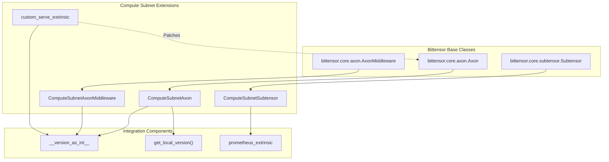
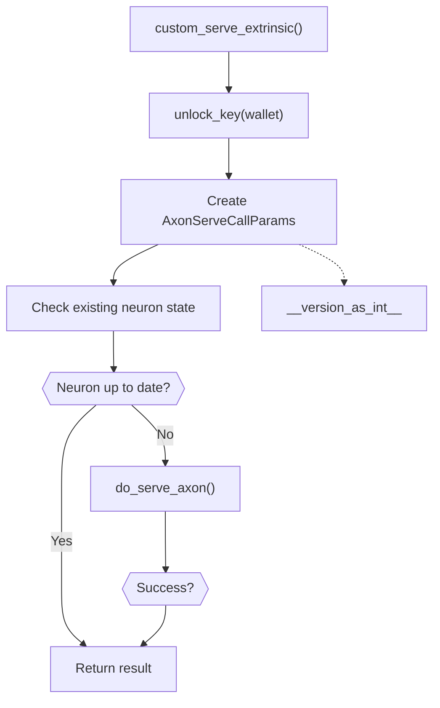
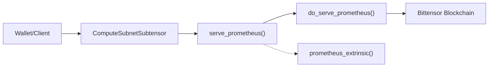
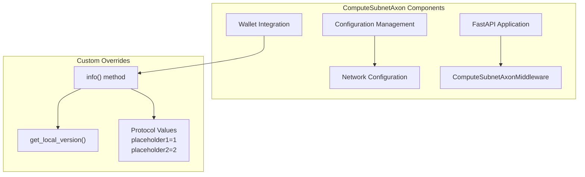
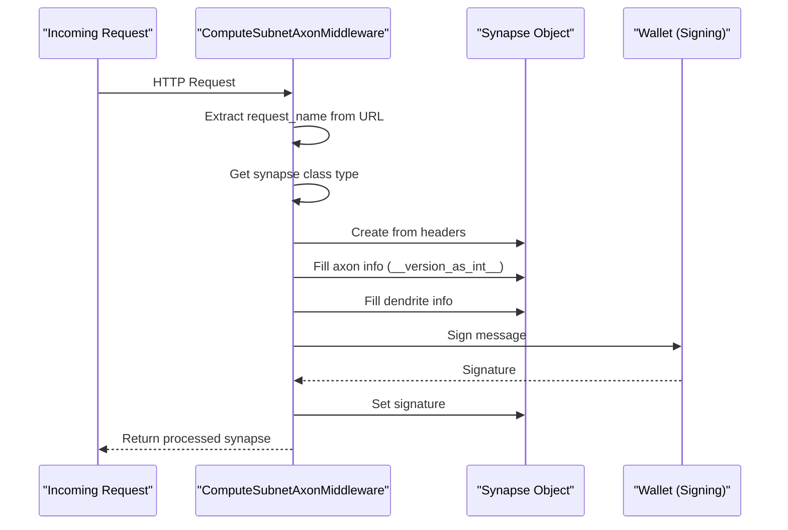
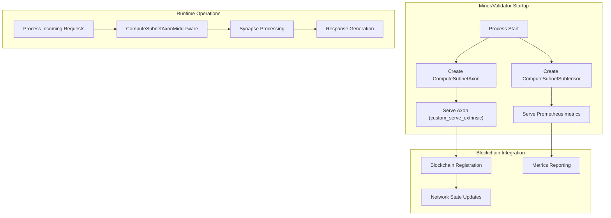

---

title: "Custom Axon and Subtensor"

---

import CollapsibleAside from '@components/CollapsibleAside.astro';

import SourceLink from '@components/SourceLink.astro';

<CollapsibleAside title="Relevant Source Files">

  <SourceLink text="compute/axon.py" href="https://github.com/neuralinternet/SN27/blob/6261c454/compute/axon.py" />

</CollapsibleAside>

This document covers the compute subnet's custom extensions to Bittensor's core communication components: Axon and Subtensor. These extensions provide subnet-specific functionality including custom version handling, Prometheus metrics integration, and enhanced request preprocessing.

For information about the core communication protocols used by these components, see [Specs, Allocate, and Challenge Protocols](/communication-protocols/specs-allocate-and-challenge-protocols#5.1). For monitoring and metrics infrastructure, see [Monitoring and Metrics](/monitoring-and-metrics#6).

## Architecture Overview

The compute subnet extends Bittensor's base communication classes to add subnet-specific functionality. The main extensions include custom serve extrinsics, Prometheus metrics support, and enhanced middleware processing.

**Sources:** <SourceLink text="compute/axon.py:1-488" href="https://github.com/neuralinternet/SN27/blob/6261c454/compute/axon.py#L1-L488" />

## Custom Serve Extrinsic

The `custom_serve_extrinsic` function replaces Bittensor's standard serve extrinsic functionality to incorporate compute subnet specific versioning.

### Function Implementation

The custom serve extrinsic handles axon registration on the blockchain with subnet-specific parameters:

Key characteristics:
- Uses `__version_as_int__` for subnet version identification
- Includes placeholder parameters for future extensibility
- Patches the original Bittensor serve extrinsic at module level
- Handles certificate-based TLS configuration

**Sources:** <SourceLink text="compute/axon.py:63-150" href="https://github.com/neuralinternet/SN27/blob/6261c454/compute/axon.py#L63-L150" />

## ComputeSubnetSubtensor

The `ComputeSubnetSubtensor` class extends the base Subtensor with Prometheus metrics functionality, allowing miners and validators to register metrics endpoints on the blockchain.

### Prometheus Integration

### Key Methods

| Method | Purpose | Parameters |
|--------|---------|------------|
| `serve_prometheus` | Public interface for Prometheus registration | `wallet`, `port`, `netuid`, wait flags |
| `do_serve_prometheus` | Internal extrinsic submission handler | `wallet`, `call_params`, wait flags |

The implementation includes:
- Retry logic with exponential backoff
- Exception handling for substrate requests
- Support for inclusion and finalization waiting
- Integration with the compute subnet's Prometheus extrinsic function

**Sources:** <SourceLink text="compute/axon.py:152-283" href="https://github.com/neuralinternet/SN27/blob/6261c454/compute/axon.py#L152-L283" />

## ComputeSubnetAxon

The `ComputeSubnetAxon` class extends the base Axon with compute subnet specific configuration and information handling.

### Architecture

### Info Method Override

The `info()` method returns subnet-specific axon information:

- Uses `get_local_version()` instead of standard versioning
- Sets protocol version to 4
- Includes custom placeholder values for future extensibility
- Returns properly formatted `AxonInfo` object

### Configuration Parameters

| Parameter | Purpose | Default Handling |
|-----------|---------|------------------|
| `external_ip` | External IP for network communication | Auto-detected if not provided |
| `external_port` | External port for network communication | Uses internal port if not provided |
| `max_workers` | Thread pool size | From configuration |

**Sources:** <SourceLink text="compute/axon.py:285-388" href="https://github.com/neuralinternet/SN27/blob/6261c454/compute/axon.py#L285-L388" />

## ComputeSubnetAxonMiddleware

The `ComputeSubnetAxonMiddleware` extends the base middleware with compute subnet specific request preprocessing.

### Request Processing Flow

### Custom Preprocessing

The `preprocess` method implements compute subnet specific logic:

1. **Request Name Extraction**: Parses request name from URL path
2. **Synapse Creation**: Instantiates appropriate synapse type from headers
3. **Version Handling**: Sets axon version to `__version_as_int__`
4. **Signature Generation**: Signs with wallet hotkey using custom message format

### Error Handling

The middleware handles three main error types:
- `InvalidRequestNameError`: Malformed URL paths
- `UnknownSynapseError`: Unknown synapse types
- `SynapseParsingError`: Header parsing failures

**Sources:** <SourceLink text="compute/axon.py:391-487" href="https://github.com/neuralinternet/SN27/blob/6261c454/compute/axon.py#L391-L487" />

## Integration Workflow

The custom Axon and Subtensor components integrate with the broader compute subnet architecture through specific workflows:

This integration ensures that:
- All network communication uses compute subnet versioning
- Prometheus metrics are properly registered and accessible
- Request processing includes subnet-specific preprocessing
- Blockchain registration includes all necessary subnet parameters

**Sources:** <SourceLink text="compute/axon.py:1-488" href="https://github.com/neuralinternet/SN27/blob/6261c454/compute/axon.py#L1-L488" />