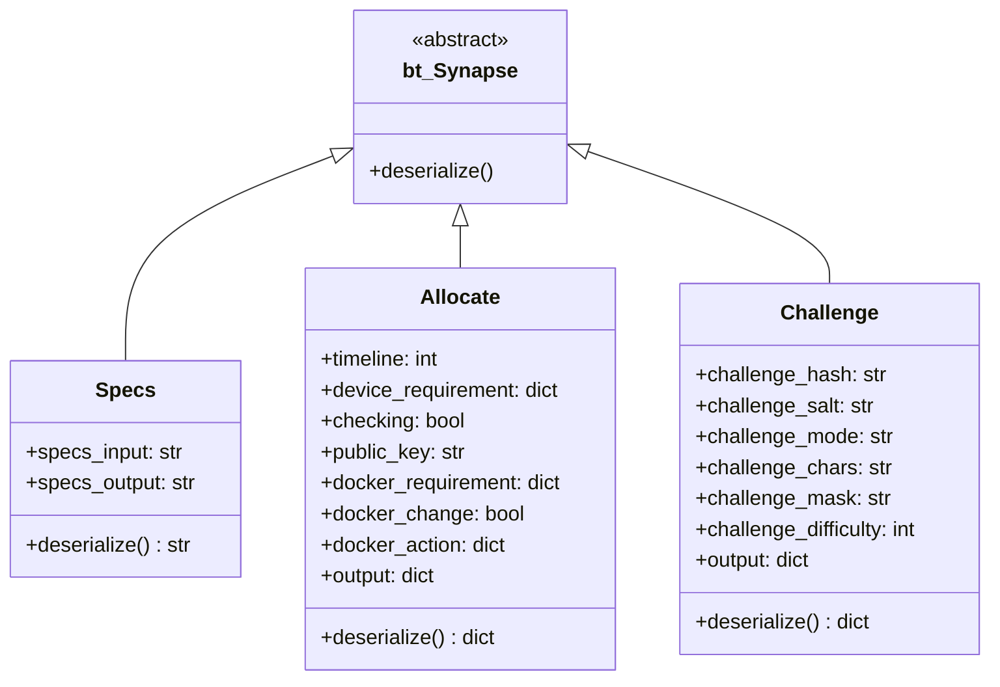
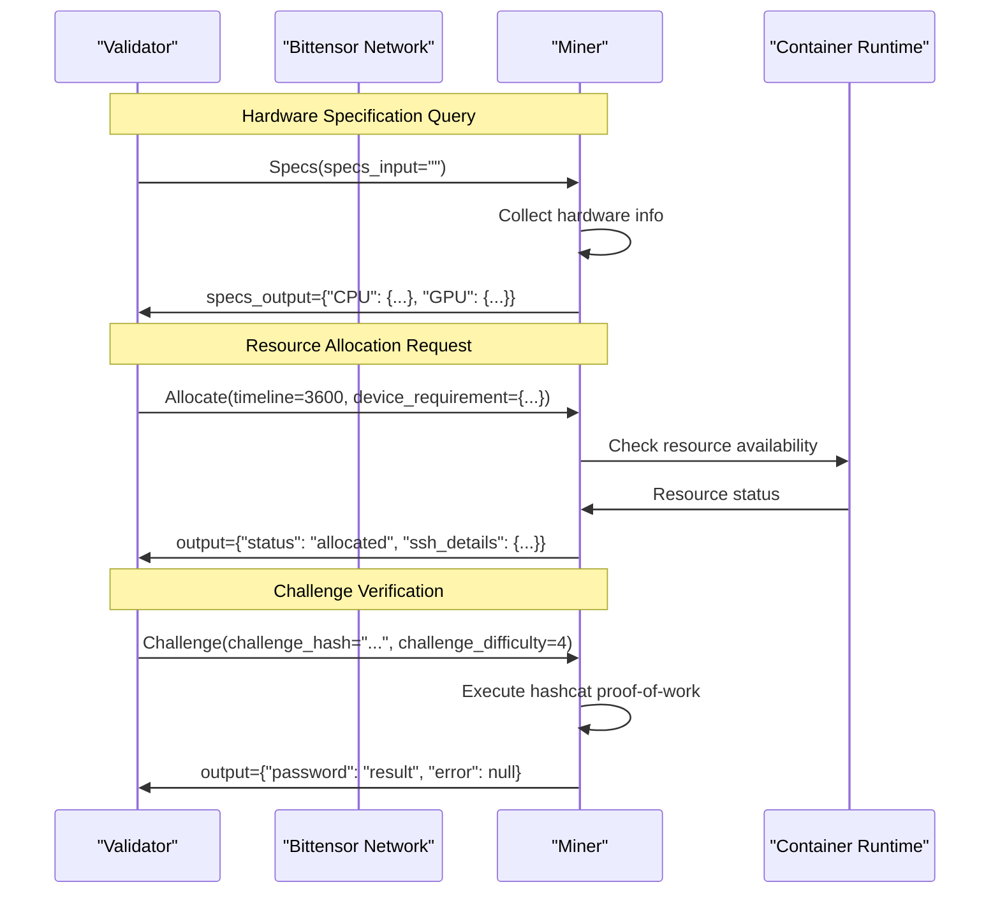
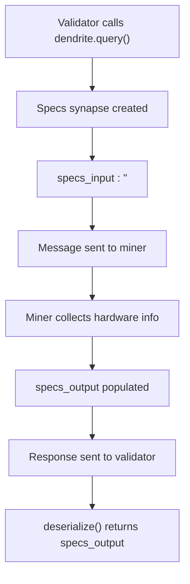
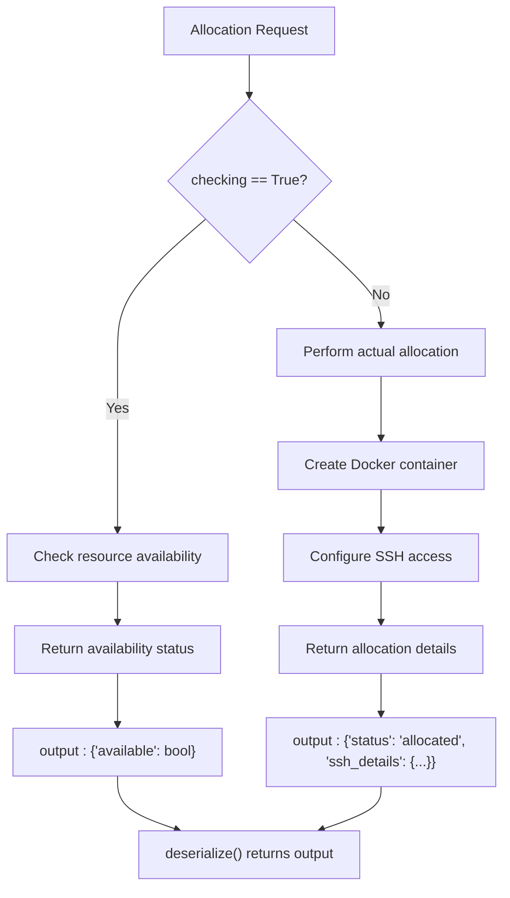
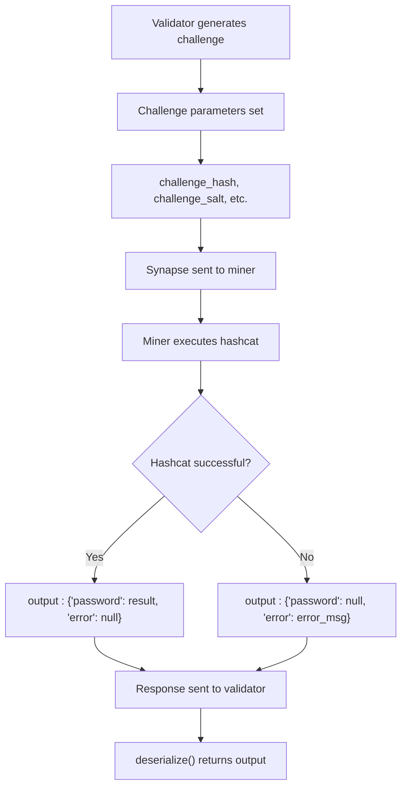

---

title: "Specs, Allocate, and Challenge Protocols"

---


import CollapsibleAside from '@components/CollapsibleAside.astro';

import SourceLink from '@components/SourceLink.astro';


<CollapsibleAside title="Relevant Source Files">

  <SourceLink text="compute/protocol.py" href="https://github.com/neuralinternet/SN27/blob/6261c454/compute/protocol.py" />

</CollapsibleAside>


This document covers the three core Bittensor synapse protocols used for communication between validators and miners in the NI Compute Subnet: hardware specification queries, resource allocation requests, and challenge-response mechanisms. These protocols form the foundational communication layer for the compute marketplace.

For information about custom Bittensor extensions and Axon modifications, see [Custom Axon and Subtensor](/communication-protocols/custom-axon-and-subtensor#5.2).

## Protocol Architecture

The NI Compute Subnet implements three primary communication protocols that extend Bittensor's `bt.Synapse` base class. Each protocol handles a specific aspect of the validator-miner interaction workflow.

### Protocol Inheritance Structure



**Sources:** <SourceLink text="compute/protocol.py:18-136" href="https://github.com/neuralinternet/SN27/blob/6261c454/compute/protocol.py#L18-L136" />

### Protocol Communication Flow



**Sources:** <SourceLink text="compute/protocol.py:23-135" href="https://github.com/neuralinternet/SN27/blob/6261c454/compute/protocol.py#L23-L135" />

## Specs Protocol

The `Specs` protocol handles hardware specification queries between validators and miners. It allows validators to discover the computational capabilities of available miners.

### Specs Protocol Structure

| Attribute | Type | Description |
|-----------|------|-------------|
| `specs_input` | `str` | Input data sent to miner (typically empty) |
| `specs_output` | `str` | Hardware specifications returned by miner |

### Specs Message Format

The `specs_output` contains detailed hardware information in the following format:

```json
{
  "CPU": {
    "count": 4,
    "vendor_id_raw": "AuthenticAMD",
    "brand_raw": "AMD Ryzen 7 3700X",
    "hz_advertised_friendly": "3.6 GHz"
  },
  "GPU": {
    "name": "NVIDIA GeForce RTX 3080",
    "memory_total": 10737418240,
    "compute_capability": "8.6"
  },
  "RAM": {
    "total": 34359738368,
    "available": 28991029248
  },
  "DISK": {
    "total": 1000204886016,
    "free": 750153424896
  }
}
```

### Specs Protocol Implementation



**Sources:** <SourceLink text="compute/protocol.py:23-57" href="https://github.com/neuralinternet/SN27/blob/6261c454/compute/protocol.py#L23-L57" />

## Allocate Protocol

The `Allocate` protocol manages resource allocation requests and Docker container provisioning. It supports both allocation checking and actual resource reservation.

### Allocate Protocol Attributes

| Attribute | Type | Default | Description |
|-----------|------|---------|-------------|
| `timeline` | `int` | `0` | Duration of allocation in seconds |
| `device_requirement` | `dict` | `{}` | Required hardware specifications |
| `checking` | `bool` | `True` | Flag for checking vs. actual allocation |
| `public_key` | `str` | `""` | RSA public key for encryption |
| `output` | `dict` | `{}` | Miner response with allocation details |
| `docker_requirement` | `dict` | See below | Docker container configuration |
| `docker_change` | `bool` | `False` | Flag for Docker configuration changes |
| `docker_action` | `dict` | See below | Docker action specifications |

### Docker Configuration Structure

The `docker_requirement` dictionary contains container configuration:

```python
{
    "base_image": "ubuntu",
    "ssh_key": "",
    "ssh_port": 4444,
    "volume_path": "/tmp",
    "dockerfile": ""
}
```

The `docker_action` dictionary specifies Docker operations:

```python
{
    "action": "",
    "ssh_key": "",
    "key_type": ""
}
```

### Allocate Protocol Workflow



**Sources:** <SourceLink text="compute/protocol.py:60-109" href="https://github.com/neuralinternet/SN27/blob/6261c454/compute/protocol.py#L60-L109" />

## Challenge Protocol

The `Challenge` protocol implements proof-of-work verification using hashcat for GPU capability validation. It ensures miners have the computational resources they claim.

### Challenge Protocol Attributes

| Attribute | Type | Default | Description |
|-----------|------|---------|-------------|
| `challenge_hash` | `str` | `""` | Target hash for proof-of-work |
| `challenge_salt` | `str` | `""` | Salt value for hash computation |
| `challenge_mode` | `str` | `""` | Hashcat attack mode |
| `challenge_chars` | `str` | `""` | Character set for brute force |
| `challenge_mask` | `str` | `""` | Password mask pattern |
| `challenge_difficulty` | `int` | `compute.pow_min_difficulty` | Minimum difficulty level |
| `output` | `dict` | `{}` | Challenge response with results |

### Challenge Response Format

The challenge response includes either a successful password result or error information:

```json
{
  "password": "found_password_or_null",
  "error": "error_message_if_failed"
}
```

### Challenge Verification Process



**Sources:** <SourceLink text="compute/protocol.py:112-135" href="https://github.com/neuralinternet/SN27/blob/6261c454/compute/protocol.py#L112-L135" />

## Protocol Integration

These protocols integrate with the broader NI Compute Subnet architecture through the Bittensor network layer and are used by both validators and miners for different purposes:

- **Validators** use these protocols to query miner capabilities, allocate resources, and verify computational claims
- **Miners** implement protocol handlers to respond to specification queries, manage resource allocation, and execute proof-of-work challenges
- **Resource Allocation API** leverages the `Allocate` protocol for external resource management requests

The protocols ensure secure, verifiable communication while maintaining compatibility with the Bittensor ecosystem.

**Sources:** <SourceLink text="compute/protocol.py:1-136" href="https://github.com/neuralinternet/SN27/blob/6261c454/compute/protocol.py#L1-L136" />