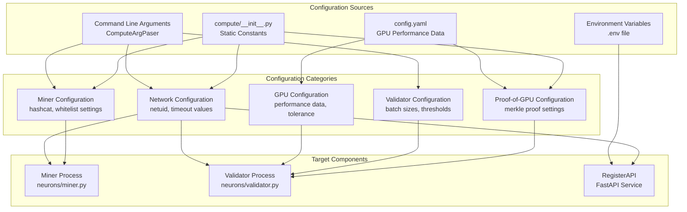
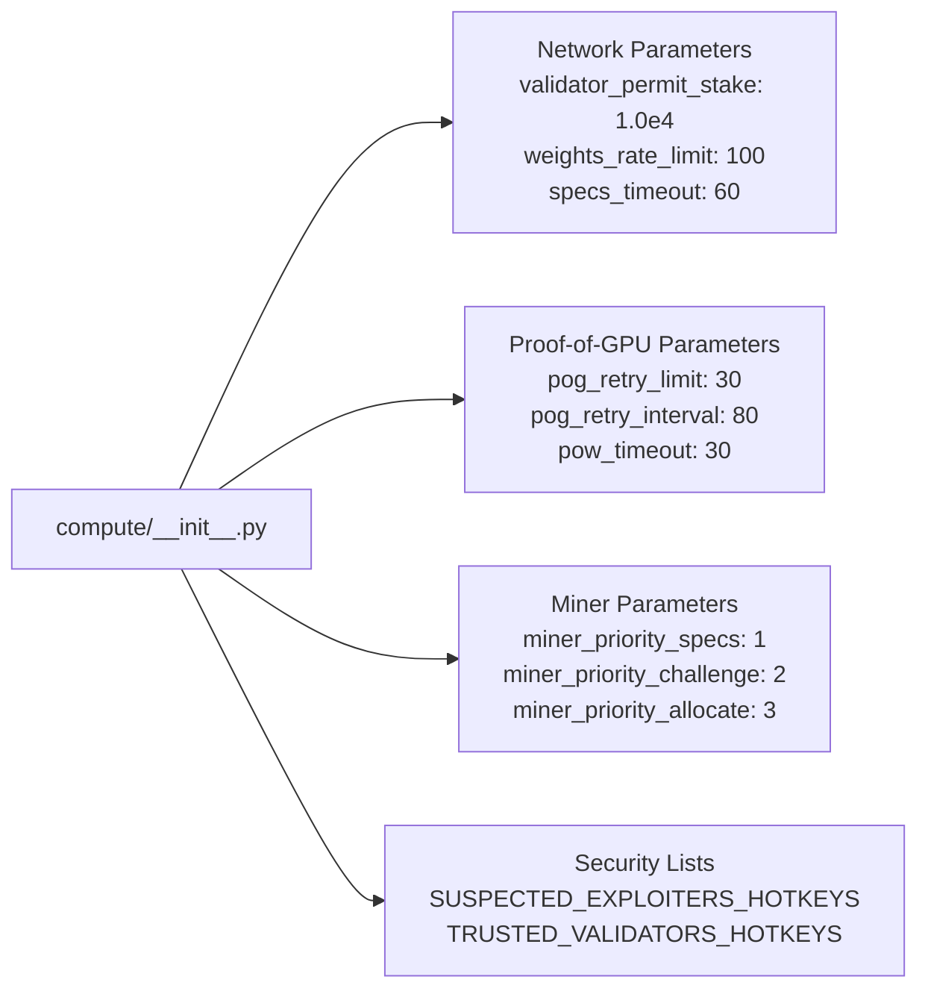
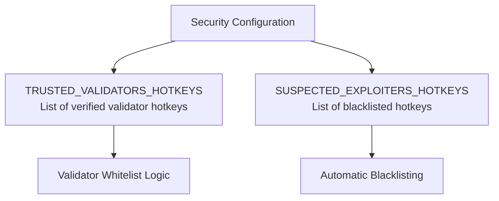
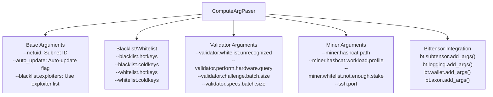
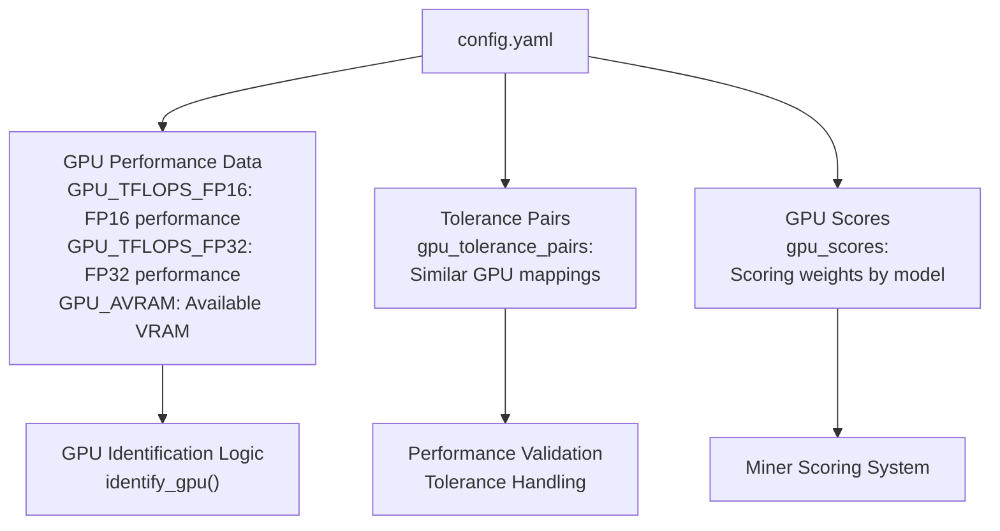
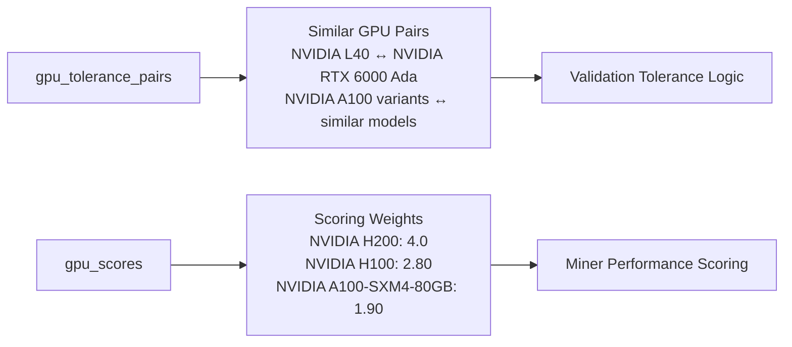
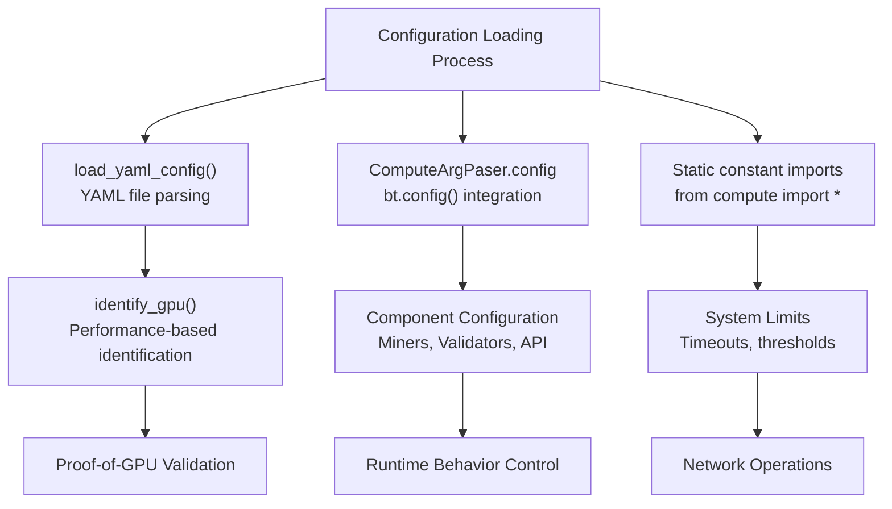
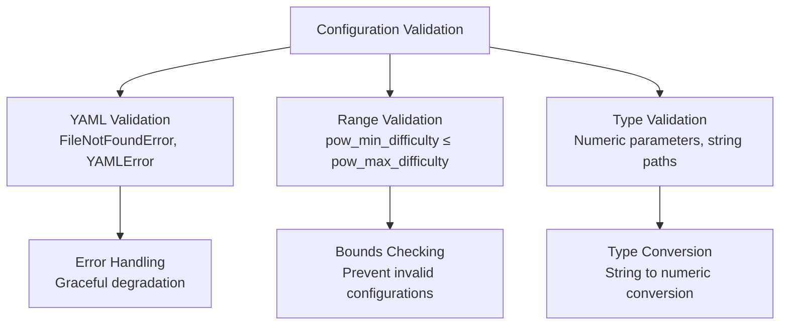

---

title: "Configuration"

---


import CollapsibleAside from '@components/CollapsibleAside.astro';

import SourceLink from '@components/SourceLink.astro';


<CollapsibleAside title="Relevant Source Files">

  <SourceLink text="README.md" href="https://github.com/neuralinternet/SN27/blob/6261c454/README.md" />

  <SourceLink text="compute/__init__.py" href="https://github.com/neuralinternet/SN27/blob/6261c454/compute/__init__.py" />

  <SourceLink text="compute/utils/math.py" href="https://github.com/neuralinternet/SN27/blob/6261c454/compute/utils/math.py" />

  <SourceLink text="compute/utils/parser.py" href="https://github.com/neuralinternet/SN27/blob/6261c454/compute/utils/parser.py" />

  <SourceLink text="config.yaml" href="https://github.com/neuralinternet/SN27/blob/6261c454/config.yaml" />

  <SourceLink text="neurons/Validator/database/miner.py" href="https://github.com/neuralinternet/SN27/blob/6261c454/neurons/Validator/database/miner.py" />

  <SourceLink text="neurons/Validator/database/pog.py" href="https://github.com/neuralinternet/SN27/blob/6261c454/neurons/Validator/database/pog.py" />

  <SourceLink text="neurons/Validator/miner_script_m_merkletree.py" href="https://github.com/neuralinternet/SN27/blob/6261c454/neurons/Validator/miner_script_m_merkletree.py" />

  <SourceLink text="neurons/Validator/pog.py" href="https://github.com/neuralinternet/SN27/blob/6261c454/neurons/Validator/pog.py" />

</CollapsibleAside>


## Purpose and Scope

This document covers the configuration system for the NI Compute Subnet, including static configuration constants, command-line argument parsing, GPU performance parameters, and runtime configuration options. The configuration system manages settings for validators, miners, and the resource allocation API across the entire compute subnet infrastructure.

For information about command-line argument usage in specific components, see [Command-line Arguments](/configuration/command-line-arguments#7.1). For GPU performance benchmarks and hardware-specific settings, see [GPU Performance Configuration](/configuration/gpu-performance-configuration#7.2).

## Configuration Architecture

The configuration system operates through multiple layers and sources that provide settings for different aspects of the compute subnet:



**Sources:** <SourceLink text="compute/__init__.py:1-93" href="https://github.com/neuralinternet/SN27/blob/6261c454/compute/__init__.py#L1-L93" />, <SourceLink text="config.yaml:1-104" href="https://github.com/neuralinternet/SN27/blob/6261c454/config.yaml#L1-L104" />, <SourceLink text="compute/utils/parser.py:1-170" href="https://github.com/neuralinternet/SN27/blob/6261c454/compute/utils/parser.py#L1-L170" />

## Static Configuration Constants

The compute subnet defines core system parameters as static constants in the main module. These constants control network behavior, validation timing, and system limits:

### Network and Validation Constants



Key configuration constants include:

| Category | Constant | Default Value | Purpose |
|----------|----------|---------------|---------|
| Network | `validator_permit_stake` | `1.0e4` | Minimum stake required for validator |
| Network | `weights_rate_limit` | `100` | Rate limit for weight updates |
| Validation | `specs_timeout` | `60` | Timeout for hardware specs queries |
| Proof-of-GPU | `pog_retry_limit` | `30` | Maximum PoG retry attempts |
| Proof-of-GPU | `pog_retry_interval` | `80` | Seconds between PoG retries |
| Proof-of-Work | `pow_min_difficulty` | `7` | Minimum PoW difficulty |
| Proof-of-Work | `pow_max_difficulty` | `12` | Maximum PoW difficulty |
| Miner | `miner_hashcat_location` | `"hashcat"` | Default hashcat binary path |

**Sources:** <SourceLink text="compute/__init__.py:29-58" href="https://github.com/neuralinternet/SN27/blob/6261c454/compute/__init__.py#L29-L58" />

### Security Configuration

The system maintains predefined lists of trusted validators and suspected exploiters:



**Sources:** <SourceLink text="compute/__init__.py:59-92" href="https://github.com/neuralinternet/SN27/blob/6261c454/compute/__init__.py#L59-L92" />

## Command-Line Argument System

The `ComputeArgPaser` class extends Python's `ArgumentParser` to provide comprehensive command-line configuration for both miners and validators:



### Argument Categories

The parser organizes arguments into logical categories:

| Category | Method | Arguments |
|----------|--------|-----------|
| Base | `__init__` | `netuid`, `auto_update`, blacklist/whitelist options |
| Validator | `add_validator_argument()` | batch sizes, hardware query settings, thresholds |
| Miner | `add_miner_argument()` | hashcat configuration, SSH port, whitelist settings |
| Bittensor | Built-in | subtensor, logging, wallet, axon arguments |

**Sources:** <SourceLink text="compute/utils/parser.py:8-71" href="https://github.com/neuralinternet/SN27/blob/6261c454/compute/utils/parser.py#L8-L71" />, <SourceLink text="compute/utils/parser.py:72-115" href="https://github.com/neuralinternet/SN27/blob/6261c454/compute/utils/parser.py#L72-L115" />, <SourceLink text="compute/utils/parser.py:116-166" href="https://github.com/neuralinternet/SN27/blob/6261c454/compute/utils/parser.py#L116-L166" />

## GPU Performance Configuration

The `config.yaml` file contains comprehensive GPU performance data used for validation and scoring:



### Performance Data Structure

The GPU configuration includes three main performance categories:

1. **FP16 Performance** (`GPU_TFLOPS_FP16`): Theoretical FP16 TFLOPS for each GPU model
2. **FP32 Performance** (`GPU_TFLOPS_FP32`): Theoretical FP32 TFLOPS for each GPU model  
3. **Available VRAM** (`GPU_AVRAM`): Effective VRAM capacity in GB

Example configuration structure:
```yaml
gpu_performance:
  GPU_TFLOPS_FP16:
    NVIDIA H100: 330
    NVIDIA A100-SXM4-80GB: 238.8
  GPU_TFLOPS_FP32:
    NVIDIA H100: 37.2
    NVIDIA A100-SXM4-80GB: 18.2
  GPU_AVRAM:
    NVIDIA H100: 34.36
    NVIDIA A100-SXM4-80GB: 34.36
```

**Sources:** <SourceLink text="config.yaml:1-94" href="https://github.com/neuralinternet/SN27/blob/6261c454/config.yaml#L1-L94" />

### GPU Tolerance and Scoring

The configuration defines tolerance pairs for GPUs with similar performance characteristics and assigns scoring weights:



**Sources:** <SourceLink text="config.yaml:63-94" href="https://github.com/neuralinternet/SN27/blob/6261c454/config.yaml#L63-L94" />

## Merkle Proof Configuration

The system includes specific configuration for Proof-of-GPU Merkle tree operations:

| Parameter | Default Value | Purpose |
|-----------|---------------|---------|
| `miner_script_path` | `"neurons/Validator/miner_script_m_merkletree.py"` | Path to Merkle proof script |
| `time_tolerance` | `5` | Time tolerance for proof verification |
| `submatrix_size` | `512` | Size of submatrices for proof generation |
| `hash_algorithm` | `'sha256'` | Hash algorithm for Merkle trees |
| `pog_retry_limit` | `22` | Maximum Proof-of-GPU retry attempts |
| `pog_retry_interval` | `60` | Seconds between PoG retries |
| `max_workers` | `64` | Maximum concurrent workers |
| `max_random_delay` | `900` | Maximum random delay in seconds |

**Sources:** <SourceLink text="config.yaml:95-104" href="https://github.com/neuralinternet/SN27/blob/6261c454/config.yaml#L95-L104" />

## Configuration Loading and Usage

The configuration system loads and applies settings through multiple mechanisms:



### Configuration Access Patterns

Components access configuration through several patterns:

1. **Static Import**: Direct import of constants from `compute` module
2. **YAML Loading**: Dynamic loading of GPU performance data via `load_yaml_config()`
3. **Argument Parsing**: Runtime configuration through `ComputeArgPaser.config`
4. **Environment Variables**: API keys and paths from `.env` files

**Sources:** <SourceLink text="neurons/Validator/pog.py:14-26" href="https://github.com/neuralinternet/SN27/blob/6261c454/neurons/Validator/pog.py#L14-L26" />, <SourceLink text="compute/utils/parser.py:70-71" href="https://github.com/neuralinternet/SN27/blob/6261c454/compute/utils/parser.py#L70-L71" />, <SourceLink text="compute/__init__.py:1-93" href="https://github.com/neuralinternet/SN27/blob/6261c454/compute/__init__.py#L1-L93" />

## Configuration Validation and Error Handling

The system includes validation mechanisms for configuration parameters:



The configuration system provides robust error handling for common issues:

- Missing configuration files (YAML not found)
- Invalid YAML syntax or structure
- Out-of-range numeric parameters
- Invalid GPU model specifications
- Missing required command-line arguments

**Sources:** <SourceLink text="neurons/Validator/pog.py:22-25" href="https://github.com/neuralinternet/SN27/blob/6261c454/neurons/Validator/pog.py#L22-L25" />, <SourceLink text="compute/utils/math.py:16-21" href="https://github.com/neuralinternet/SN27/blob/6261c454/compute/utils/math.py#L16-L21" />