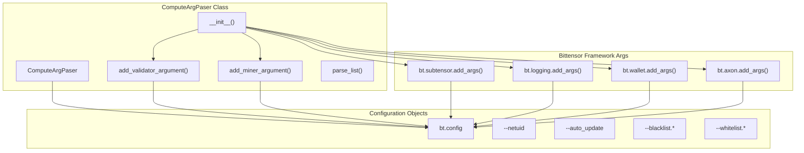
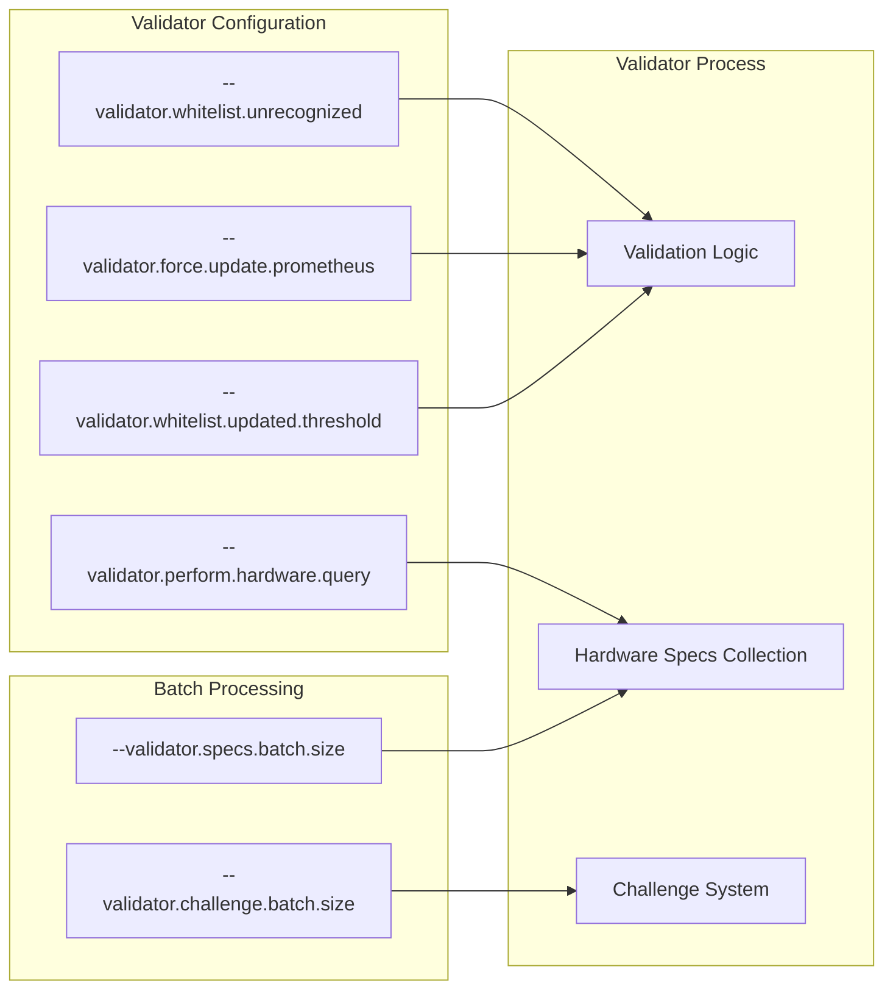
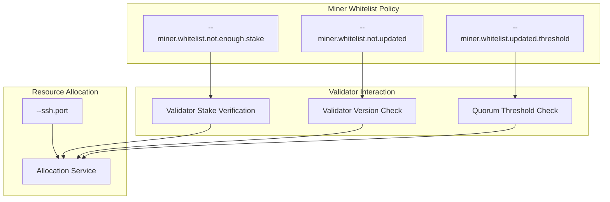
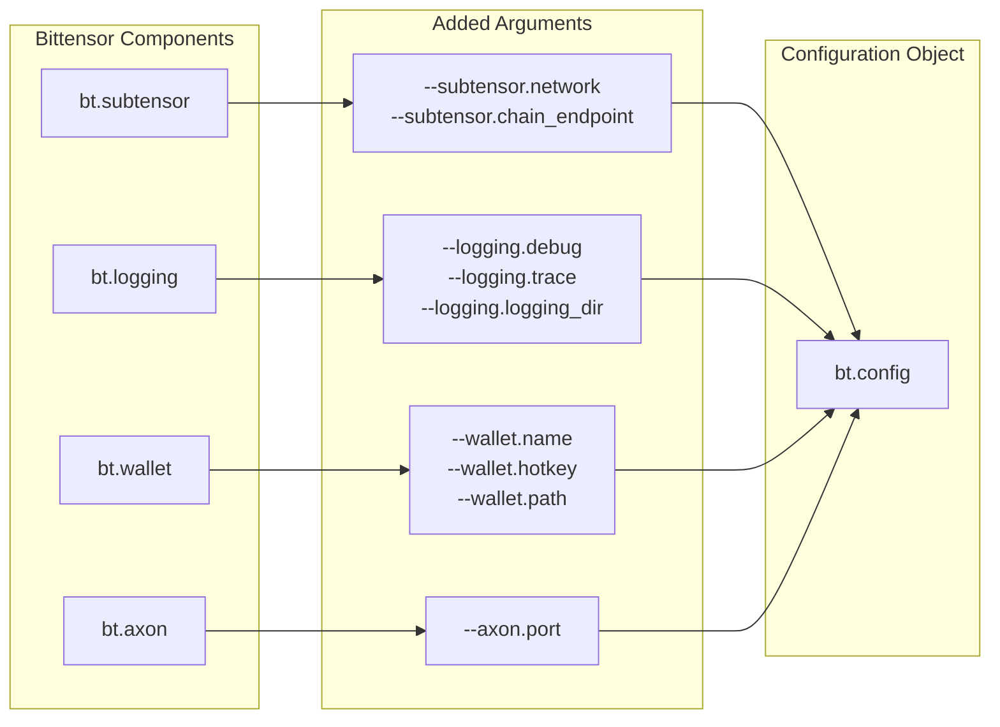

---

title: "Command-line Arguments"

---


import CollapsibleAside from '@components/CollapsibleAside.astro';

import SourceLink from '@components/SourceLink.astro';


<CollapsibleAside title="Relevant Source Files">

  <SourceLink text="README.md" href="https://github.com/neuralinternet/SN27/blob/6261c454/README.md" />

  <SourceLink text="compute/__init__.py" href="https://github.com/neuralinternet/SN27/blob/6261c454/compute/__init__.py" />

  <SourceLink text="compute/utils/parser.py" href="https://github.com/neuralinternet/SN27/blob/6261c454/compute/utils/parser.py" />

</CollapsibleAside>


This document provides a comprehensive reference for all command-line arguments available in the NI Compute Subnet. The arguments control the behavior of miners and validators, including network configuration, validation parameters, resource allocation settings, and security controls.

For information about GPU performance configuration parameters, see [GPU Performance Configuration](/configuration/gpu-performance-configuration#7.2). For details about using the registration CLI tools, see [Registration CLI](/cli-tools/registration-cli#8.1).

## Argument Parser Architecture

The command-line argument system is built using the `ComputeArgPaser` class, which extends Python's `argparse.ArgumentParser` to provide both compute subnet-specific arguments and inherited Bittensor framework arguments.

### Argument Parser Structure



Sources: <SourceLink text="compute/utils/parser.py:8-71" href="https://github.com/neuralinternet/SN27/blob/6261c454/compute/utils/parser.py#L8-L71" />

## Core Arguments

### Network Configuration

| Argument | Type | Default | Description |
|----------|------|---------|-------------|
| `--netuid` | int | 27 | The chain subnet UID (27 for mainnet, 15 for testnet) |
| `--auto_update` | flag | True | Automatically update the git repository |

The `--netuid` argument determines which Bittensor subnet the process connects to. The main production network uses netuid 27, while the test network uses netuid 15.

Sources: <SourceLink text="compute/utils/parser.py:12-22" href="https://github.com/neuralinternet/SN27/blob/6261c454/compute/utils/parser.py#L12-L22" />

### Security and Access Control

The subnet provides comprehensive blacklisting and whitelisting capabilities for both hotkeys and coldkeys:

| Argument | Type | Default | Description |
|----------|------|---------|-------------|
| `--blacklist.exploiters` | flag | True | Automatically blacklist known exploiter hotkeys |
| `--blacklist.hotkeys` | list | [] | Comma-separated list of hotkeys to blacklist |
| `--blacklist.coldkeys` | list | [] | Comma-separated list of coldkeys to blacklist |
| `--whitelist.hotkeys` | list | [] | Comma-separated list of hotkeys to whitelist |
| `--whitelist.coldkeys` | list | [] | Comma-separated list of coldkeys to whitelist |

The `--blacklist.exploiters` flag automatically applies the hardcoded list of suspected exploiter hotkeys defined in `SUSPECTED_EXPLOITERS_HOTKEYS`.

Sources: <SourceLink text="compute/utils/parser.py:24-57" href="https://github.com/neuralinternet/SN27/blob/6261c454/compute/utils/parser.py#L24-L57" />, <SourceLink text="compute/__init__.py:60-77" href="https://github.com/neuralinternet/SN27/blob/6261c454/compute/__init__.py#L60-L77" />

## Validator Arguments

Validators use specialized arguments to control their validation behavior, hardware querying, and performance parameters.

### Validation Control Arguments



| Argument | Type | Default | Description |
|----------|------|---------|-------------|
| `--validator.whitelist.unrecognized` | flag | False | Whitelist unrecognized miners |
| `--validator.perform.hardware.query` | bool | True | Enable hardware specs collection from miners |
| `--validator.challenge.batch.size` | int | 256 | Batch size for challenge processing |
| `--validator.specs.batch.size` | int | 64 | Batch size for hardware specs queries |
| `--validator.force.update.prometheus` | flag | False | Force Prometheus version update |
| `--validator.whitelist.updated.threshold` | int | 60 | Quorum threshold percentage for whitelisting |

The batch size arguments allow validators with lower hardware specifications to reduce memory and processing load by processing smaller batches of miners at a time.

Sources: <SourceLink text="compute/utils/parser.py:72-114" href="https://github.com/neuralinternet/SN27/blob/6261c454/compute/utils/parser.py#L72-L114" />

## Miner Arguments

Miners have specialized arguments for hashcat configuration, resource allocation, and validator interaction policies.

### Hashcat Configuration

| Argument | Type | Default | Description |
|----------|------|---------|-------------|
| `--miner.hashcat.path` | str | "hashcat" | Path to the hashcat binary executable |
| `--miner.hashcat.workload.profile` | str | "3" | Performance profile (1=Low, 2=Economic, 3=High, 4=Insane) |
| `--miner.hashcat.extended.options` | str | "" | Additional hashcat command-line options |

The hashcat configuration controls how miners respond to Proof-of-Work challenges. The workload profile directly impacts the computational intensity and power consumption.

Sources: <SourceLink text="compute/utils/parser.py:117-137" href="https://github.com/neuralinternet/SN27/blob/6261c454/compute/utils/parser.py#L117-L137" />, <SourceLink text="compute/__init__.py:55-57" href="https://github.com/neuralinternet/SN27/blob/6261c454/compute/__init__.py#L55-L57" />

### Miner Security and Validation Policies



| Argument | Type | Default | Description |
|----------|------|---------|-------------|
| `--miner.whitelist.not.enough.stake` | flag | False | Accept validators without sufficient stake |
| `--miner.whitelist.not.updated` | flag | False | Accept validators not using latest code version |
| `--miner.whitelist.updated.threshold` | int | 60 | Quorum threshold percentage before applying whitelist |
| `--ssh.port` | int | 4444 | SSH port for resource allocation service |

These security policies allow miners to control which validators they accept requests from based on stake requirements and code version compliance.

Sources: <SourceLink text="compute/utils/parser.py:138-165" href="https://github.com/neuralinternet/SN27/blob/6261c454/compute/utils/parser.py#L138-L165" />

## Inherited Bittensor Arguments

The argument parser incorporates standard Bittensor framework arguments through method calls that extend the parser with additional argument groups.

### Bittensor Framework Integration



### Subtensor Arguments
- `--subtensor.network`: Network endpoint (finney, test, or custom)
- `--subtensor.chain_endpoint`: Custom blockchain endpoint URL

### Logging Arguments
- `--logging.debug`: Enable debug-level logging
- `--logging.trace`: Enable trace-level logging
- `--logging.logging_dir`: Directory for log files

### Wallet Arguments
- `--wallet.name`: Coldkey wallet name
- `--wallet.hotkey`: Hotkey name
- `--wallet.path`: Custom wallet directory path

### Axon Arguments
- `--axon.port`: Port for serving the axon (default: 8091)

Sources: <SourceLink text="compute/utils/parser.py:61-70" href="https://github.com/neuralinternet/SN27/blob/6261c454/compute/utils/parser.py#L61-L70" />

## Usage Examples

### Miner Command Line

```bash
pm2 start ./neurons/miner.py --name MINER_NAME --interpreter python3 -- \
  --netuid 27 \
  --subtensor.network finney \
  --wallet.name COLDKEY_NAME \
  --wallet.hotkey HOTKEY_NAME \
  --axon.port 8091 \
  --ssh.port 4444 \
  --logging.debug \
  --auto_update
```

### Validator Command Line

```bash
pm2 start ./neurons/validator.py --name VALIDATOR_NAME --interpreter python3 -- \
  --netuid 27 \
  --subtensor.network finney \
  --wallet.name COLDKEY_NAME \
  --wallet.hotkey HOTKEY_NAME \
  --validator.specs.batch.size 64 \
  --validator.challenge.batch.size 256 \
  --logging.debug \
  --auto_update
```

### Advanced Configuration Examples

For miners with custom hashcat optimization:
```bash
--miner.hashcat.workload.profile 4 \
--miner.hashcat.extended.options "-O --force"
```

For validators with restrictive whitelisting:
```bash
--validator.whitelist.updated.threshold 80 \
--blacklist.exploiters \
--blacklist.hotkeys "5HZ1ATsziEMDm1iUqNWQatfEDb1JSNf37AiG8s3X4pZzoP3A"
```

Sources: <SourceLink text="README.md:362-425" href="https://github.com/neuralinternet/SN27/blob/6261c454/README.md#L362-L425" />