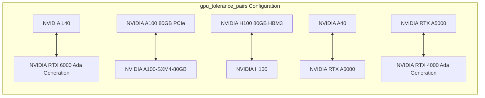
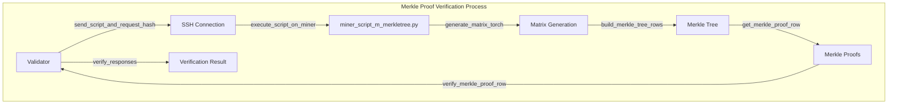
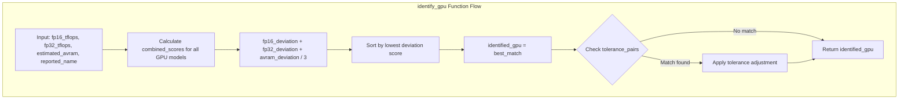
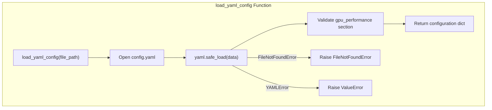

---

title: "GPU Performance Configuration"

---


import CollapsibleAside from '@components/CollapsibleAside.astro';

import SourceLink from '@components/SourceLink.astro';


<CollapsibleAside title="Relevant Source Files">

  <SourceLink text="compute/__init__.py" href="https://github.com/neuralinternet/SN27/blob/6261c454/compute/__init__.py" />

  <SourceLink text="compute/utils/math.py" href="https://github.com/neuralinternet/SN27/blob/6261c454/compute/utils/math.py" />

  <SourceLink text="config.yaml" href="https://github.com/neuralinternet/SN27/blob/6261c454/config.yaml" />

  <SourceLink text="neurons/Validator/database/miner.py" href="https://github.com/neuralinternet/SN27/blob/6261c454/neurons/Validator/database/miner.py" />

  <SourceLink text="neurons/Validator/database/pog.py" href="https://github.com/neuralinternet/SN27/blob/6261c454/neurons/Validator/database/pog.py" />

  <SourceLink text="neurons/Validator/miner_script_m_merkletree.py" href="https://github.com/neuralinternet/SN27/blob/6261c454/neurons/Validator/miner_script_m_merkletree.py" />

  <SourceLink text="neurons/Validator/pog.py" href="https://github.com/neuralinternet/SN27/blob/6261c454/neurons/Validator/pog.py" />

</CollapsibleAside>


## Overview

This document details the GPU performance configuration system used for Proof-of-GPU validation in the NI Compute subnet. It covers the performance benchmarks, tolerance settings, identification logic, and Merkle proof parameters that enable validators to verify miner GPU capabilities. For overall system configuration options, see [Command-line Arguments](/configuration/command-line-arguments#7.1).

The GPU performance configuration consists of several key components:
- Performance benchmark data (TFLOPS, AVRAM) for GPU identification
- Tolerance pairs for handling equivalent GPU models  
- Merkle proof parameters for cryptographic verification
- Benchmarking timeouts and retry limits

Sources: <SourceLink text="config.yaml:1-104" href="https://github.com/neuralinternet/SN27/blob/6261c454/config.yaml#L1-L104" />, <SourceLink text="compute/__init__.py:37-48" href="https://github.com/neuralinternet/SN27/blob/6261c454/compute/__init__.py#L37-L48" />

## GPU Performance Benchmarks

The system maintains comprehensive performance data for GPU models in `config.yaml` under the `gpu_performance` section. This data enables accurate GPU identification and performance verification through three key metrics:

### Performance Data Structure

**FP16 TFLOPS Configuration**
```yaml
GPU_TFLOPS_FP16:
  NVIDIA B200: 1205
  NVIDIA H200: 610
  NVIDIA H100 80GB HBM3: 570
  NVIDIA A100-SXM4-80GB: 238.8
```

**FP32 TFLOPS Configuration**  
```yaml
GPU_TFLOPS_FP32:
  NVIDIA B200: 67.2
  NVIDIA H200: 49.6
  NVIDIA H100 80GB HBM3: 49.0
  NVIDIA A100-SXM4-80GB: 18.2
```

**VRAM Configuration**
```yaml
GPU_AVRAM:
  NVIDIA B200: 68.72
  NVIDIA H200: 68.72
  NVIDIA H100 80GB HBM3: 34.36
  NVIDIA A100-SXM4-80GB: 34.36
```

### GPU Performance Ranking

The `gpu_scores` section assigns relative performance values used by the scoring system:

| GPU Model | Performance Score |
|-----------|------------------|
| NVIDIA B200 | 5.00 |
| NVIDIA H200 | 4.0 |
| NVIDIA H100 80GB HBM3 | 3.30 |
| NVIDIA H100 | 2.80 |
| NVIDIA A100-SXM4-80GB | 1.90 |
| NVIDIA L40s | 0.90 |
| NVIDIA RTX 6000 Ada Generation | 0.83 |
| NVIDIA RTX 4090 | 0.68 |

Sources: <SourceLink text="config.yaml:1-94" href="https://github.com/neuralinternet/SN27/blob/6261c454/config.yaml#L1-L94" />

## GPU Tolerance Configuration

The system handles functionally equivalent GPU models through tolerance pairs that prevent false negatives during GPU identification. This mechanism accounts for naming variations and similar performance characteristics.

### Tolerance Pairs Configuration



### Tolerance Implementation

The `identify_gpu` function in `neurons/Validator/pog.py` applies tolerance logic during GPU identification:

```python
# Check if identified GPU matches the tolerance pair
if identified_gpu in tolerance_pairs and reported_name == tolerance_pairs.get(identified_gpu):
    identified_gpu = reported_name
# Check reverse mapping
elif reported_name in tolerance_pairs and identified_gpu == tolerance_pairs.get(reported_name):
    identified_gpu = reported_name
```

This allows miners with equivalent hardware to receive consistent identification regardless of minor naming differences.

Sources: <SourceLink text="config.yaml:63-73" href="https://github.com/neuralinternet/SN27/blob/6261c454/config.yaml#L63-L73" />, <SourceLink text="neurons/Validator/pog.py:27-73" href="https://github.com/neuralinternet/SN27/blob/6261c454/neurons/Validator/pog.py#L27-L73" />

## Merkle Proof Configuration

The Proof-of-GPU system uses Merkle tree verification to cryptographically validate GPU computations. The merkle proof configuration parameters control this verification process.

### Merkle Proof Parameters

```yaml
merkle_proof:
  miner_script_path: "neurons/Validator/miner_script_m_merkletree.py"
  time_tolerance: 5
  submatrix_size: 512
  hash_algorithm: 'sha256'
  pog_retry_limit: 22
  pog_retry_interval: 60  # seconds
  max_workers: 64
  max_random_delay: 900  # 900 seconds
```

### Merkle Tree Process Flow



### Implementation Components

The Merkle proof system involves several key functions:
- `send_script_and_request_hash()`: Transfers and verifies the benchmark script
- `execute_script_on_miner()`: Runs computation modes (benchmark/compute/proof)
- `build_merkle_tree_rows()`: Constructs Merkle trees from computation results
- `verify_merkle_proof_row()`: Validates individual proof elements
- `verify_responses()`: Performs overall verification with failure tolerance

Sources: <SourceLink text="config.yaml:95-104" href="https://github.com/neuralinternet/SN27/blob/6261c454/config.yaml#L95-L104" />, <SourceLink text="neurons/Validator/pog.py:75-340" href="https://github.com/neuralinternet/SN27/blob/6261c454/neurons/Validator/pog.py#L75-L340" />

## Benchmarking Parameters

The system uses several timeout and retry parameters to ensure reliable GPU performance validation while handling network and hardware variations.

### Core PoG Parameters

From `compute/__init__.py`:
```python
# Proof of GPU settings
pog_retry_limit = 30
pog_retry_interval = 80  # seconds
specs_timeout = 60  # Time before specs requests timeout
```

### Benchmark Execution Flow

```mermaid
flowchart TD
    subgraph "GPU Benchmarking Process"
        start["Validator initiates PoG"] --> send["send_script_and_request_hash()"]
        send --> verify["Verify script hash"]
        verify --> benchmark["execute_script_on_miner(mode='benchmark')"]
        benchmark --> parse["parse_benchmark_output()"]
        parse --> compute["execute_script_on_miner(mode='compute')"]
        compute --> merkle["parse_merkle_output()"]
        merkle --> proof["execute_script_on_miner(mode='proof')"]
        proof --> validate["verify_responses()"]
        validate --> result["GPU identification & scoring"]
    end
```



### Benchmark Output Parsing

The `parse_benchmark_output` function processes miner responses:
```python
num_gpus, vram, size_fp16, time_fp16, size_fp32, time_fp32 = parse_benchmark_output(output)
```

This extracts:
- GPU count
- Available VRAM 
- FP16 matrix size and execution time
- FP32 matrix size and execution time

These values are then used by `identify_gpu()` to match against the performance database.

Sources: <SourceLink text="compute/__init__.py:37-48" href="https://github.com/neuralinternet/SN27/blob/6261c454/compute/__init__.py#L37-L48" />, <SourceLink text="neurons/Validator/pog.py:101-146" href="https://github.com/neuralinternet/SN27/blob/6261c454/neurons/Validator/pog.py#L101-L146" />

## GPU Identification Logic

The core GPU identification process combines performance benchmarking with tolerance-aware matching to accurately identify miner hardware capabilities.

### Identification Algorithm



### Performance Deviation Calculation

The `identify_gpu` function calculates deviation scores for each GPU model:

```python
fp16_deviation = abs(fp16_tflops - fp16_theoretical) / fp16_theoretical
fp32_deviation = abs(fp32_tflops - fp32_theoretical) / fp32_theoretical  
avram_deviation = abs(estimated_avram - avram_theoretical) / avram_theoretical
combined_score = (fp16_deviation + fp32_deviation + avram_deviation) / 3
```

The GPU with the lowest combined deviation score is selected as the identified model.

### Benchmark Script Integration

The `miner_script_m_merkletree.py` script provides multiple execution modes:
- `benchmark`: Matrix multiplication performance testing
- `compute`: Merkle tree computation with PRNG matrices
- `proof`: Generate cryptographic proofs for verification
- `gpu_info`: Basic GPU detection and enumeration

Sources: <SourceLink text="neurons/Validator/pog.py:27-73" href="https://github.com/neuralinternet/SN27/blob/6261c454/neurons/Validator/pog.py#L27-L73" />, <SourceLink text="neurons/Validator/miner_script_m_merkletree.py:21-388" href="https://github.com/neuralinternet/SN27/blob/6261c454/neurons/Validator/miner_script_m_merkletree.py#L21-L388" />

## Configuration Loading and Validation

The GPU performance configuration is loaded and validated through the YAML configuration system with error handling for missing or malformed data.

### Configuration Loading Process



### Configuration Structure Access

The loaded configuration provides access to all GPU performance data:

```python
gpu_data = load_yaml_config("config.yaml")
GPU_TFLOPS_FP16 = gpu_data["gpu_performance"]["GPU_TFLOPS_FP16"]
GPU_TFLOPS_FP32 = gpu_data["gpu_performance"]["GPU_TFLOPS_FP32"] 
GPU_AVRAM = gpu_data["gpu_performance"]["GPU_AVRAM"]
tolerance_pairs = gpu_data["gpu_performance"]["gpu_tolerance_pairs"]
```

### Database Integration

GPU configuration data is persisted using database functions:
- `update_pog_stats()`: Stores GPU name and count for miners
- `get_pog_specs()`: Retrieves most recent GPU specifications
- `write_stats()`: Stores comprehensive performance data with JSON serialization

Sources: <SourceLink text="neurons/Validator/pog.py:14-26" href="https://github.com/neuralinternet/SN27/blob/6261c454/neurons/Validator/pog.py#L14-L26" />, <SourceLink text="neurons/Validator/database/pog.py:24-98" href="https://github.com/neuralinternet/SN27/blob/6261c454/neurons/Validator/database/pog.py#L24-L98" />

## Implementation Details

### Key Components

1. **GPU Performance Configuration**: Defined in `config.yaml`
2. **Score Calculation Logic**: Implemented in `neurons/Validator/calculate_pow_score.py`
3. **GPU Data Storage**: Managed by functions in `neurons/Validator/database/pog.py`
4. **Mathematical Utilities**: Provided in `compute/utils/math.py`

### Database Interaction

GPU specifications are stored in the database using JSON serialization:

```python
# Convert dict to JSON string for storage
if isinstance(raw_specs, dict):
    gpu_specs = json.dumps(raw_specs)
else:
    gpu_specs = raw_specs

# When retrieving
raw_gpu_specs = row[2]
if raw_gpu_specs:
    try:
        gpu_specs = json.loads(raw_gpu_specs)  # Convert from JSON -> dict
    except Exception as e:
        gpu_specs = None
```

This allows flexible storage of different GPU configurations while maintaining a structured database schema.

Sources: <SourceLink text="neurons/Validator/database/pog.py:100-186" href="https://github.com/neuralinternet/SN27/blob/6261c454/neurons/Validator/database/pog.py#L100-L186" />