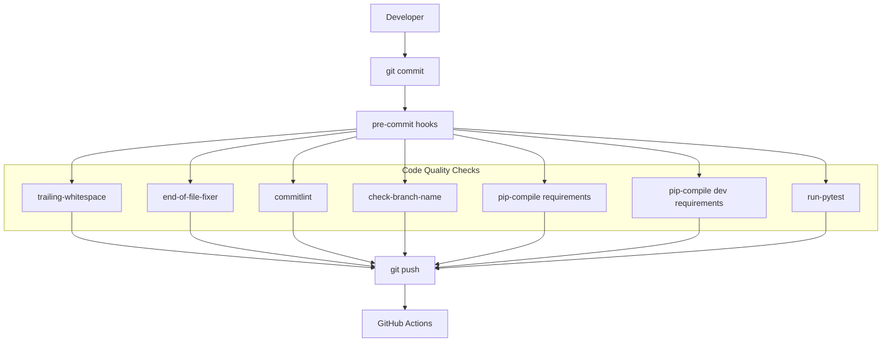
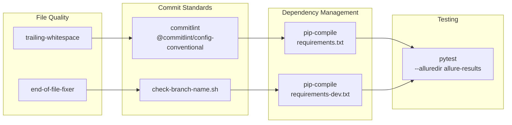
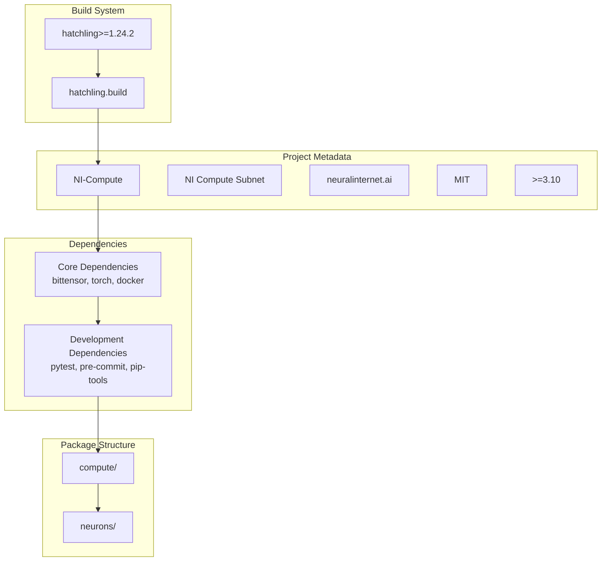
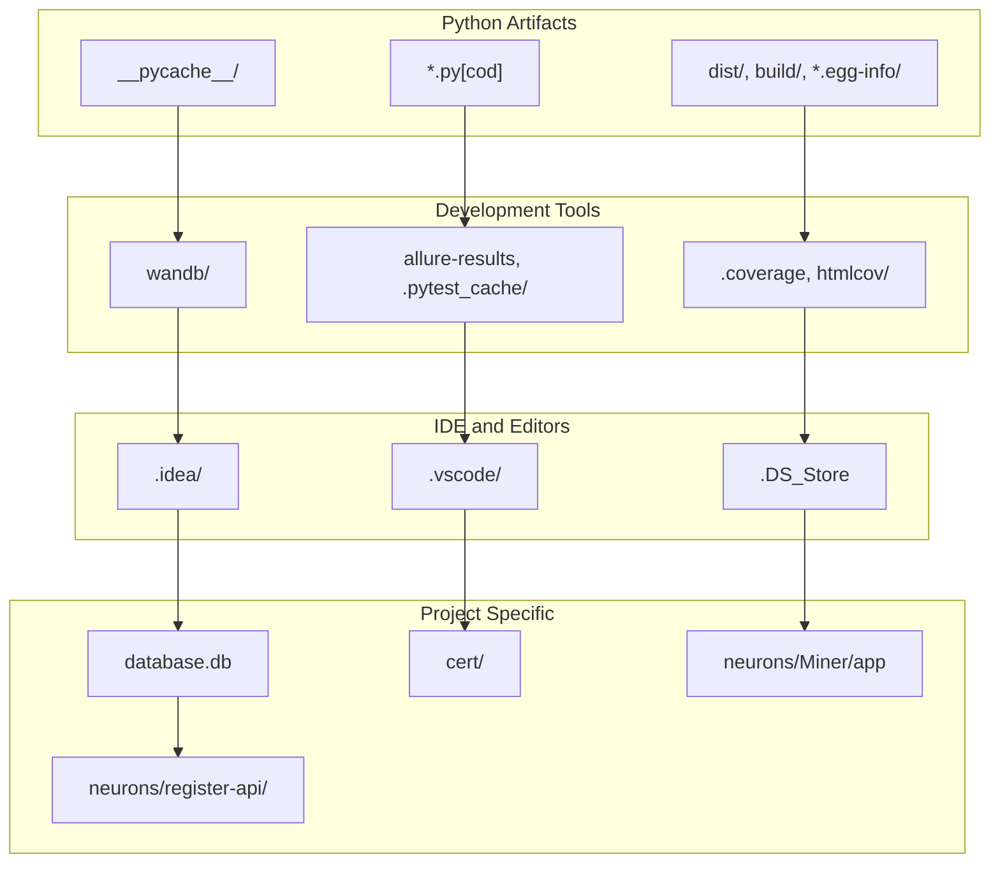

---

title: "Development"

---


import CollapsibleAside from '@components/CollapsibleAside.astro';

import SourceLink from '@components/SourceLink.astro';


<CollapsibleAside title="Relevant Source Files">

  <SourceLink text=".github/workflows/pre-commit.yml" href="https://github.com/neuralinternet/SN27/blob/6261c454/.github/workflows/pre-commit.yml" />

  <SourceLink text=".gitignore" href="https://github.com/neuralinternet/SN27/blob/6261c454/.gitignore" />

  <SourceLink text=".pre-commit-config.yaml" href="https://github.com/neuralinternet/SN27/blob/6261c454/.pre-commit-config.yaml" />

  <SourceLink text="pyproject.toml" href="https://github.com/neuralinternet/SN27/blob/6261c454/pyproject.toml" />

  <SourceLink text="requirements-dev.txt" href="https://github.com/neuralinternet/SN27/blob/6261c454/requirements-dev.txt" />

  <SourceLink text="scripts/check-branch-name.sh" href="https://github.com/neuralinternet/SN27/blob/6261c454/scripts/check-branch-name.sh" />

  <SourceLink text="scripts/check-current-branch.sh" href="https://github.com/neuralinternet/SN27/blob/6261c454/scripts/check-current-branch.sh" />

</CollapsibleAside>


This document covers the development workflows, code quality tools, and project structure for the NI Compute Subnet codebase. It includes pre-commit hooks, branch naming conventions, dependency management, and testing infrastructure that ensures code quality and maintainability.

For information about specific CLI tools used in development, see [CLI Tools](/cli-tools#8). For details about system configuration, see [Configuration](/configuration#7).

## Development Workflow Overview

The development process enforces code quality through automated checks and standardized workflows. The system uses pre-commit hooks, branch naming validation, and continuous integration to maintain code standards.

### Pre-commit Hook System



Sources: <SourceLink text=".pre-commit-config.yaml:1-64" href="https://github.com/neuralinternet/SN27/blob/6261c454/.pre-commit-config.yaml#L1-L64" />, <SourceLink text=".github/workflows/pre-commit.yml:1-22" href="https://github.com/neuralinternet/SN27/blob/6261c454/.github/workflows/pre-commit.yml#L1-L22" />

### Branch Naming Convention

The codebase enforces strict branch naming conventions through the `check-branch-name.sh` script:

| Branch Type | Format | Example |
|-------------|--------|---------|
| Feature | `feat/CSN-XXXX-description` | `feat/CSN-1234-add-gpu-monitoring` |
| Bugfix | `fix/CSN-XXXX-description` | `fix/CSN-5678-memory-leak` |
| Hotfix | `hotfix/vX.Y.Z-CSN-XXXX-description` | `hotfix/v1.2.3-CSN-1234-critical-fix` |
| Release | `release/vX.Y.Z` | `release/v1.2.3` |
| Protected | `main`, `dev` | No validation required |

**Branch Validation Rules:**
- Must include JIRA ticket format: `CSN-XXXX` (where XXXX is any number of digits)
- Description must be lowercase, kebab-case (hyphens only)
- No underscores, spaces, or special characters in description
- Must start with allowed prefix: `feat`, `fix`, `hotfix`, `chore`, `refactor`, `test`, `spike`, `prototype`, `release`, `docs`

Sources: <SourceLink text="scripts/check-branch-name.sh:1-114" href="https://github.com/neuralinternet/SN27/blob/6261c454/scripts/check-branch-name.sh#L1-L114" />, <SourceLink text="scripts/check-current-branch.sh:1-7" href="https://github.com/neuralinternet/SN27/blob/6261c454/scripts/check-current-branch.sh#L1-L7" />

## Code Quality Enforcement

### Pre-commit Hook Configuration

The pre-commit system runs multiple quality checks before allowing commits:



Sources: <SourceLink text=".pre-commit-config.yaml:1-64" href="https://github.com/neuralinternet/SN27/blob/6261c454/.pre-commit-config.yaml#L1-L64" />

### Continuous Integration

GitHub Actions runs the same pre-commit checks on pull requests and pushes to `dev` and `main` branches:

```yaml
# Workflow triggers
on:
  pull_request:
  push:
    branches: ["dev", "main"]
```

The CI pipeline installs dependencies and runs all pre-commit hooks to ensure code quality standards are maintained across the repository.

Sources: <SourceLink text=".github/workflows/pre-commit.yml:1-22" href="https://github.com/neuralinternet/SN27/blob/6261c454/.github/workflows/pre-commit.yml#L1-L22" />

## Project Structure and Dependencies

### Project Configuration

The project uses `pyproject.toml` for modern Python packaging and dependency management:



Sources: <SourceLink text="pyproject.toml:1-97" href="https://github.com/neuralinternet/SN27/blob/6261c454/pyproject.toml#L1-L97" />

### Dependency Management

The project uses `pip-tools` for dependency resolution and pinning:

| File | Purpose | Generation Command |
|------|---------|-------------------|
| `requirements.txt` | Production dependencies | `pip-compile pyproject.toml` |
| `requirements-dev.txt` | Development dependencies | `pip-compile --extra dev pyproject.toml` |

**Key Dependencies:**
- **Core**: `bittensor==9.0.0`, `torch==2.5.1`, `docker==7.0.0`
- **GPU/Compute**: `GPUtil==1.4.0`, `igpu==0.1.2`, `numpy==2.0.2`
- **Security**: `cryptography==43.0.1`, `paramiko==3.4.1`
- **Monitoring**: `wandb==0.19.0`, `psutil==5.9.8`
- **Development**: `pytest`, `pre-commit`, `allure-pytest`

Sources: <SourceLink text="pyproject.toml:36-69" href="https://github.com/neuralinternet/SN27/blob/6261c454/pyproject.toml#L36-L69" />, <SourceLink text="requirements-dev.txt:1-418" href="https://github.com/neuralinternet/SN27/blob/6261c454/requirements-dev.txt#L1-L418" />

### Testing Configuration

The project uses `pytest` with coverage reporting and Allure for test reporting:

```toml
[tool.pytest.ini_options]
addopts = "-v --cov=. --cov-report=term-missing"
testpaths = ["tests"]
```

Tests are automatically run during pre-commit with Allure results generation:
```bash
python -m pytest --alluredir allure-results
```

Sources: <SourceLink text="pyproject.toml:92-97" href="https://github.com/neuralinternet/SN27/blob/6261c454/pyproject.toml#L92-L97" />, <SourceLink text=".pre-commit-config.yaml:56-63" href="https://github.com/neuralinternet/SN27/blob/6261c454/.pre-commit-config.yaml#L56-L63" />

## File Organization and Exclusions

### Git Ignore Patterns

The `.gitignore` file excludes development artifacts and sensitive data:



Sources: <SourceLink text=".gitignore:1-263" href="https://github.com/neuralinternet/SN27/blob/6261c454/.gitignore#L1-L263" />

### Build Configuration

The project packages include:
- `compute/` - Core compute subnet logic
- `neurons/` - Validator and miner implementations

Build artifacts are excluded from the source distribution:
```toml
[tool.hatch.build.targets.sdist]
exclude = ["/.github"]
```

Version information is managed through `compute/__init__.py`:
```toml
[tool.hatch.version]
path = "compute/__init__.py"
```

Sources: <SourceLink text="pyproject.toml:78-91" href="https://github.com/neuralinternet/SN27/blob/6261c454/pyproject.toml#L78-L91" />