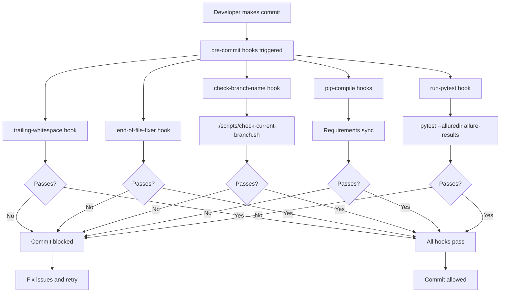
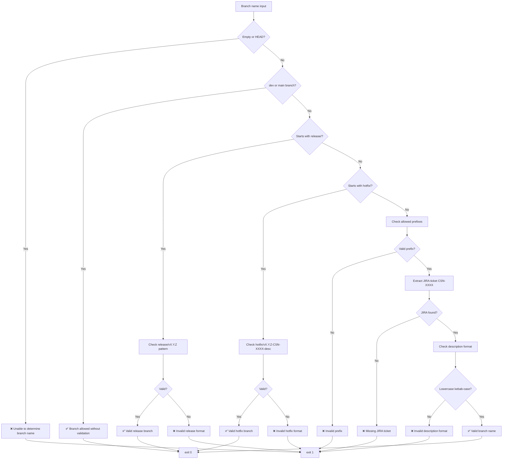
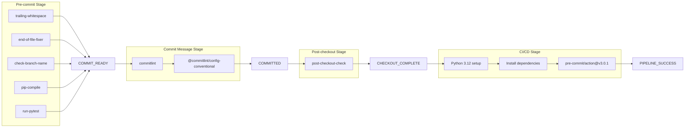
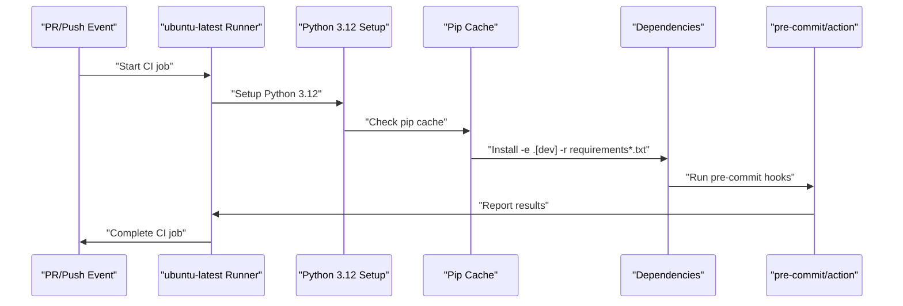
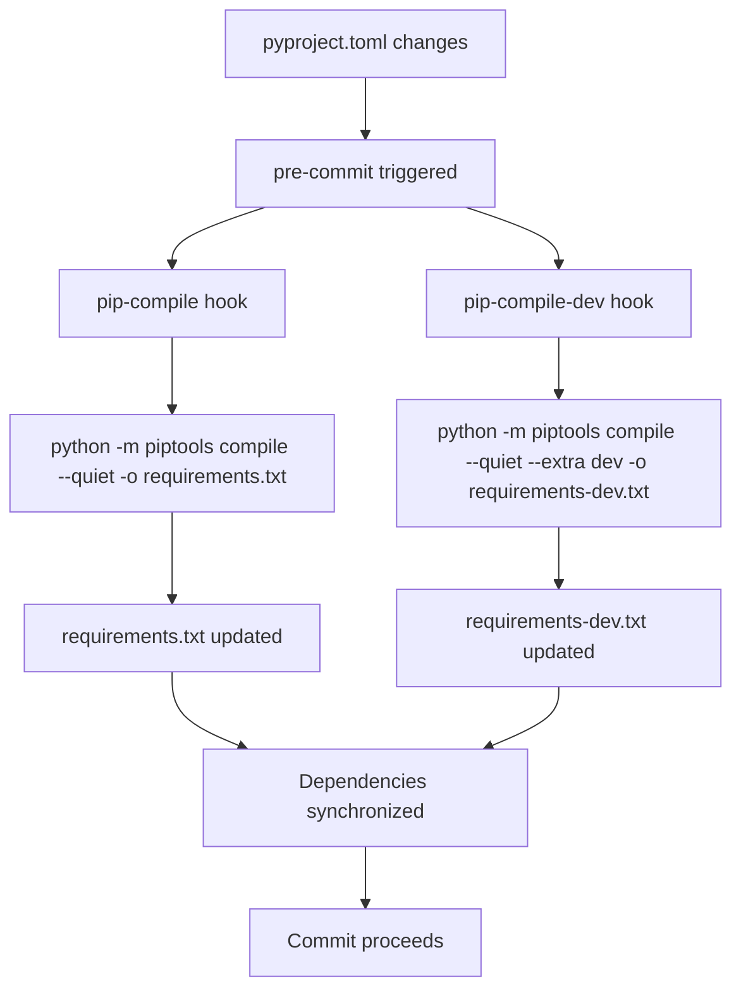

---

title: "Development Workflow"

---

import CollapsibleAside from '@components/CollapsibleAside.astro';

import SourceLink from '@components/SourceLink.astro';

<CollapsibleAside title="Relevant Source Files">

  <SourceLink text=".github/workflows/pre-commit.yml" href="https://github.com/neuralinternet/SN27/blob/6261c454/.github/workflows/pre-commit.yml" />

  <SourceLink text=".pre-commit-config.yaml" href="https://github.com/neuralinternet/SN27/blob/6261c454/.pre-commit-config.yaml" />

  <SourceLink text="scripts/check-branch-name.sh" href="https://github.com/neuralinternet/SN27/blob/6261c454/scripts/check-branch-name.sh" />

  <SourceLink text="scripts/check-current-branch.sh" href="https://github.com/neuralinternet/SN27/blob/6261c454/scripts/check-current-branch.sh" />

</CollapsibleAside>

This document covers the development workflow, code quality enforcement, and automated testing infrastructure for the NI Compute Subnet project. It details the pre-commit hooks system, branch naming conventions, continuous integration pipeline, and dependency management processes that ensure code quality and consistency across the project.

For information about project structure and organization, see [Project Structure](/development/project-structure#9.2). For details about CLI tools used in development, see [CLI Tools](/cli-tools#8).

## Pre-commit Hooks System

The project uses a comprehensive pre-commit hooks system to enforce code quality standards before commits are made. The configuration is defined in <SourceLink text=".pre-commit-config.yaml:1-64" href="https://github.com/neuralinternet/SN27/blob/6261c454/.pre-commit-config.yaml#L1-L64" /> and includes multiple stages of validation.

### Hook Configuration

The pre-commit system includes the following hook categories:

| Hook Category | Purpose | Stage |
|---------------|---------|-------|
| Code Formatting | Trailing whitespace and end-of-file fixes | `pre-commit`, `manual` |
| Commit Validation | Conventional commit message format | `commit-msg` |
| Branch Validation | Branch naming convention enforcement | `pre-commit`, `pre-push`, `manual` |
| Dependency Management | Requirements file synchronization | `pre-commit`, `manual` |
| Testing | Automated test execution | `pre-commit`, `manual` |

### Pre-commit Hook Flow

**Sources:** <SourceLink text=".pre-commit-config.yaml:1-64" href="https://github.com/neuralinternet/SN27/blob/6261c454/.pre-commit-config.yaml#L1-L64" />, <SourceLink text="scripts/check-current-branch.sh:1-7" href="https://github.com/neuralinternet/SN27/blob/6261c454/scripts/check-current-branch.sh#L1-L7" />

## Branch Naming Conventions

The project enforces strict branch naming conventions through the `check-branch-name.sh` script, which validates branch names against predefined patterns.

### Allowed Branch Patterns

The branch validation system supports the following patterns:

| Branch Type | Pattern | Example |
|-------------|---------|---------|
| Feature | `feat/CSN-XXXX-description` | `feat/CSN-1234-add-gpu-validation` |  
| Bug Fix | `fix/CSN-XXXX-description` | `fix/CSN-5678-memory-leak-issue` |
| Hotfix | `hotfix/vX.Y.Z-CSN-XXXX-description` | `hotfix/v1.2.3-CSN-9999-critical-fix` |
| Release | `release/vX.Y.Z` | `release/v2.1.0` |
| Chore | `chore/CSN-XXXX-description` | `chore/CSN-1111-update-dependencies` |

### Branch Validation Logic

**Sources:** <SourceLink text="scripts/check-branch-name.sh:1-114" href="https://github.com/neuralinternet/SN27/blob/6261c454/scripts/check-branch-name.sh#L1-L114" />, <SourceLink text=".pre-commit-config.yaml:19-26" href="https://github.com/neuralinternet/SN27/blob/6261c454/.pre-commit-config.yaml#L19-L26" />

### Branch Name Validation Implementation

The validation logic is implemented in <SourceLink text="scripts/check-branch-name.sh:1-114" href="https://github.com/neuralinternet/SN27/blob/6261c454/scripts/check-branch-name.sh#L1-L114" /> with the following key components:

- **Allowed Prefixes**: <SourceLink text="scripts/check-branch-name.sh:4" href="https://github.com/neuralinternet/SN27/blob/6261c454/scripts/check-branch-name.sh#L4" /> defines `feat|fix|hotfix|chore|refactor|test|spike|prototype|release|docs`
- **JIRA Pattern**: <SourceLink text="scripts/check-branch-name.sh:7" href="https://github.com/neuralinternet/SN27/blob/6261c454/scripts/check-branch-name.sh#L7" /> requires `CSN-[0-9]+` format
- **Release Pattern**: <SourceLink text="scripts/check-branch-name.sh:10" href="https://github.com/neuralinternet/SN27/blob/6261c454/scripts/check-branch-name.sh#L10" /> validates `release/v[0-9]+\.[0-9]+\.[0-9]+(-[a-z0-9]+)?`
- **Hotfix Pattern**: <SourceLink text="scripts/check-branch-name.sh:16" href="https://github.com/neuralinternet/SN27/blob/6261c454/scripts/check-branch-name.sh#L16" /> validates `hotfix/v[0-9]+\.[0-9]+\.[0-9]+`

**Sources:** <SourceLink text="scripts/check-branch-name.sh:4-16" href="https://github.com/neuralinternet/SN27/blob/6261c454/scripts/check-branch-name.sh#L4-L16" />

## Code Quality Enforcement

The development workflow enforces code quality through multiple automated checks that run at different stages of the development process.

### Quality Check Pipeline

**Sources:** <SourceLink text=".pre-commit-config.yaml:1-64" href="https://github.com/neuralinternet/SN27/blob/6261c454/.pre-commit-config.yaml#L1-L64" />, <SourceLink text=".github/workflows/pre-commit.yml:1-22" href="https://github.com/neuralinternet/SN27/blob/6261c454/.github/workflows/pre-commit.yml#L1-L22" />

### Testing Integration

The pre-commit system includes automated test execution using `pytest` with Allure reporting:

- **Test Command**: <SourceLink text=".pre-commit-config.yaml:58" href="https://github.com/neuralinternet/SN27/blob/6261c454/.pre-commit-config.yaml#L58" /> executes `python -m pytest --alluredir allure-results`
- **Test Stage**: <SourceLink text=".pre-commit-config.yaml:60" href="https://github.com/neuralinternet/SN27/blob/6261c454/.pre-commit-config.yaml#L60" /> runs on `pre-commit` and `manual` stages
- **Always Run**: <SourceLink text=".pre-commit-config.yaml:61" href="https://github.com/neuralinternet/SN27/blob/6261c454/.pre-commit-config.yaml#L61" /> ensures tests run regardless of file changes
- **No Filenames**: <SourceLink text=".pre-commit-config.yaml:63" href="https://github.com/neuralinternet/SN27/blob/6261c454/.pre-commit-config.yaml#L63" /> prevents passing filenames to pytest

**Sources:** <SourceLink text=".pre-commit-config.yaml:56-63" href="https://github.com/neuralinternet/SN27/blob/6261c454/.pre-commit-config.yaml#L56-L63" />

## Continuous Integration Pipeline

The project uses GitHub Actions for continuous integration, with the workflow defined in <SourceLink text=".github/workflows/pre-commit.yml:1-22" href="https://github.com/neuralinternet/SN27/blob/6261c454/.github/workflows/pre-commit.yml#L1-L22" />.

### CI/CD Workflow Configuration

| Configuration | Value | Purpose |
|---------------|-------|---------|
| **Trigger Events** | `pull_request`, `push` to `dev`/`main` | Automated validation on key events |
| **Runner** | `ubuntu-latest` | Consistent Linux environment |
| **Python Version** | `3.12` | Latest stable Python version |
| **Cache Strategy** | `pip` with `pyproject.toml`, `requirements*.txt` | Dependency caching for performance |

### CI Pipeline Steps

**Sources:** <SourceLink text=".github/workflows/pre-commit.yml:8-22" href="https://github.com/neuralinternet/SN27/blob/6261c454/.github/workflows/pre-commit.yml#L8-L22" />

## Dependency Management

The project uses `pip-tools` for dependency management with automated synchronization through pre-commit hooks.

### Requirements Compilation

The dependency management system includes two compilation targets:

- **Production Requirements**: <SourceLink text=".pre-commit-config.yaml:40" href="https://github.com/neuralinternet/SN27/blob/6261c454/.pre-commit-config.yaml#L40" /> compiles `pyproject.toml` to `requirements.txt`
- **Development Requirements**: <SourceLink text=".pre-commit-config.yaml:49" href="https://github.com/neuralinternet/SN27/blob/6261c454/.pre-commit-config.yaml#L49" /> compiles with `--extra dev` to `requirements-dev.txt`

### Dependency Compilation Flow

**Sources:** <SourceLink text=".pre-commit-config.yaml:38-53" href="https://github.com/neuralinternet/SN27/blob/6261c454/.pre-commit-config.yaml#L38-L53" />

### Installation Command Sequence

The CI/CD pipeline installs dependencies in the following order as defined in <SourceLink text=".github/workflows/pre-commit.yml:20" href="https://github.com/neuralinternet/SN27/blob/6261c454/.github/workflows/pre-commit.yml#L20" />:

1. `pip install -e .[dev]` - Install package in development mode with dev extras
2. `-r requirements.txt` - Install production dependencies
3. `-r requirements-dev.txt` - Install development dependencies

**Sources:** <SourceLink text=".github/workflows/pre-commit.yml:20" href="https://github.com/neuralinternet/SN27/blob/6261c454/.github/workflows/pre-commit.yml#L20" />