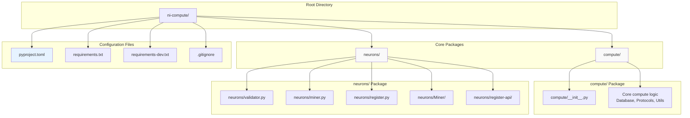
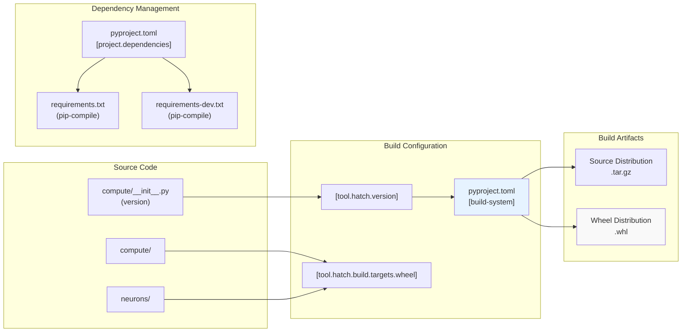
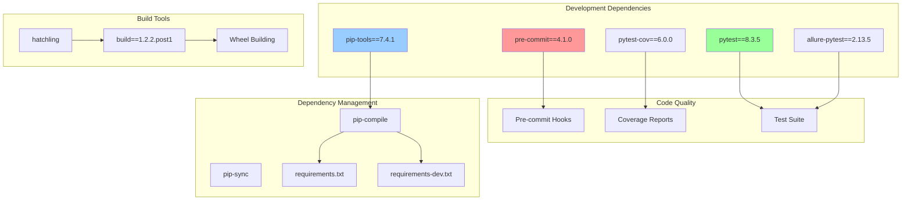
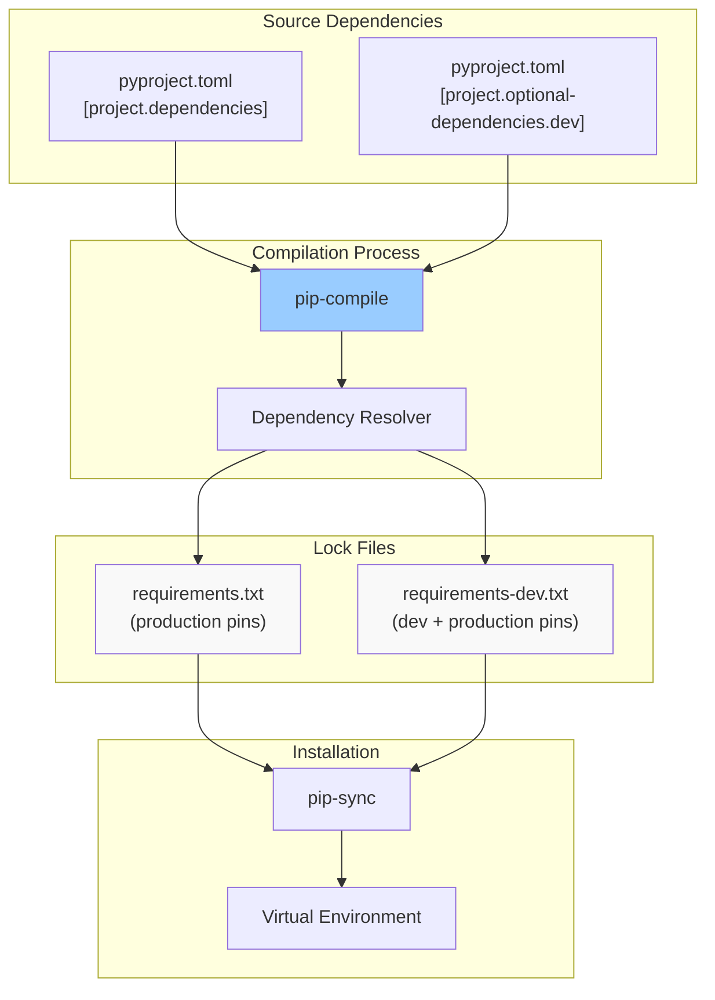

---

title: "Project Structure"

---

import CollapsibleAside from '@components/CollapsibleAside.astro';

import SourceLink from '@components/SourceLink.astro';

<CollapsibleAside title="Relevant Source Files">

  <SourceLink text=".gitignore" href="https://github.com/neuralinternet/SN27/blob/6261c454/.gitignore" />

  <SourceLink text="pyproject.toml" href="https://github.com/neuralinternet/SN27/blob/6261c454/pyproject.toml" />

  <SourceLink text="requirements-dev.txt" href="https://github.com/neuralinternet/SN27/blob/6261c454/requirements-dev.txt" />

  <SourceLink text="requirements.txt" href="https://github.com/neuralinternet/SN27/blob/6261c454/requirements.txt" />

</CollapsibleAside>

This document describes the organizational structure, dependency management, and build configuration of the NI Compute Subnet codebase. It covers the package layout, key dependencies, build tooling, and development infrastructure that supports the distributed GPU compute marketplace.

For information about installation and setup procedures, see [Installation and Setup](/installation-and-setup#1.2). For details about development workflows and code quality tools, see [Development Workflow](/development/development-workflow#9.1).

## Package Organization

The codebase is organized into two main Python packages with a clear separation between core compute logic and network protocol implementations.

**Sources:** <SourceLink text="pyproject.toml:87-91" href="https://github.com/neuralinternet/SN27/blob/6261c454/pyproject.toml#L87-L91" />, <SourceLink text=".gitignore:248-262" href="https://github.com/neuralinternet/SN27/blob/6261c454/.gitignore#L248-L262" />

## Core Dependencies Architecture

The project relies on a carefully curated set of dependencies that enable blockchain integration, GPU computation, containerization, and distributed system monitoring.

```mermaid
graph TB
    subgraph "Blockchain Layer"
        BITTENSOR["bittensor==9.0.0"]
        BTCLI["bittensor-cli==9.1.0"]
        BTWALLET["bittensor-wallet==3.0.4"]
        SUBSTRATE["async-substrate-interface==1.0.3"]
    end
    
    subgraph "GPU Computing"
        TORCH["torch==2.5.1"]
        NVIDIA["nvidia-* packages<br/>CUDA Runtime"]
        GPUTIL["GPUtil==1.4.0"]
        IGPU["igpu==0.1.2"]
        PYNVML["pynvml==12.0.0"]
    end
    
    subgraph "Web Services"
        FASTAPI["fastapi==0.110.3"]
        UVICORN["uvicorn==0.34.0"]
        STARLETTE["starlette==0.37.2"]
        AIOHTTP["aiohttp==3.10.11"]
    end
    
    subgraph "Containerization"
        DOCKER["docker==7.0.0"]
        PARAMIKO["paramiko==3.4.1"]
    end
    
    subgraph "Monitoring & Logging"
        WANDB["wandb==0.19.0"]
        PSUTIL["psutil==5.9.8"]
    end
    
    subgraph "Cryptography"
        CRYPTO["cryptography==43.0.1"]
        BLAKE3["blake3==1.0.4"]
        PYCRYPTO["pycryptodome==3.21.0"]
    end
    
    subgraph "Data Processing"
        NUMPY["numpy==2.0.2"]
        REQUESTS["requests==2.31.0"]
        MSGPACK["msgpack-numpy-opentensor==0.5.0"]
    end
    
    BITTENSOR --> SUBSTRATE
    BITTENSOR --> BTWALLET
    BITTENSOR --> BTCLI
    
    TORCH --> NVIDIA
    GPUTIL --> NVIDIA
    IGPU --> PYNVML
    
    FASTAPI --> STARLETTE
    FASTAPI --> UVICORN
    
    style BITTENSOR fill:#ff9999
    style TORCH fill:#99ff99
    style FASTAPI fill:#99ccff
    style DOCKER fill:#ffcc99
```

**Sources:** <SourceLink text="requirements.txt:36-59" href="https://github.com/neuralinternet/SN27/blob/6261c454/requirements.txt#L36-L59" />, <SourceLink text="pyproject.toml:36-59" href="https://github.com/neuralinternet/SN27/blob/6261c454/pyproject.toml#L36-L59" />

## Build and Packaging Configuration

The project uses modern Python packaging standards with `hatchling` as the build backend and supports both source and wheel distributions.

| Component | Configuration | Purpose |
|-----------|---------------|---------|
| **Build Backend** | `hatchling>=1.24.2` | Modern Python build system |
| **Version Source** | `compute/__init__.py` | Dynamic versioning from package |
| **Python Requirement** | `>=3.10` | Minimum Python version |
| **Package Distribution** | `compute`, `neurons` | Core packages included in wheel |
| **License** | MIT | Open source license |

**Sources:** <SourceLink text="pyproject.toml:1-5" href="https://github.com/neuralinternet/SN27/blob/6261c454/pyproject.toml#L1-L5" />, <SourceLink text="pyproject.toml:78-91" href="https://github.com/neuralinternet/SN27/blob/6261c454/pyproject.toml#L78-L91" />, <SourceLink text="requirements.txt:1-6" href="https://github.com/neuralinternet/SN27/blob/6261c454/requirements.txt#L1-L6" />

## Development Environment Structure

The development environment includes comprehensive tooling for code quality, testing, and dependency management with automated workflows.

**Sources:** <SourceLink text="requirements-dev.txt:242-307" href="https://github.com/neuralinternet/SN27/blob/6261c454/requirements-dev.txt#L242-L307" />, <SourceLink text="pyproject.toml:61-69" href="https://github.com/neuralinternet/SN27/blob/6261c454/pyproject.toml#L61-L69" />, <SourceLink text="pyproject.toml:92-96" href="https://github.com/neuralinternet/SN27/blob/6261c454/pyproject.toml#L92-L96" />

## File Exclusions and Generated Content

The project maintains clean version control by excluding build artifacts, runtime data, and generated content from the repository.

| Category | Files/Patterns | Purpose |
|----------|----------------|---------|
| **Python Artifacts** | `__pycache__/`, `*.pyc`, `build/`, `dist/` | Standard Python build artifacts |
| **Runtime Data** | `database.db`, `wandb/` | Validator database and monitoring data |
| **Generated Content** | `neurons/Miner/app`, `neurons/register-api/` | Dynamically generated applications |
| **Security** | `cert/`, `.env` | SSL certificates and environment variables |
| **Development** | `.idea/`, `.pytest_cache/`, `allure-results` | IDE and testing artifacts |

**Sources:** <SourceLink text=".gitignore:1-262" href="https://github.com/neuralinternet/SN27/blob/6261c454/.gitignore#L1-L262" />

## Dependency Resolution Strategy

The project uses a two-stage dependency management approach with `pip-tools` for deterministic builds and dependency conflict resolution.

**Sources:** <SourceLink text="requirements.txt:1-6" href="https://github.com/neuralinternet/SN27/blob/6261c454/requirements.txt#L1-L6" />, <SourceLink text="requirements-dev.txt:1-6" href="https://github.com/neuralinternet/SN27/blob/6261c454/requirements-dev.txt#L1-L6" />, <SourceLink text="pyproject.toml:36-69" href="https://github.com/neuralinternet/SN27/blob/6261c454/pyproject.toml#L36-L69" />