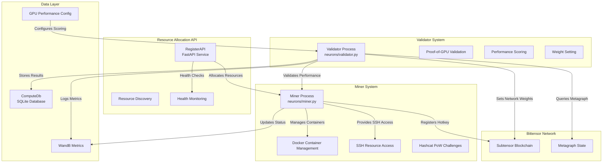
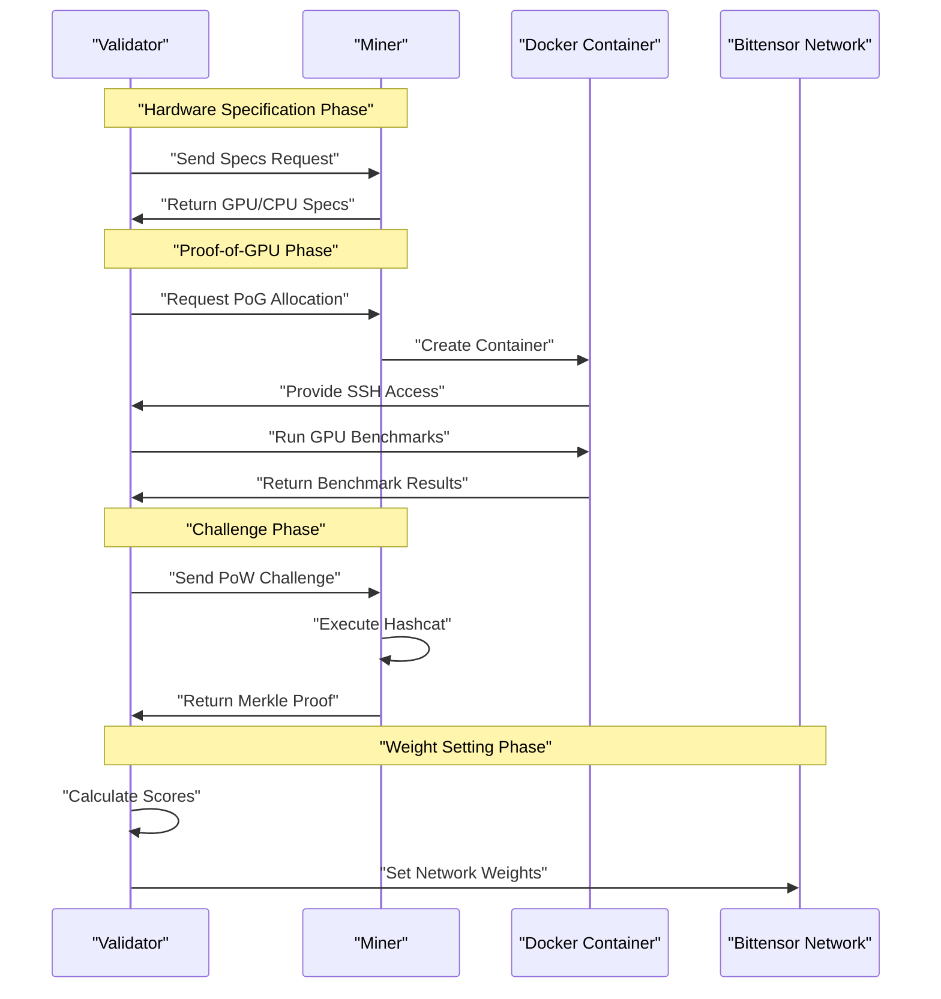
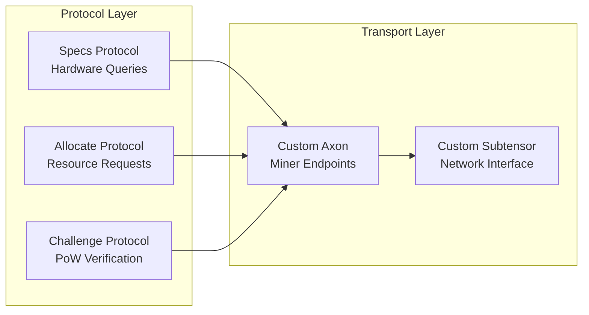

---

title: "Overview"

---

import CollapsibleAside from '@components/CollapsibleAside.astro';

import SourceLink from '@components/SourceLink.astro';

<CollapsibleAside title="Relevant Source Files">

  <SourceLink text="README.md" href="https://github.com/neuralinternet/SN27/blob/6261c454/README.md" />

  <SourceLink text="compute/__init__.py" href="https://github.com/neuralinternet/SN27/blob/6261c454/compute/__init__.py" />

  <SourceLink text="compute/utils/parser.py" href="https://github.com/neuralinternet/SN27/blob/6261c454/compute/utils/parser.py" />

</CollapsibleAside>

The NI Compute Subnet is a decentralized GPU compute marketplace operating on the Bittensor network as subnet 27. It enables miners to contribute GPU resources and earn rewards based on their computational performance, while validators measure miner capabilities and allocate resources to clients through a trustless, permissionless system.

This document provides a high-level overview of the system architecture, core components, and their interactions. For detailed installation instructions, see [Installation and Setup](/installation-and-setup#1.2). For specific component documentation, refer to the [Validator System](/validator-system#2), [Miner System](/miner-system#3), and [Resource Allocation API](/resource-allocation-api#4) sections.

## System Architecture

The NI Compute Subnet consists of three primary components that interact through the Bittensor network and custom communication protocols:

**Sources:** <SourceLink text="README.md:1-535" href="https://github.com/neuralinternet/SN27/blob/6261c454/README.md#L1-L535" />, <SourceLink text="compute/__init__.py:1-93" href="https://github.com/neuralinternet/SN27/blob/6261c454/compute/__init__.py#L1-L93" />

## Core Components

### Validator System
Validators are responsible for measuring miner performance and maintaining network integrity. They operate continuous validation cycles that include hardware specification queries, proof-of-GPU benchmarks, and cryptographic challenge verification.

The validator system implements a sophisticated scoring mechanism based on GPU performance metrics, with base scores assigned to different GPU models and scaling factors for multiple GPU configurations. Validators with sufficient stake (`validator_permit_stake = 1.0e4` TAO) can set network weights that determine miner rewards.

**Key Classes and Constants:**
- `neurons/validator.py` - Main validator process
- `validator_permit_stake` - Minimum stake requirement for validators
- `specs_timeout = 60` - Timeout for hardware specification requests
- `pog_retry_limit = 30` - Maximum retries for proof-of-GPU validation

### Miner System
Miners contribute GPU computational resources to the network and respond to validator requests. They manage Docker containers for resource isolation, handle SSH-based resource allocation, and participate in proof-of-work challenges using Hashcat.

The miner system uses a priority-based request handling system where resource allocation requests (`miner_priority_allocate = 3`) take precedence over challenge responses (`miner_priority_challenge = 2`) and specification queries (`miner_priority_specs = 1`).

**Key Classes and Constants:**
- `neurons/miner.py` - Main miner process  
- `miner_hashcat_location = "hashcat"` - Hashcat binary location
- `miner_hashcat_workload_profile = "3"` - High performance profile
- `pow_timeout = 30` - Proof-of-work challenge timeout

### Resource Allocation API
The Resource Allocation API is a FastAPI-based web service that provides external access to the compute network. It handles resource discovery, allocation requests, and health monitoring of active allocations.

The API implements RSA encryption for secure communication and maintains state through both local database storage and distributed WandB synchronization.

**Sources:** <SourceLink text="compute/__init__.py:21-77" href="https://github.com/neuralinternet/SN27/blob/6261c454/compute/__init__.py#L21-L77" />, <SourceLink text="README.md:87-108" href="https://github.com/neuralinternet/SN27/blob/6261c454/README.md#L87-L108" />

## Validation and Challenge System

The subnet implements multiple validation mechanisms to ensure miner integrity and performance:

**Proof-of-Work Configuration:**
- `pow_min_difficulty = 7` - Minimum challenge difficulty
- `pow_max_difficulty = 12` - Maximum challenge difficulty  
- `pow_default_mode = "610"` - BLAKE2b-512 hash mode
- `pow_default_chars` - Challenge character set including alphanumeric and special characters

**Sources:** <SourceLink text="compute/__init__.py:37-49" href="https://github.com/neuralinternet/SN27/blob/6261c454/compute/__init__.py#L37-L49" />, <SourceLink text="README.md:437-450" href="https://github.com/neuralinternet/SN27/blob/6261c454/README.md#L437-L450" />

## Data Management and Monitoring

The system maintains state through multiple data persistence layers:

| Component | Storage Type | Purpose |
|-----------|--------------|---------|
| ComputeDb | SQLite | Local miner stats, scores, allocations |
| WandB | Distributed | Cross-validator metrics, distributed state |
| Configuration | YAML/ENV | GPU performance benchmarks, API keys |

The monitoring system uses WandB for distributed state management and metrics collection, with separate runs for validators and miners to track performance and resource utilization.

**Version Management:**
- `__version__ = "1.9.0"` - Current subnet version
- `__minimal_miner_version__ = "1.8.5"` - Minimum required miner version
- `__minimal_validator_version__ = "1.8.8"` - Minimum required validator version

**Sources:** <SourceLink text="compute/__init__.py:20-26" href="https://github.com/neuralinternet/SN27/blob/6261c454/compute/__init__.py#L20-L26" />, <SourceLink text="README.md:297-303" href="https://github.com/neuralinternet/SN27/blob/6261c454/README.md#L297-L303" />

## Network Communication

The subnet uses custom Bittensor synapse protocols for component communication:

The communication system includes blacklist management for suspected exploiters and trusted validator lists to maintain network security and integrity.

**Sources:** <SourceLink text="compute/__init__.py:59-92" href="https://github.com/neuralinternet/SN27/blob/6261c454/compute/__init__.py#L59-L92" />, <SourceLink text="compute/utils/parser.py:8-170" href="https://github.com/neuralinternet/SN27/blob/6261c454/compute/utils/parser.py#L8-L170" />

For detailed information about specific components, see the [Validator System](/validator-system#2), [Miner System](/miner-system#3), [Resource Allocation API](/resource-allocation-api#4), and [Communication Protocols](/communication-protocols#5) sections.