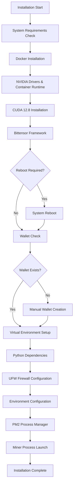
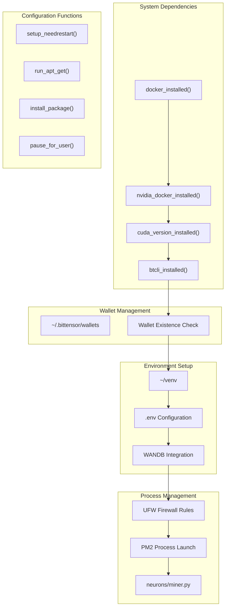
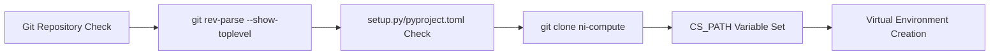

---

title: "Installation and Setup"

---


import CollapsibleAside from '@components/CollapsibleAside.astro';

import SourceLink from '@components/SourceLink.astro';


<CollapsibleAside title="Relevant Source Files">

  <SourceLink text="scripts/installation_script/README.md" href="https://github.com/neuralinternet/SN27/blob/6261c454/scripts/installation_script/README.md" />

  <SourceLink text="scripts/installation_script/compute_subnet_installer.sh" href="https://github.com/neuralinternet/SN27/blob/6261c454/scripts/installation_script/compute_subnet_installer.sh" />

</CollapsibleAside>


This document provides comprehensive installation instructions for setting up the NI Compute Subnet on Ubuntu systems. It covers system requirements, dependency installation, wallet configuration, and miner deployment using the automated installation script.

For information about validator-specific setup procedures, see [Validator System](/validator-system#2). For details about the API service deployment, see [Resource Allocation API](/resource-allocation-api#4).

## Installation Architecture

The installation process follows a two-pass approach with clear separation between system-level dependencies and application-level configuration:



Sources: <SourceLink text="scripts/installation_script/compute_subnet_installer.sh:1-805" href="https://github.com/neuralinternet/SN27/blob/6261c454/scripts/installation_script/compute_subnet_installer.sh#L1-L805" />

## System Requirements

The installation script supports Ubuntu 22.04 and 24.04 with the following requirements:

| Component | Requirement | Detection Method |
|-----------|-------------|------------------|
| Operating System | Ubuntu 22.04/24.04 | `uname` check |
| GPU | NVIDIA GPU | Driver installation |
| Docker | Latest stable | `docker --version` |
| CUDA | Version 12.8 | `nvcc --version` |
| Python | 3.8+ | System package |
| Node.js | 18.x | Package manager |

The installer performs automatic detection and installation of missing components through the `docker_installed()`, `nvidia_docker_installed()`, and `cuda_version_installed()` functions.

Sources: <SourceLink text="scripts/installation_script/compute_subnet_installer.sh:93-95" href="https://github.com/neuralinternet/SN27/blob/6261c454/scripts/installation_script/compute_subnet_installer.sh#L93-L95" />, <SourceLink text="scripts/installation_script/compute_subnet_installer.sh:113-118" href="https://github.com/neuralinternet/SN27/blob/6261c454/scripts/installation_script/compute_subnet_installer.sh#L113-L118" />, <SourceLink text="scripts/installation_script/compute_subnet_installer.sh:154-160" href="https://github.com/neuralinternet/SN27/blob/6261c454/scripts/installation_script/compute_subnet_installer.sh#L154-L160" />, <SourceLink text="scripts/installation_script/compute_subnet_installer.sh:165-188" href="https://github.com/neuralinternet/SN27/blob/6261c454/scripts/installation_script/compute_subnet_installer.sh#L165-L188" />

## Installation Script Components

The `compute_subnet_installer.sh` script orchestrates the entire installation process through modular functions:



Sources: <SourceLink text="scripts/installation_script/compute_subnet_installer.sh:113-203" href="https://github.com/neuralinternet/SN27/blob/6261c454/scripts/installation_script/compute_subnet_installer.sh#L113-L203" />, <SourceLink text="scripts/installation_script/compute_subnet_installer.sh:566-570" href="https://github.com/neuralinternet/SN27/blob/6261c454/scripts/installation_script/compute_subnet_installer.sh#L566-L570" />, <SourceLink text="scripts/installation_script/compute_subnet_installer.sh:681-732" href="https://github.com/neuralinternet/SN27/blob/6261c454/scripts/installation_script/compute_subnet_installer.sh#L681-L732" />, <SourceLink text="scripts/installation_script/compute_subnet_installer.sh:750-770" href="https://github.com/neuralinternet/SN27/blob/6261c454/scripts/installation_script/compute_subnet_installer.sh#L750-L770" />

## Installation Process

### Phase 1: System Dependencies

The installer first establishes the execution environment and installs core system dependencies:

**Environment Detection**
```bash
# User and home directory detection
REAL_USER=$(whoami)
USER_NAME="$REAL_USER"
HOME_DIR="$(eval echo "~$REAL_USER")"
```

**Docker Installation**
The script installs Docker CE with NVIDIA container runtime support when not present:

Sources: <SourceLink text="scripts/installation_script/compute_subnet_installer.sh:97-110" href="https://github.com/neuralinternet/SN27/blob/6261c454/scripts/installation_script/compute_subnet_installer.sh#L97-L110" />, <SourceLink text="scripts/installation_script/compute_subnet_installer.sh:223-249" href="https://github.com/neuralinternet/SN27/blob/6261c454/scripts/installation_script/compute_subnet_installer.sh#L223-L249" />, <SourceLink text="scripts/installation_script/compute_subnet_installer.sh:251-272" href="https://github.com/neuralinternet/SN27/blob/6261c454/scripts/installation_script/compute_subnet_installer.sh#L251-L272" />

**CUDA 12.8 Installation**
Version-specific CUDA installation based on Ubuntu release:

Sources: <SourceLink text="scripts/installation_script/compute_subnet_installer.sh:274-330" href="https://github.com/neuralinternet/SN27/blob/6261c454/scripts/installation_script/compute_subnet_installer.sh#L274-L330" />, <SourceLink text="scripts/installation_script/compute_subnet_installer.sh:287-298" href="https://github.com/neuralinternet/SN27/blob/6261c454/scripts/installation_script/compute_subnet_installer.sh#L287-L298" />, <SourceLink text="scripts/installation_script/compute_subnet_installer.sh:299-313" href="https://github.com/neuralinternet/SN27/blob/6261c454/scripts/installation_script/compute_subnet_installer.sh#L299-L313" />

### Phase 2: Repository Setup

The installer locates or clones the compute subnet repository:



Sources: <SourceLink text="scripts/installation_script/compute_subnet_installer.sh:334-395" href="https://github.com/neuralinternet/SN27/blob/6261c454/scripts/installation_script/compute_subnet_installer.sh#L334-L395" />, <SourceLink text="scripts/installation_script/compute_subnet_installer.sh:427-444" href="https://github.com/neuralinternet/SN27/blob/6261c454/scripts/installation_script/compute_subnet_installer.sh#L427-L444" />

### Phase 3: Python Environment

Virtual environment creation and dependency installation:

| Step | Command | Configuration File |
|------|---------|-------------------|
| Virtual Environment | `python3 -m venv ~/venv` | N/A |
| Base Dependencies | `pip install -r requirements.txt` | `requirements.txt` |
| Compute Dependencies | `pip install --no-deps -r requirements-compute.txt` | `requirements-compute.txt` |
| Editable Install | `pip install -e .` | `setup.py`/`pyproject.toml` |

Sources: <SourceLink text="scripts/installation_script/compute_subnet_installer.sh:446-464" href="https://github.com/neuralinternet/SN27/blob/6261c454/scripts/installation_script/compute_subnet_installer.sh#L446-L464" />, <SourceLink text="scripts/installation_script/compute_subnet_installer.sh:453-461" href="https://github.com/neuralinternet/SN27/blob/6261c454/scripts/installation_script/compute_subnet_installer.sh#L453-L461" />

### Phase 4: Wallet Configuration

The installer checks for existing Bittensor wallets and provides guidance for wallet creation:

```bash
WALLET_DIR="${HOME}/.bittensor/wallets"
have_wallets=false
if [ -d "${WALLET_DIR}" ] && [ -n "$(ls -A "${WALLET_DIR}" 2>/dev/null)" ]; then
  have_wallets=true
fi
```

Sources: <SourceLink text="scripts/installation_script/compute_subnet_installer.sh:566-600" href="https://github.com/neuralinternet/SN27/blob/6261c454/scripts/installation_script/compute_subnet_installer.sh#L566-L600" />

### Phase 5: Network Configuration

**Firewall Setup**
UFW configuration with required ports:

| Port | Protocol | Purpose |
|------|----------|---------|
| 22 | TCP | SSH Access |
| 4444 | TCP | Validator Communication |
| 8091 | TCP | Default Axon Port |

Sources: <SourceLink text="scripts/installation_script/compute_subnet_installer.sh:610-655" href="https://github.com/neuralinternet/SN27/blob/6261c454/scripts/installation_script/compute_subnet_installer.sh#L610-L655" />

**Environment Configuration**
The installer configures the `.env` file with database and API settings:

```bash
# SQLITE_DB_PATH configuration
sed -i "s@^SQLITE_DB_PATH=.*@SQLITE_DB_PATH=\"${CS_PATH}/database.db\"@" "$env_path"

# WANDB_API_KEY configuration
sed -i "s@^WANDB_API_KEY=.*@WANDB_API_KEY=\"$WANDB_API_KEY\"@" "$env_path"
```

Sources: <SourceLink text="scripts/installation_script/compute_subnet_installer.sh:699-732" href="https://github.com/neuralinternet/SN27/blob/6261c454/scripts/installation_script/compute_subnet_installer.sh#L699-L732" />, <SourceLink text="scripts/installation_script/compute_subnet_installer.sh:718-720" href="https://github.com/neuralinternet/SN27/blob/6261c454/scripts/installation_script/compute_subnet_installer.sh#L718-L720" />

### Phase 6: Process Management

**PM2 Configuration**
The miner process is launched using PM2 with comprehensive environment variables:

```bash
pm2 start "${VENV_DIR}/bin/python3" \
  --name "subnet${NETUID}_miner" \
  -- \
  "${CS_PATH}/neurons/miner.py" \
  --netuid "${NETUID}" \
  --subtensor.network "${SUBTENSOR_NETWORK}" \
  --wallet.name "default" \
  --wallet.hotkey "default" \
  --axon.port "${AXON_PORT}"
```

Sources: <SourceLink text="scripts/installation_script/compute_subnet_installer.sh:750-770" href="https://github.com/neuralinternet/SN27/blob/6261c454/scripts/installation_script/compute_subnet_installer.sh#L750-L770" />, <SourceLink text="scripts/installation_script/compute_subnet_installer.sh:776-797" href="https://github.com/neuralinternet/SN27/blob/6261c454/scripts/installation_script/compute_subnet_installer.sh#L776-L797" />

## Configuration Options

### Network Selection

The installer supports both mainnet and testnet configurations:

| Network | NetUID | Subtensor Network | Default Port |
|---------|--------|-------------------|--------------|
| Mainnet | 27 | `subvortex.info:9944` | 8091 |
| Testnet | 15 | `test` | 8091 |

Sources: <SourceLink text="scripts/installation_script/compute_subnet_installer.sh:618-649" href="https://github.com/neuralinternet/SN27/blob/6261c454/scripts/installation_script/compute_subnet_installer.sh#L618-L649" />

### Automated Mode

The installer supports non-interactive execution:

```bash
./compute_subnet_installer.sh --automated
```

This mode uses environment variables for configuration and skips user prompts.

Sources: <SourceLink text="scripts/installation_script/compute_subnet_installer.sh:24-29" href="https://github.com/neuralinternet/SN27/blob/6261c454/scripts/installation_script/compute_subnet_installer.sh#L24-L29" />, <SourceLink text="scripts/installation_script/compute_subnet_installer.sh:539-561" href="https://github.com/neuralinternet/SN27/blob/6261c454/scripts/installation_script/compute_subnet_installer.sh#L539-L561" />

## Verification

### Process Status
```bash
# Check PM2 process status
pm2 list
pm2 logs subnet${NETUID}_miner

# Check log files
tail -f ${CS_PATH}/pm2_out.log
tail -f ${CS_PATH}/pm2_error.log
```

### Network Registration
```bash
# Register hotkey on network
btcli subnet register --wallet.name default --wallet.hotkey default --netuid ${NETUID}
```

Sources: <SourceLink text="scripts/installation_script/compute_subnet_installer.sh:773-774" href="https://github.com/neuralinternet/SN27/blob/6261c454/scripts/installation_script/compute_subnet_installer.sh#L773-L774" />, <SourceLink text="scripts/installation_script/README.md:118-122" href="https://github.com/neuralinternet/SN27/blob/6261c454/scripts/installation_script/README.md#L118-L122" />

## Troubleshooting

### Common Issues

**Docker Permission Errors**
```bash
sudo usermod -aG docker $USER
sudo systemctl restart docker
```

**CUDA Environment Issues**
The installer automatically configures CUDA paths in `.bashrc`:
```bash
export PATH=/usr/local/cuda-12.8/bin:$PATH
export LD_LIBRARY_PATH=/usr/local/cuda-12.8/lib64:$LD_LIBRARY_PATH
```

**Wallet Not Found**
Ensure wallet exists at `~/.bittensor/wallets/<coldkey>/hotkeys/<hotkey>` before running the second installation pass.

Sources: <SourceLink text="scripts/installation_script/compute_subnet_installer.sh:131-142" href="https://github.com/neuralinternet/SN27/blob/6261c454/scripts/installation_script/compute_subnet_installer.sh#L131-L142" />, <SourceLink text="scripts/installation_script/compute_subnet_installer.sh:315-326" href="https://github.com/neuralinternet/SN27/blob/6261c454/scripts/installation_script/compute_subnet_installer.sh#L315-L326" />, <SourceLink text="scripts/installation_script/README.md:127-140" href="https://github.com/neuralinternet/SN27/blob/6261c454/scripts/installation_script/README.md#L127-L140" />