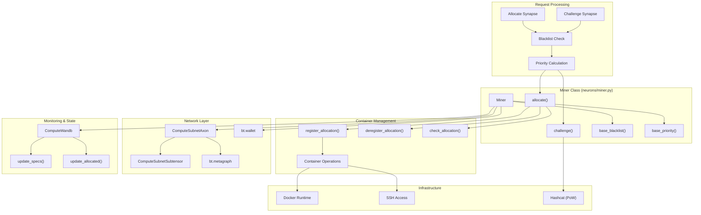
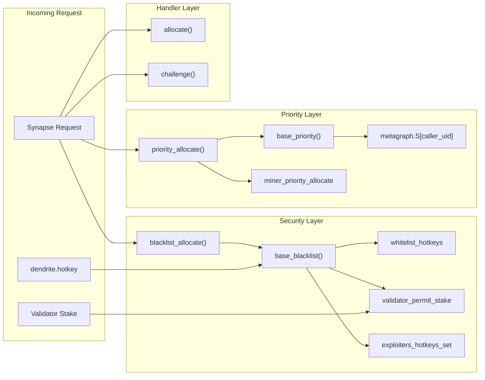
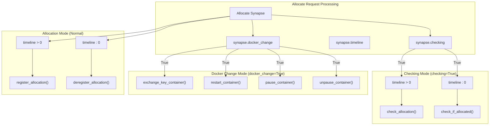
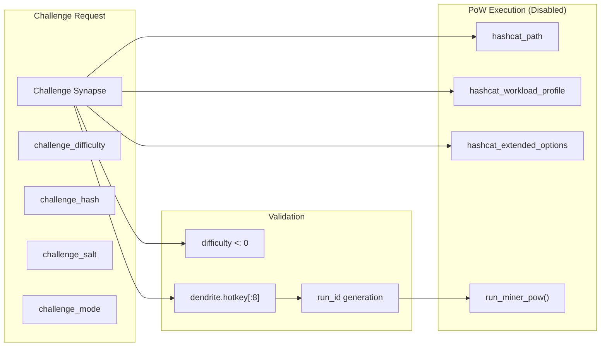
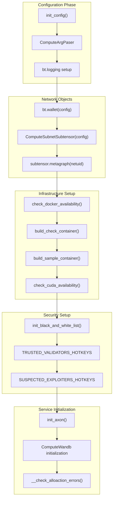

---

title: "Miner System"

---


import CollapsibleAside from '@components/CollapsibleAside.astro';

import SourceLink from '@components/SourceLink.astro';


<CollapsibleAside title="Relevant Source Files">

  <SourceLink text="neurons/miner.py" href="https://github.com/neuralinternet/SN27/blob/6261c454/neurons/miner.py" />

</CollapsibleAside>


The Miner System provides compute resources to the NI Compute Subnet by responding to resource allocation requests and validation challenges from validators. It manages Docker containers for secure compute workloads, handles proof-of-work challenges, and maintains network connectivity through the Bittensor protocol.

For information about validator-side operations, see [Validator System](/validator-system#2). For details about the resource allocation API that coordinates with miners, see [Resource Allocation API](/resource-allocation-api#4). For container lifecycle management specifics, see [Container Management](/miner-system/container-management#3.1).

## Architecture Overview

The miner system is implemented as a single `Miner` class that operates as a Bittensor axon server, handling three primary types of requests from validators: resource allocation, challenge-response, and system monitoring.

### Core System Components



Sources: <SourceLink text="neurons/miner.py:79-714" href="https://github.com/neuralinternet/SN27/blob/6261c454/neurons/miner.py#L79-L714" />

### Miner Lifecycle and Main Loop

```mermaid
sequenceDiagram
    participant MAIN as "main()"
    participant MINER as "Miner.__init__()"
    participant AXON as "ComputeSubnetAxon"
    participant WANDB as "ComputeWandb"
    participant LOOP as "start() Loop"
    participant VALIDATOR as "Validator"
    
    MAIN->>MINER: "Initialize miner"
    MINER->>MINER: "init_config()"
    MINER->>MINER: "init_black_and_white_list()"
    MINER->>AXON: "Initialize axon server"
    MINER->>WANDB: "Initialize WandB monitoring"
    MINER->>MINER: "build_check_container()"
    
    MINER->>AXON: "axon.attach(allocate, challenge)"
    MINER->>AXON: "axon.serve(netuid, subtensor)"
    MINER->>AXON: "axon.start()"
    
    MINER->>LOOP: "asyncio.run(start())"
    
    loop "Every 5 seconds"
        LOOP->>LOOP: "sync_local()"
        
        alt "Every 30 blocks (~6 min)"
            LOOP->>LOOP: "get_updated_validator()"
        end
        
        alt "Every 150 blocks (~30 min)"
            LOOP->>WANDB: "update_specs()"
        end
        
        alt "Every 75 blocks (~15 min)"
            LOOP->>LOOP: "sync_status()"
            LOOP->>WANDB: "log_chain_data()"
        end
    end
    
    Note over VALIDATOR,AXON: "Concurrent request handling"
    VALIDATOR->>AXON: "Allocate/Challenge requests"
    AXON->>MINER: "Route to handler methods"
```

Sources: <SourceLink text="neurons/miner.py:702-714" href="https://github.com/neuralinternet/SN27/blob/6261c454/neurons/miner.py#L702-L714" />, <SourceLink text="neurons/miner.py:606-700" href="https://github.com/neuralinternet/SN27/blob/6261c454/neurons/miner.py#L606-L700" />, <SourceLink text="neurons/miner.py:117-189" href="https://github.com/neuralinternet/SN27/blob/6261c454/neurons/miner.py#L117-L189" />

## Request Handling System

The miner processes two primary types of requests from validators through the Bittensor axon protocol: `Allocate` requests for compute resource management and `Challenge` requests for proof-of-work validation.

### Request Processing Pipeline

All incoming requests go through a standardized processing pipeline that includes blacklisting, priority calculation, and request-specific handling.



Sources: <SourceLink text="neurons/miner.py:330-374" href="https://github.com/neuralinternet/SN27/blob/6261c454/neurons/miner.py#L330-L374" />, <SourceLink text="neurons/miner.py:375-385" href="https://github.com/neuralinternet/SN27/blob/6261c454/neurons/miner.py#L375-L385" />, <SourceLink text="neurons/miner.py:397-403" href="https://github.com/neuralinternet/SN27/blob/6261c454/neurons/miner.py#L397-L403" />

### Blacklist and Security Controls

The `base_blacklist()` method implements comprehensive security controls to prevent unauthorized access and abuse:

| Security Check | Implementation | Purpose |
|---|---|---|
| Whitelist Check | `hotkey not in self.whitelist_hotkeys` | Allow trusted validators regardless of stake |
| Network Recognition | `hotkey not in self.metagraph.hotkeys` | Reject unregistered entities |
| Stake Requirement | `stake &lt; validator_permit_stake` | Ensure minimum validator stake |
| Explicit Blacklist | `hotkey in self.blacklist_hotkeys` | Block specific problematic validators |
| Exploiter Detection | `hotkey in self.exploiters_hotkeys_set` | Block known malicious actors |

Sources: <SourceLink text="neurons/miner.py:330-374" href="https://github.com/neuralinternet/SN27/blob/6261c454/neurons/miner.py#L330-L374" />

## Resource Allocation Handler

The `allocate()` method manages the complete lifecycle of compute resource allocation, from initial availability checks to container provisioning and deallocation.

### Allocation Request Types



Sources: <SourceLink text="neurons/miner.py:419-479" href="https://github.com/neuralinternet/SN27/blob/6261c454/neurons/miner.py#L419-L479" />

### Allocation State Management

The miner tracks allocation state through multiple mechanisms to ensure consistency and prevent conflicts:

- **WandB Integration**: `self.wandb.update_allocated()` synchronizes allocation status across the network
- **File-based State**: `allocation_key` file stores the current allocation's public key
- **Container State**: Docker container lifecycle tied to allocation status
- **Concurrency Control**: `self.allocate_action` flag prevents concurrent allocations

Sources: <SourceLink text="neurons/miner.py:405-417" href="https://github.com/neuralinternet/SN27/blob/6261c454/neurons/miner.py#L405-L417" />, <SourceLink text="neurons/miner.py:190-221" href="https://github.com/neuralinternet/SN27/blob/6261c454/neurons/miner.py#L190-L221" />

## Challenge Response System

The `challenge()` method handles proof-of-work validation requests from validators, though the actual proof-of-work execution is currently disabled in the implementation.

### Challenge Processing Flow



Sources: <SourceLink text="neurons/miner.py:491-515" href="https://github.com/neuralinternet/SN27/blob/6261c454/neurons/miner.py#L491-L515" />

## Network Integration and Monitoring

The miner maintains continuous integration with the Bittensor network through periodic synchronization and state updates.

### Network Synchronization Schedule

| Operation | Frequency | Purpose |
|---|---|---|
| `sync_local()` | Every 5 seconds | Update local metagraph state |
| `get_updated_validator()` | Every 30 blocks (~6 min) | Refresh validator whitelist |
| `update_specs()` | Every 150 blocks (~30 min) | Sync hardware specs to WandB |
| `sync_status()` | Every 75 blocks (~15 min) | Update registration status and log metrics |

### WandB Integration Points

The miner integrates with Weights & Biases for distributed state management and monitoring:

- **Specs Management**: `self.wandb.update_specs()` publishes hardware specifications
- **Allocation Tracking**: `self.wandb.update_allocated()` maintains allocation state
- **Chain Data Logging**: `self.wandb.log_chain_data()` records network metrics
- **Validator Discovery**: `self.wandb.get_allocated_hotkeys()` queries network state

Sources: <SourceLink text="neurons/miner.py:606-700" href="https://github.com/neuralinternet/SN27/blob/6261c454/neurons/miner.py#L606-L700" />, <SourceLink text="neurons/miner.py:179-181" href="https://github.com/neuralinternet/SN27/blob/6261c454/neurons/miner.py#L179-L181" />

### Initialization and Configuration

The miner initialization process follows a structured sequence to establish network connectivity and prepare for operation:



Sources: <SourceLink text="neurons/miner.py:117-189" href="https://github.com/neuralinternet/SN27/blob/6261c454/neurons/miner.py#L117-L189" />, <SourceLink text="neurons/miner.py:254-281" href="https://github.com/neuralinternet/SN27/blob/6261c454/neurons/miner.py#L254-L281" />, <SourceLink text="neurons/miner.py:222-252" href="https://github.com/neuralinternet/SN27/blob/6261c454/neurons/miner.py#L222-L252" />