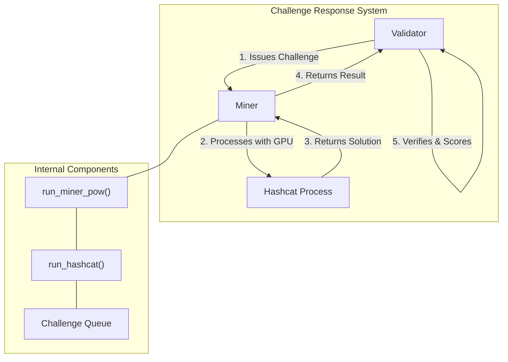
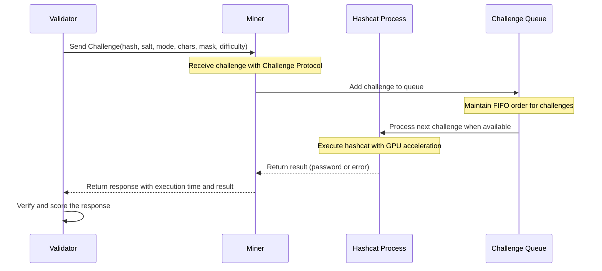
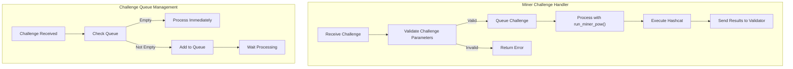
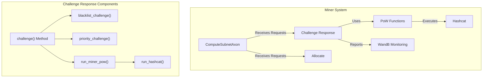

---

title: "Challenge Response"

---


import CollapsibleAside from '@components/CollapsibleAside.astro';

import SourceLink from '@components/SourceLink.astro';


<CollapsibleAside title="Relevant Source Files">

  <SourceLink text=".env.example" href="https://github.com/neuralinternet/SN27/blob/6261c454/.env.example" />

  <SourceLink text="neurons/Miner/pow.py" href="https://github.com/neuralinternet/SN27/blob/6261c454/neurons/Miner/pow.py" />

  <SourceLink text="neurons/Validator/pow.py" href="https://github.com/neuralinternet/SN27/blob/6261c454/neurons/Validator/pow.py" />

  <SourceLink text="neurons/miner.py" href="https://github.com/neuralinternet/SN27/blob/6261c454/neurons/miner.py" />

</CollapsibleAside>


This document describes the Challenge Response system within NI Compute's miner implementation. The Challenge Response mechanism allows miners to respond to computational challenges issued by validators, primarily for Proof of GPU (PoG) verification. This is one of several verification methods used in the subnet to ensure miners have the hardware capabilities they claim and are operational. For details on how validators score miners based on challenge results, see [Scoring System](/validator-system/scoring-system#2.2).

## Overview

The Challenge Response system enables validators to verify miners' GPU capabilities by requiring them to solve cryptographic challenges using their hardware. These challenges are designed to:

1. Verify that miners possess the GPU resources they claim
2. Ensure miners have properly configured systems with working CUDA and hashcat
3. Provide a standardized benchmark for comparison across different hardware
4. Prevent fraudulent resource claims by requiring proof of computational power



Sources: <SourceLink text="neurons/miner.py:491-515" href="https://github.com/neuralinternet/SN27/blob/6261c454/neurons/miner.py#L491-L515" />, <SourceLink text="neurons/Miner/pow.py:175-205" href="https://github.com/neuralinternet/SN27/blob/6261c454/neurons/Miner/pow.py#L175-L205" />

## Challenge Structure

Challenges sent by validators to miners contain specific parameters that define the computational task:

| Parameter | Description |
|-----------|-------------|
| `challenge_hash` | The hash that needs to be cracked |
| `challenge_salt` | Salt value used in the hash generation |
| `challenge_mode` | Hashcat mode identifier for the algorithm |
| `challenge_chars` | Available characters for the password |
| `challenge_mask` | Pattern mask defining password structure |
| `challenge_difficulty` | Difficulty level of the challenge |

The challenges are cryptographic problems that require GPU acceleration to solve efficiently, typically involving password recovery for a hashed value.

Sources: <SourceLink text="neurons/miner.py:491-500" href="https://github.com/neuralinternet/SN27/blob/6261c454/neurons/miner.py#L491-L500" />, <SourceLink text="neurons/Validator/pow.py:29-72" href="https://github.com/neuralinternet/SN27/blob/6261c454/neurons/Validator/pow.py#L29-L72" />

## Challenge Response Flow

The Challenge Response process follows a specific sequence of operations between validators and miners:



Sources: <SourceLink text="neurons/miner.py:491-515" href="https://github.com/neuralinternet/SN27/blob/6261c454/neurons/miner.py#L491-L515" />, <SourceLink text="neurons/Miner/pow.py:175-205" href="https://github.com/neuralinternet/SN27/blob/6261c454/neurons/Miner/pow.py#L175-L205" />

## Challenge Handling on Miner Side

When a miner receives a challenge, it follows these steps:

1. The miner receives the challenge through the `challenge()` method in the `Miner` class.
2. The challenge is identified by a run ID constructed from validator ID, difficulty, and portion of the challenge hash.
3. The challenge is queued in a FIFO manner, ensuring orderly processing of multiple challenges.
4. When processing begins, the miner calls `run_miner_pow()` which executes `run_hashcat()` with the appropriate parameters.
5. Hashcat is run on the miner's GPU to attempt to recover the original input from the hash.
6. Results, including success/failure and execution time, are returned to the validator.

The miner's challenge handler includes validation to prevent invalid challenges (e.g., difficulty &lt;= 0):



Sources: <SourceLink text="neurons/miner.py:491-515" href="https://github.com/neuralinternet/SN27/blob/6261c454/neurons/miner.py#L491-L515" />, <SourceLink text="neurons/Miner/pow.py:29-205" href="https://github.com/neuralinternet/SN27/blob/6261c454/neurons/Miner/pow.py#L29-L205" />

## Hashcat Execution

The core of the challenge response system uses Hashcat, a popular password recovery tool that leverages GPU acceleration:

1. The miner configures Hashcat with parameters from the challenge:
   - Hash and salt combination
   - Attack mode (mode 3 for mask attack)
   - Device type (2 for CUDA/GPU)
   - Hash mode (defining the hash algorithm)
   - Character set and mask
   - Workload profile and extended options

2. Hashcat is executed as a subprocess with timeout protection to prevent hanging:
   - Successful execution returns the recovered password
   - Timeouts or errors are captured and returned as part of the response

3. A queue system ensures challenges are processed sequentially, preventing resource contention:
   - Challenges are added to a FIFO queue
   - New challenges wait until currently running challenges complete
   - Execution time is tracked and returned for performance evaluation

Sources: <SourceLink text="neurons/Miner/pow.py:43-172" href="https://github.com/neuralinternet/SN27/blob/6261c454/neurons/Miner/pow.py#L43-L172" />

## Challenge Generation (Validator Side)

While this document focuses on the miner's perspective, understanding how validators generate challenges provides context:

Validators create challenges using:
1. Secure random password generation with cryptographic randomness
2. Hash generation using BLAKE2b algorithm
3. Configuration of difficulty levels and character sets
4. Creation of formatted challenges with all necessary parameters

The generated challenge is designed to be:
- Verifiable (validator knows the expected answer)
- Hardware-intensive (requires GPU acceleration)
- Time-sensitive (expected completion time correlates with hardware capability)

Sources: <SourceLink text="neurons/Validator/pow.py:29-72" href="https://github.com/neuralinternet/SN27/blob/6261c454/neurons/Validator/pow.py#L29-L72" />

## Priority and Blacklisting

The Challenge Response system includes priority and blacklisting mechanisms:

1. **Priority Handling**: Challenge requests are prioritized based on:
   - Validator stake (higher stake = higher priority)
   - Base priority value (`miner_priority_challenge`)
   - This ensures that challenges from trusted validators with more stake are processed first

2. **Blacklisting**: Miners can reject challenge requests based on:
   - Unrecognized hotkeys (validators not registered in the metagraph)
   - Insufficient stake (below `validator_permit_stake`)
   - Manually blacklisted validators
   - Known exploiters (from `SUSPECTED_EXPLOITERS_HOTKEYS` list)

These mechanisms help protect miners from spam or malicious challenges while ensuring responsiveness to legitimate validators.

Sources: <SourceLink text="neurons/miner.py:482-488" href="https://github.com/neuralinternet/SN27/blob/6261c454/neurons/miner.py#L482-L488" />, <SourceLink text="neurons/miner.py:330-373" href="https://github.com/neuralinternet/SN27/blob/6261c454/neurons/miner.py#L330-L373" />

## Integration with Miner System

The Challenge Response system is integrated into the broader miner architecture:



The Challenge Response system attaches to the miner's axon to receive requests from validators, alongside other endpoints like allocation requests.

Sources: <SourceLink text="neurons/miner.py:227-235" href="https://github.com/neuralinternet/SN27/blob/6261c454/neurons/miner.py#L227-L235" />, <SourceLink text="neurons/miner.py:491-515" href="https://github.com/neuralinternet/SN27/blob/6261c454/neurons/miner.py#L491-L515" />

## CUDA Availability Check

Before processing challenges, miners verify CUDA availability to ensure GPU acceleration works:

```python
def check_cuda_availability():
    import torch

    if torch.cuda.is_available():
        device_count = torch.cuda.device_count()
        bt.logging.info(f"CUDA is available with {device_count} CUDA device(s)!")
    else:
        bt.logging.warning(
            "CUDA is not available or not properly configured on this system."
        )
```

This check happens during miner initialization, ensuring that the challenge response system can utilize GPU acceleration.

Sources: <SourceLink text="neurons/Miner/pow.py:31-40" href="https://github.com/neuralinternet/SN27/blob/6261c454/neurons/Miner/pow.py#L31-L40" />

## Performance Considerations

Challenge response performance is a critical factor in miner evaluation:

1. **Execution Time**: The time taken to solve challenges directly influences scoring
2. **Queue Management**: FIFO queuing ensures fair processing of challenges
3. **Timeout Handling**: Challenges have a maximum execution time (`pow_timeout`)
4. **Workload Profile**: Configurable workload profiles allow miners to balance performance vs. system load

Miners can configure several parameters to optimize challenge response:
- `miner_hashcat_path`: Path to the hashcat executable
- `miner_hashcat_workload_profile`: Performance vs. system impact balance
- `miner_hashcat_extended_options`: Additional hashcat options

Sources: <SourceLink text="neurons/Miner/pow.py:51-172" href="https://github.com/neuralinternet/SN27/blob/6261c454/neurons/Miner/pow.py#L51-L172" />, <SourceLink text="neurons/miner.py:170-172" href="https://github.com/neuralinternet/SN27/blob/6261c454/neurons/miner.py#L170-L172" />

## Security Considerations

The Challenge Response system includes several security features:

1. **Timeout Protection**: Prevents validators from hanging miners with impossible challenges
2. **Blacklisting**: Protects against malicious validators
3. **Process Isolation**: Hashcat runs as a separate subprocess
4. **Error Handling**: Robust error handling prevents system crashes
5. **Queue System**: Prevents resource exhaustion from multiple simultaneous challenges

Sources: <SourceLink text="neurons/Miner/pow.py:92-172" href="https://github.com/neuralinternet/SN27/blob/6261c454/neurons/Miner/pow.py#L92-L172" />, <SourceLink text="neurons/miner.py:330-373" href="https://github.com/neuralinternet/SN27/blob/6261c454/neurons/miner.py#L330-L373" />

## Troubleshooting

Common issues with Challenge Response include:

| Issue | Possible Causes | Solutions |
|-------|-----------------|-----------|
| Timeouts | GPU overload, insufficient hardware | Adjust workload profile, upgrade hardware |
| Errors | Missing/incompatible hashcat, CUDA issues | Check hashcat installation, update drivers |
| No response | Blacklisting, network issues | Check blacklist settings, network connectivity |
| Poor performance | Hardware limitations, competing processes | Close other GPU applications, optimize settings |

Sources: <SourceLink text="neurons/Miner/pow.py:147-165" href="https://github.com/neuralinternet/SN27/blob/6261c454/neurons/Miner/pow.py#L147-L165" />

## Conclusion

The Challenge Response system is a critical component in NI Compute's validator-miner relationship, allowing objective verification of GPU capabilities through computational challenges. By requiring miners to solve cryptographic problems with their GPU hardware, validators can ensure that miners possess the resources they claim to have. This mechanism, combined with other verification methods, creates a trustworthy decentralized GPU marketplace.