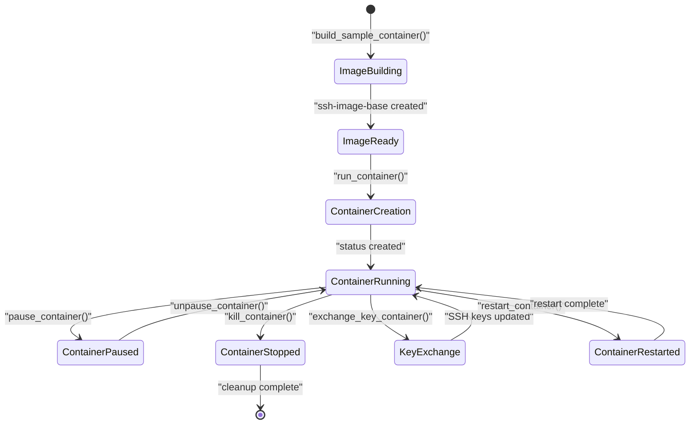
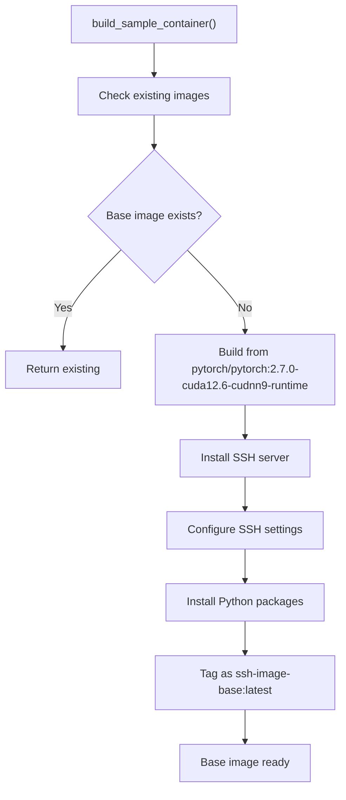
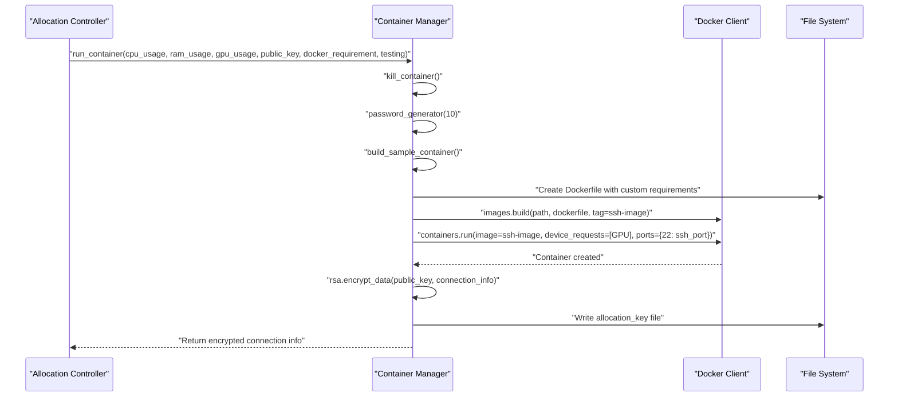
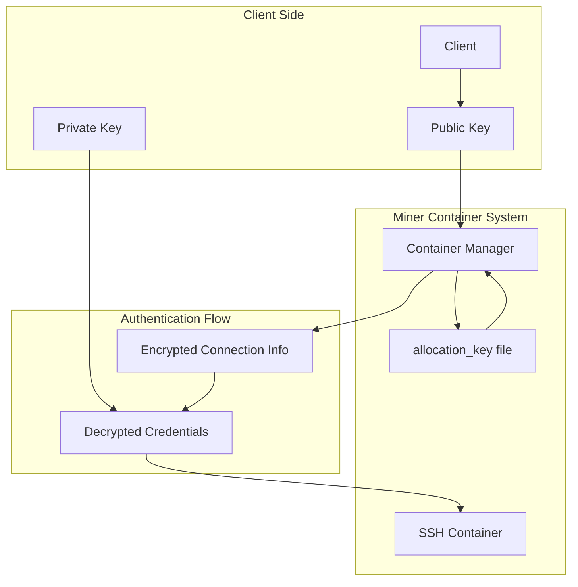
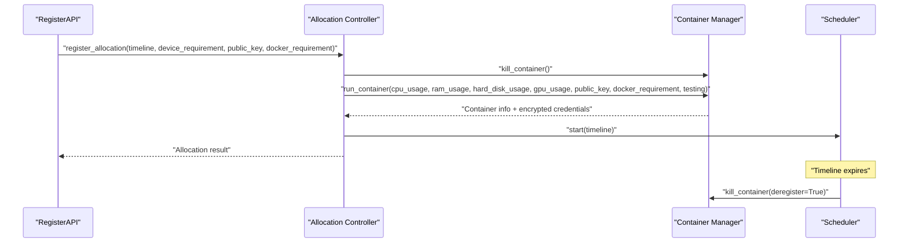
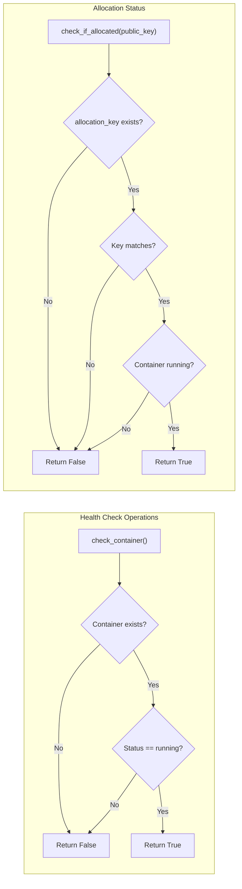
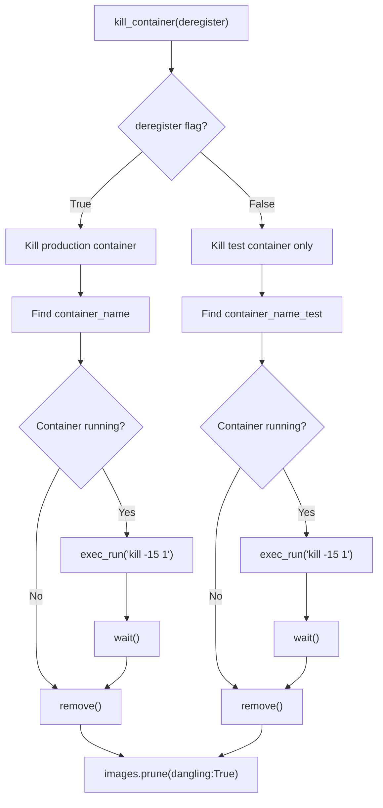

---

title: "Container Management"

---

import CollapsibleAside from '@components/CollapsibleAside.astro';

import SourceLink from '@components/SourceLink.astro';

<CollapsibleAside title="Relevant Source Files">

  <SourceLink text="min_compute.yml" href="https://github.com/neuralinternet/SN27/blob/6261c454/min_compute.yml" />

  <SourceLink text="neurons/Miner/allocate.py" href="https://github.com/neuralinternet/SN27/blob/6261c454/neurons/Miner/allocate.py" />

  <SourceLink text="neurons/Miner/container.py" href="https://github.com/neuralinternet/SN27/blob/6261c454/neurons/Miner/container.py" />

  <SourceLink text="neurons/miner_checker.py" href="https://github.com/neuralinternet/SN27/blob/6261c454/neurons/miner_checker.py" />

  <SourceLink text="tests/test_miner_container.py" href="https://github.com/neuralinternet/SN27/blob/6261c454/tests/test_miner_container.py" />

  <SourceLink text="tests/test_rsa_encryption.py" href="https://github.com/neuralinternet/SN27/blob/6261c454/tests/test_rsa_encryption.py" />

</CollapsibleAside>

Container Management is the core Docker container lifecycle system used by miners to provide isolated compute resources to validators and clients. This system handles the creation, configuration, monitoring, and termination of SSH-enabled containers that serve as the compute environments for resource allocation requests.

For information about how containers integrate with the broader resource allocation workflow, see [Resource Allocation](/miner-system/resource-allocation#3.3). For details about the communication protocols used during container provisioning, see [Specs, Allocate, and Challenge Protocols](/communication-protocols/specs-allocate-and-challenge-protocols#5.1).

## Container Lifecycle Overview

The container management system orchestrates Docker containers through a complete lifecycle from base image preparation to final cleanup. Each container is configured with SSH access, GPU capabilities, and custom software environments based on allocation requirements.

Sources: <SourceLink text="neurons/Miner/container.py:57-103" href="https://github.com/neuralinternet/SN27/blob/6261c454/neurons/Miner/container.py#L57-L103" />, <SourceLink text="neurons/Miner/container.py:384-420" href="https://github.com/neuralinternet/SN27/blob/6261c454/neurons/Miner/container.py#L384-L420" />, <SourceLink text="neurons/Miner/container.py:421-473" href="https://github.com/neuralinternet/SN27/blob/6261c454/neurons/Miner/container.py#L421-L473" />

## Base Image Management

The system maintains a base container image `ssh-image-base` that provides the foundation for all allocated containers. This image includes SSH server configuration, Python runtime, and GPU support.

### Base Image Construction

The base image includes:
- PyTorch CUDA runtime environment
- SSH server with root access enabled
- Python 3 and pip package manager
- Essential build tools and libraries
- Conda environment configuration

Sources: <SourceLink text="neurons/Miner/container.py:280-368" href="https://github.com/neuralinternet/SN27/blob/6261c454/neurons/Miner/container.py#L280-L368" />

## Container Creation and Configuration

When a resource allocation request is received, the system creates a customized container based on the base image and specific requirements.

### Container Creation Process

### Container Configuration Parameters

| Parameter | Description | Example |
|-----------|-------------|---------|
| `cpu_assignment` | CPU cores allocated | `"0-1"` for 2 cores |
| `ram_limit` | Memory limit | `"5g"` for 5GB |
| `hard_disk_capacity` | Storage limit | `"100g"` for 100GB |
| `gpu_capacity` | GPU allocation | `"all"` for all GPUs |
| `ssh_port` | SSH access port | `4444` |
| `shm_size` | Shared memory size | `"7g"` (90% of available) |

Sources: <SourceLink text="neurons/Miner/container.py:105-207" href="https://github.com/neuralinternet/SN27/blob/6261c454/neurons/Miner/container.py#L105-L207" />

## Security and Access Control

The container management system implements a multi-layered security model using RSA encryption and allocation key verification.

### Security Architecture

### Allocation Key Management

The system uses allocation keys to verify container access permissions:

- **Key Storage**: Public keys are base64-encoded and stored in `allocation_key` file
- **Key Verification**: All container operations require matching public key
- **Key Rotation**: SSH keys can be updated through `exchange_key_container()`

### Security Functions

| Function | Purpose | Key Verification |
|----------|---------|------------------|
| `restart_container()` | Restart existing container | Required |
| `pause_container()` | Pause container execution | Required |
| `unpause_container()` | Resume container execution | Required |
| `exchange_key_container()` | Update SSH keys | Required |

Sources: <SourceLink text="neurons/Miner/container.py:370-382" href="https://github.com/neuralinternet/SN27/blob/6261c454/neurons/Miner/container.py#L370-L382" />, <SourceLink text="neurons/Miner/container.py:384-420" href="https://github.com/neuralinternet/SN27/blob/6261c454/neurons/Miner/container.py#L384-L420" />, <SourceLink text="neurons/Miner/container.py:475-521" href="https://github.com/neuralinternet/SN27/blob/6261c454/neurons/Miner/container.py#L475-L521" />

## Integration with Allocation System

Container management integrates with the resource allocation system through the `allocate.py` module, which orchestrates container lifecycle during allocation requests.

### Allocation Integration Flow

### Container Types

The system supports two container types:

- **Production Containers** (`container_name`): Long-running containers for actual resource allocation
- **Test Containers** (`container_name_test`): Short-lived containers for validation and health checks

Sources: <SourceLink text="neurons/Miner/allocate.py:29-62" href="https://github.com/neuralinternet/SN27/blob/6261c454/neurons/Miner/allocate.py#L29-L62" />, <SourceLink text="neurons/Miner/allocate.py:66-94" href="https://github.com/neuralinternet/SN27/blob/6261c454/neurons/Miner/allocate.py#L66-L94" />

## Container Monitoring and Health Checks

The system provides container status monitoring and health checking capabilities used by validators and the allocation system.

### Health Check Functions

### Monitoring Integration

The container system integrates with validator monitoring through:

- **Miner Checker**: Validators use `miner_checker.py` to test container allocation and SSH access
- **Health Endpoints**: API endpoints query container status for resource availability
- **Allocation Tracking**: Container state is synchronized with allocation records

Sources: <SourceLink text="neurons/Miner/container.py:210-222" href="https://github.com/neuralinternet/SN27/blob/6261c454/neurons/Miner/container.py#L210-L222" />, <SourceLink text="neurons/Miner/allocate.py:106-137" href="https://github.com/neuralinternet/SN27/blob/6261c454/neurons/Miner/allocate.py#L106-L137" />, <SourceLink text="neurons/miner_checker.py:85-151" href="https://github.com/neuralinternet/SN27/blob/6261c454/neurons/miner_checker.py#L85-L151" />

## Container Cleanup and Resource Management

The system implements comprehensive cleanup procedures to prevent resource leaks and ensure proper container lifecycle management.

### Cleanup Operations

The cleanup process includes:
- Graceful container termination using SIGTERM
- Container removal from Docker
- Dangling image cleanup
- Allocation key file management

Sources: <SourceLink text="neurons/Miner/container.py:57-103" href="https://github.com/neuralinternet/SN27/blob/6261c454/neurons/Miner/container.py#L57-L103" />