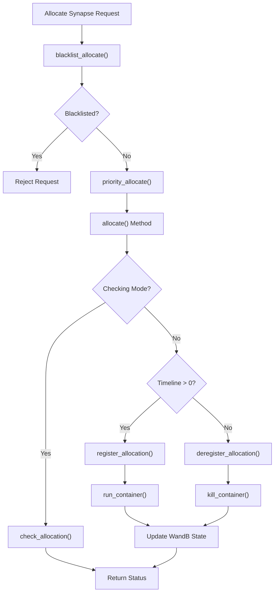
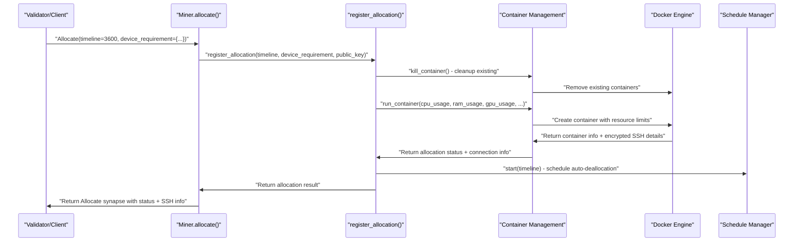
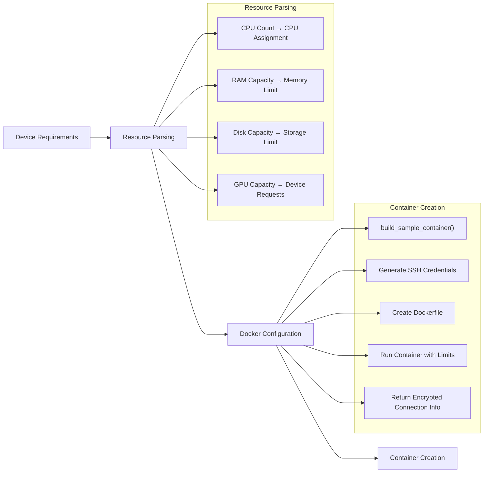
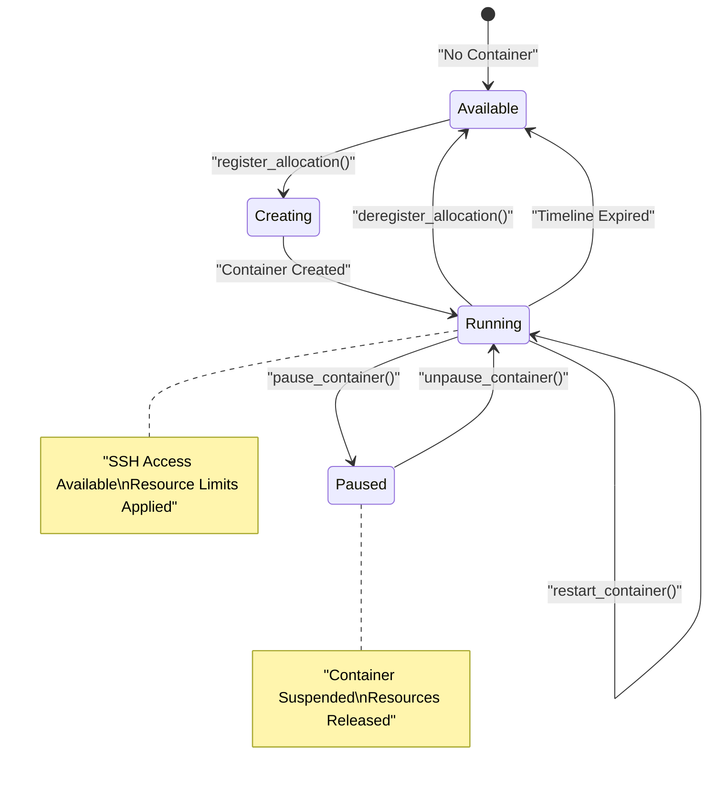
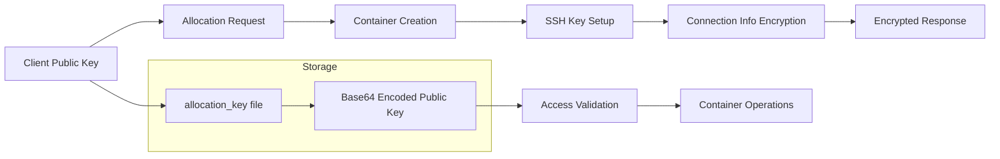
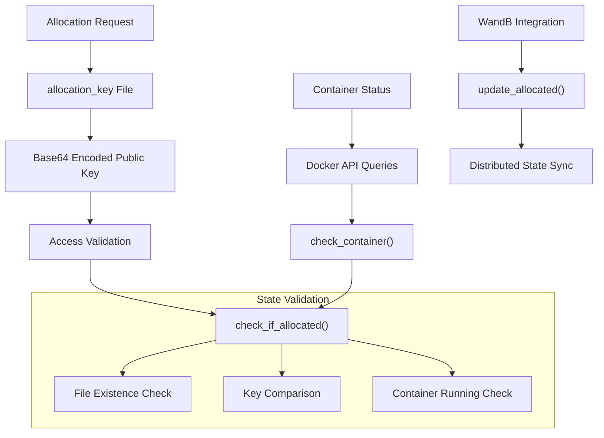
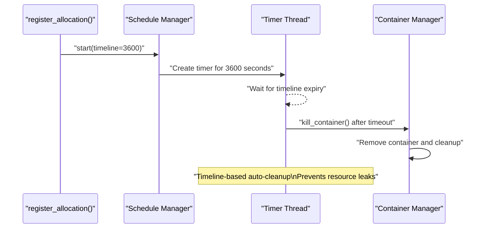
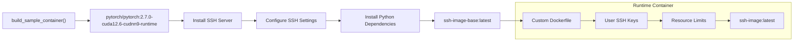

---

title: "Resource Allocation"

---

import CollapsibleAside from '@components/CollapsibleAside.astro';

import SourceLink from '@components/SourceLink.astro';

<CollapsibleAside title="Relevant Source Files">

  <SourceLink text="neurons/Miner/allocate.py" href="https://github.com/neuralinternet/SN27/blob/6261c454/neurons/Miner/allocate.py" />

  <SourceLink text="neurons/Miner/container.py" href="https://github.com/neuralinternet/SN27/blob/6261c454/neurons/Miner/container.py" />

  <SourceLink text="neurons/miner.py" href="https://github.com/neuralinternet/SN27/blob/6261c454/neurons/miner.py" />

  <SourceLink text="neurons/miner_checker.py" href="https://github.com/neuralinternet/SN27/blob/6261c454/neurons/miner_checker.py" />

</CollapsibleAside>

This document covers how miners in the NI Compute Subnet handle resource allocation requests from validators and external clients. Resource allocation involves provisioning Docker containers with specified compute resources (CPU, RAM, GPU, storage) and providing secure SSH access to allocated environments.

For information about the Resource Allocation API that external clients use to request resources, see [Resource Allocation API](/resource-allocation-api#4). For details about container lifecycle management, see [Container Management](/miner-system/container-management#3.1).

## Allocation Request Processing

The miner's resource allocation system is built around the `Allocate` synapse protocol. When a validator or client sends an allocation request, the miner processes it through several stages:

**Allocation Request Flow**

Sources: <SourceLink text="neurons/miner.py:419-479" href="https://github.com/neuralinternet/SN27/blob/6261c454/neurons/miner.py#L419-L479" />, <SourceLink text="neurons/miner.py:397-403" href="https://github.com/neuralinternet/SN27/blob/6261c454/neurons/miner.py#L397-L403" />

The `allocate` method in the `Miner` class handles three types of operations:

| Operation Type | Condition | Action |
|---------------|-----------|---------|
| **Check Allocation** | `checking=True, timeline>0` | Verify resource availability without allocating |
| **Register Allocation** | `checking=False, timeline>0` | Create new resource allocation |
| **Deregister Allocation** | `checking=False, timeline=0` | Remove existing allocation |

## Resource Registration Process

When a miner receives a valid allocation request with `timeline > 0`, it initiates the resource registration process:

**Resource Registration Sequence**

Sources: <SourceLink text="neurons/Miner/allocate.py:29-62" href="https://github.com/neuralinternet/SN27/blob/6261c454/neurons/Miner/allocate.py#L29-L62" />, <SourceLink text="neurons/miner.py:463-476" href="https://github.com/neuralinternet/SN27/blob/6261c454/neurons/miner.py#L463-L476" />

The registration process transforms device requirements into Docker container configurations:

**Resource Requirement Processing**

Sources: <SourceLink text="neurons/Miner/allocate.py:34-51" href="https://github.com/neuralinternet/SN27/blob/6261c454/neurons/Miner/allocate.py#L34-L51" />, <SourceLink text="neurons/Miner/container.py:105-207" href="https://github.com/neuralinternet/SN27/blob/6261c454/neurons/Miner/container.py#L105-L207" />

## Container Resource Management

The container management system translates abstract resource requirements into concrete Docker container limits:

### Resource Limit Translation

| Resource Type | Input Format | Docker Configuration | Implementation |
|--------------|--------------|---------------------|----------------|
| **CPU** | `{"count": 2}` | `cpuset_cpus="0-1"` | <SourceLink text="container.py:110-137" href="https://github.com/neuralinternet/SN27/blob/6261c454/container.py#L110-L137" /> |
| **RAM** | `{"capacity": 5368709120}` | `mem_limit="5g"` | <SourceLink text="container.py:111-133" href="https://github.com/neuralinternet/SN27/blob/6261c454/container.py#L111-L133" /> |
| **GPU** | `{"capacity": "all"}` | `device_requests=[DeviceRequest(...)]` | <SourceLink text="container.py:167-175" href="https://github.com/neuralinternet/SN27/blob/6261c454/container.py#L167-L175" /> |
| **Storage** | `{"capacity": 107374182400}` | Volume mount limits | <SourceLink text="container.py:112-149" href="https://github.com/neuralinternet/SN27/blob/6261c454/container.py#L112-L149" /> |

### Container Lifecycle Operations

The system supports several container management operations beyond basic allocation:

**Container State Management**

Sources: <SourceLink text="neurons/Miner/container.py:421-520" href="https://github.com/neuralinternet/SN27/blob/6261c454/neurons/Miner/container.py#L421-L520" />, <SourceLink text="neurons/miner.py:437-458" href="https://github.com/neuralinternet/SN27/blob/6261c454/neurons/miner.py#L437-L458" />

## Security and Access Control

Resource allocation implements multiple security layers:

### Public Key Authentication

All allocation operations require RSA public key authentication:

**Public Key Authentication Flow**

Sources: <SourceLink text="neurons/Miner/container.py:188-200" href="https://github.com/neuralinternet/SN27/blob/6261c454/neurons/Miner/container.py#L188-L200" />, <SourceLink text="neurons/Miner/allocate.py:74-77" href="https://github.com/neuralinternet/SN27/blob/6261c454/neurons/Miner/allocate.py#L74-L77" />

### SSH Access Management

The system provides secure SSH access to allocated containers:

| Operation | Function | Security Check |
|-----------|----------|----------------|
| **Key Exchange** | `exchange_key_container()` | Public key validation |
| **Container Restart** | `restart_container()` | Allocation key verification |
| **Container Pause** | `pause_container()` | Authentication required |

Sources: <SourceLink text="neurons/Miner/container.py:475-520" href="https://github.com/neuralinternet/SN27/blob/6261c454/neurons/Miner/container.py#L475-L520" />, <SourceLink text="neurons/Miner/container.py:384-419" href="https://github.com/neuralinternet/SN27/blob/6261c454/neurons/Miner/container.py#L384-L419" />

## Allocation State Management

The miner maintains allocation state through multiple mechanisms:

### Local State Storage

**Allocation State Management**

Sources: <SourceLink text="neurons/Miner/allocate.py:106-137" href="https://github.com/neuralinternet/SN27/blob/6261c454/neurons/Miner/allocate.py#L106-L137" />, <SourceLink text="neurons/miner.py:405-417" href="https://github.com/neuralinternet/SN27/blob/6261c454/neurons/miner.py#L405-L417" />

### Automatic Deallocation

The system includes automatic resource cleanup through timeline-based scheduling:

**Automatic Deallocation Timeline**

Sources: <SourceLink text="neurons/Miner/allocate.py:57" href="https://github.com/neuralinternet/SN27/blob/6261c454/neurons/Miner/allocate.py#L57" />, <SourceLink text="neurons/Miner/schedule.py" href="https://github.com/neuralinternet/SN27/blob/6261c454/neurons/Miner/schedule.py" />

## Docker Integration

The allocation system builds upon Docker containers with specific configurations:

### Base Container Setup

The system uses a pre-built base image (`ssh-image-base`) for faster allocation:

**Container Image Pipeline**

Sources: <SourceLink text="neurons/Miner/container.py:280-368" href="https://github.com/neuralinternet/SN27/blob/6261c454/neurons/Miner/container.py#L280-L368" />, <SourceLink text="neurons/Miner/container.py:136-159" href="https://github.com/neuralinternet/SN27/blob/6261c454/neurons/Miner/container.py#L136-L159" />

### Container Configuration

Each allocation creates a customized container with:

- **SSH Access**: Root user with password and key-based authentication
- **GPU Support**: NVIDIA GPU access through device requests
- **Resource Limits**: CPU, memory, and storage constraints
- **Custom Environment**: User-specified Docker commands and dependencies

Sources: <SourceLink text="neurons/Miner/container.py:170-181" href="https://github.com/neuralinternet/SN27/blob/6261c454/neurons/Miner/container.py#L170-L181" />, <SourceLink text="neurons/Miner/container.py:136-146" href="https://github.com/neuralinternet/SN27/blob/6261c454/neurons/Miner/container.py#L136-L146" />