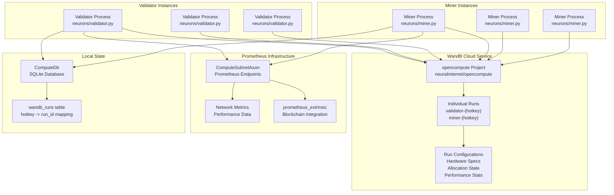
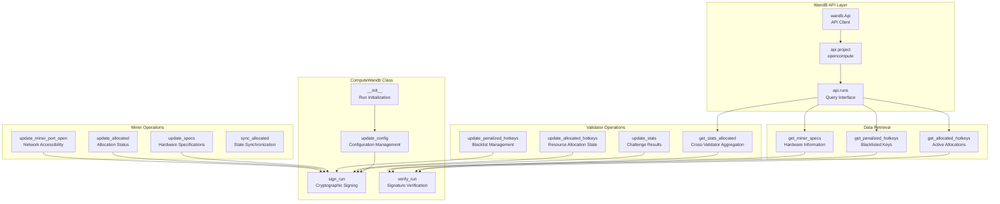
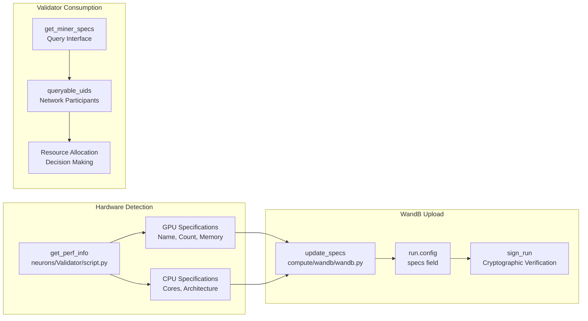
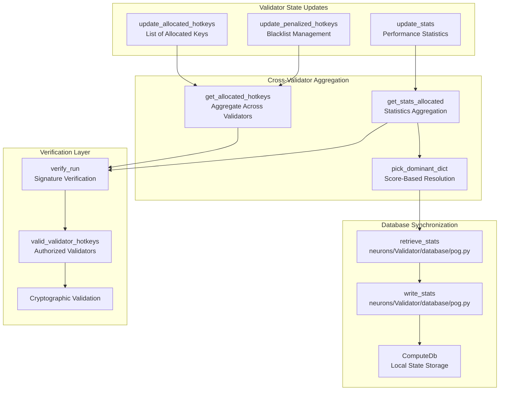
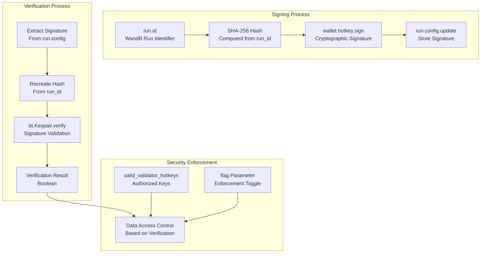
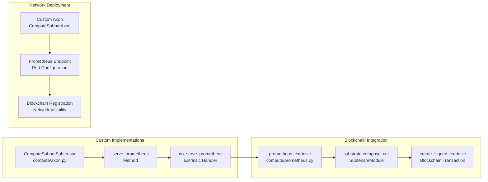
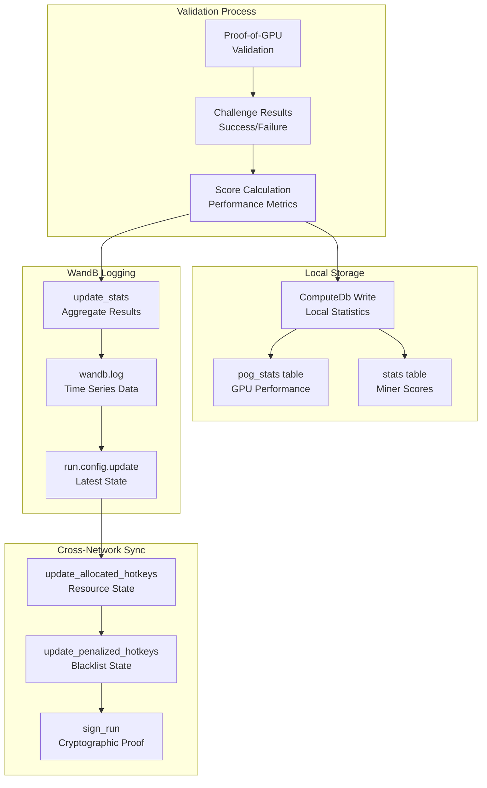

---

title: "Monitoring and Metrics"

---

import CollapsibleAside from '@components/CollapsibleAside.astro';

import SourceLink from '@components/SourceLink.astro';

<CollapsibleAside title="Relevant Source Files">

  <SourceLink text="compute/axon.py" href="https://github.com/neuralinternet/SN27/blob/6261c454/compute/axon.py" />

  <SourceLink text="compute/wandb/wandb.py" href="https://github.com/neuralinternet/SN27/blob/6261c454/compute/wandb/wandb.py" />

</CollapsibleAside>

This document covers the monitoring and observability infrastructure used in the NI Compute Subnet. The system employs two primary monitoring solutions: Weights & Biases (WandB) for distributed state management and experiment tracking, and Prometheus for network observability metrics.

For information about the database operations used for local state persistence, see [Database Operations](/validator-system/database-operations#2.3). For details about the communication protocols that generate monitored events, see [Communication Protocols](/communication-protocols#5).

## Architecture Overview

The monitoring system operates across three main components: validators, miners, and the resource allocation API. WandB serves as the primary distributed state store, while Prometheus provides real-time metrics collection.

### Monitoring Architecture

**Sources:** <SourceLink text="compute/wandb/wandb.py:1-648" href="https://github.com/neuralinternet/SN27/blob/6261c454/compute/wandb/wandb.py#L1-L648" />, <SourceLink text="compute/axon.py:152-284" href="https://github.com/neuralinternet/SN27/blob/6261c454/compute/axon.py#L152-L284" />

## WandB Integration

The `ComputeWandb` class provides the core monitoring infrastructure, managing distributed state across the network through individual WandB runs for each validator and miner.

### WandB System Components

**Sources:** <SourceLink text="compute/wandb/wandb.py:19-648" href="https://github.com/neuralinternet/SN27/blob/6261c454/compute/wandb/wandb.py#L19-L648" />

### Run Management and Initialization

Each network participant creates a WandB run with a standardized naming convention: `{role}-{hotkey}`. The system handles run persistence through local database storage and automatic recovery.

| Component | Description | Key Methods |
|-----------|-------------|-------------|
| Run Initialization | Creates or resumes WandB runs | `__init__`, `save_run_id`, `get_run_id` |
| Configuration Management | Updates run configuration with network state | `update_config` |
| State Persistence | Stores run IDs in local SQLite database | Database operations in `wandb_runs` table |

**Sources:** <SourceLink text="compute/wandb/wandb.py:52-88" href="https://github.com/neuralinternet/SN27/blob/6261c454/compute/wandb/wandb.py#L52-L88" />, <SourceLink text="compute/wandb/wandb.py:109-138" href="https://github.com/neuralinternet/SN27/blob/6261c454/compute/wandb/wandb.py#L109-L138" />

### Hardware Specifications Tracking

Miners upload hardware specifications to enable validators to make informed allocation decisions. The `update_specs` method integrates with the performance measurement system to provide encrypted hardware details.

**Sources:** <SourceLink text="compute/wandb/wandb.py:140-159" href="https://github.com/neuralinternet/SN27/blob/6261c454/compute/wandb/wandb.py#L140-L159" />, <SourceLink text="compute/wandb/wandb.py:540-574" href="https://github.com/neuralinternet/SN27/blob/6261c454/compute/wandb/wandb.py#L540-L574" />

## State Management and Synchronization

The WandB system maintains several critical state categories across the network, with built-in aggregation and conflict resolution mechanisms.

### Allocation State Management

**Sources:** <SourceLink text="compute/wandb/wandb.py:198-250" href="https://github.com/neuralinternet/SN27/blob/6261c454/compute/wandb/wandb.py#L198-L250" />, <SourceLink text="compute/wandb/wandb.py:291-333" href="https://github.com/neuralinternet/SN27/blob/6261c454/compute/wandb/wandb.py#L291-L333" />, <SourceLink text="compute/wandb/wandb.py:334-450" href="https://github.com/neuralinternet/SN27/blob/6261c454/compute/wandb/wandb.py#L334-L450" />

### Statistics Aggregation Algorithm

The `get_stats_allocated` method implements a sophisticated aggregation algorithm that resolves conflicts between multiple validator reports for the same miner UID.

| Step | Process | Implementation |
|------|---------|----------------|
| 1. Collection | Query all validator runs with stats | WandB API filters |
| 2. Verification | Validate cryptographic signatures | `verify_run` method |
| 3. Filtering | Select entries with `own_score=True` and `allocated=True` | Boolean filtering |
| 4. Aggregation | Group by UID, collect multiple reports | Dictionary aggregation |
| 5. Resolution | Use `pick_dominant_dict` for conflict resolution | Counter-based selection |
| 6. Scoring | Prefer highest score in case of ties | Score comparison |

**Sources:** <SourceLink text="compute/wandb/wandb.py:334-450" href="https://github.com/neuralinternet/SN27/blob/6261c454/compute/wandb/wandb.py#L334-L450" />, <SourceLink text="compute/wandb/wandb.py:391-426" href="https://github.com/neuralinternet/SN27/blob/6261c454/compute/wandb/wandb.py#L391-L426" />

## Security and Verification

The monitoring system implements cryptographic verification to ensure data integrity and prevent tampering.

### Signature Verification Process

**Sources:** <SourceLink text="compute/wandb/wandb.py:576-591" href="https://github.com/neuralinternet/SN27/blob/6261c454/compute/wandb/wandb.py#L576-L591" />, <SourceLink text="compute/wandb/wandb.py:592-616" href="https://github.com/neuralinternet/SN27/blob/6261c454/compute/wandb/wandb.py#L592-L616" />

## Prometheus Integration

The Prometheus integration provides real-time metrics collection through custom Axon and Subtensor implementations.

### Prometheus Architecture

**Sources:** <SourceLink text="compute/axon.py:166-201" href="https://github.com/neuralinternet/SN27/blob/6261c454/compute/axon.py#L166-L201" />, <SourceLink text="compute/axon.py:203-283" href="https://github.com/neuralinternet/SN27/blob/6261c454/compute/axon.py#L203-L283" />

### Prometheus Extrinsic Submission

The `serve_prometheus` method submits blockchain extrinsics to register Prometheus endpoints with the network, enabling distributed metrics collection.

| Component | Function | Parameters |
|-----------|----------|------------|
| `serve_prometheus` | Main entry point | `wallet`, `port`, `netuid`, `wait_for_inclusion`, `wait_for_finalization` |
| `do_serve_prometheus` | Extrinsic handler | `call_params`, retry logic with exponential backoff |
| `prometheus_extrinsic` | Blockchain integration | Custom prometheus integration (imported) |

**Sources:** <SourceLink text="compute/axon.py:166-201" href="https://github.com/neuralinternet/SN27/blob/6261c454/compute/axon.py#L166-L201" />, <SourceLink text="compute/axon.py:203-283" href="https://github.com/neuralinternet/SN27/blob/6261c454/compute/axon.py#L203-L283" />

## Data Flow Integration

The monitoring system integrates with the core subnet operations through several key data flows.

### Validator Monitoring Flow

**Sources:** <SourceLink text="compute/wandb/wandb.py:186-196" href="https://github.com/neuralinternet/SN27/blob/6261c454/compute/wandb/wandb.py#L186-L196" />, <SourceLink text="compute/wandb/wandb.py:198-230" href="https://github.com/neuralinternet/SN27/blob/6261c454/compute/wandb/wandb.py#L198-L230" />, <SourceLink text="compute/wandb/wandb.py:232-249" href="https://github.com/neuralinternet/SN27/blob/6261c454/compute/wandb/wandb.py#L232-L249" />

## Configuration and Environment

The monitoring system requires specific configuration for proper operation, including API credentials and network parameters.

### Environment Requirements

| Requirement | Configuration | Source |
|-------------|---------------|---------|
| WandB API Key | `WANDB_API_KEY` environment variable or `.netrc` file | Environment setup |
| Project Configuration | `PUBLIC_WANDB_NAME = "opencompute"` | Hard-coded constant |
| Entity Configuration | `PUBLIC_WANDB_ENTITY = "neuralinternet"` | Hard-coded constant |
| Database Connection | `ComputeDb()` instance | Local SQLite database |

**Sources:** <SourceLink text="compute/wandb/wandb.py:15-16" href="https://github.com/neuralinternet/SN27/blob/6261c454/compute/wandb/wandb.py#L15-L16" />, <SourceLink text="compute/wandb/wandb.py:38-45" href="https://github.com/neuralinternet/SN27/blob/6261c454/compute/wandb/wandb.py#L38-L45" />