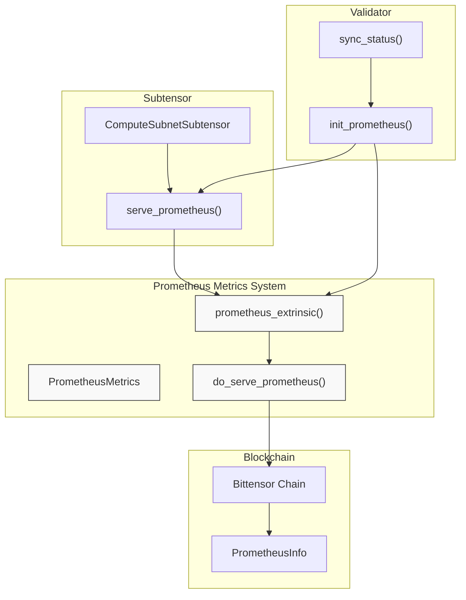
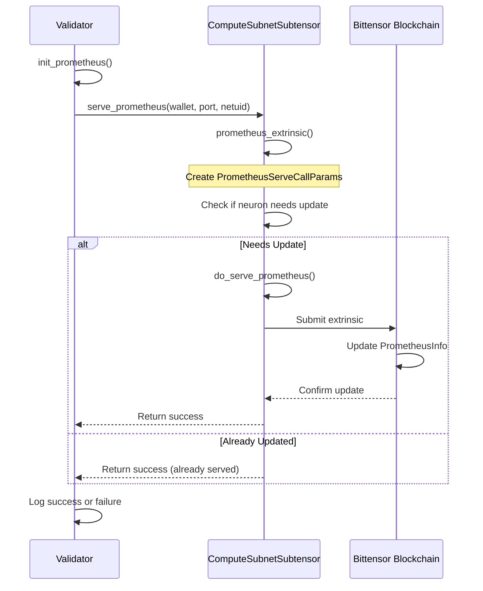
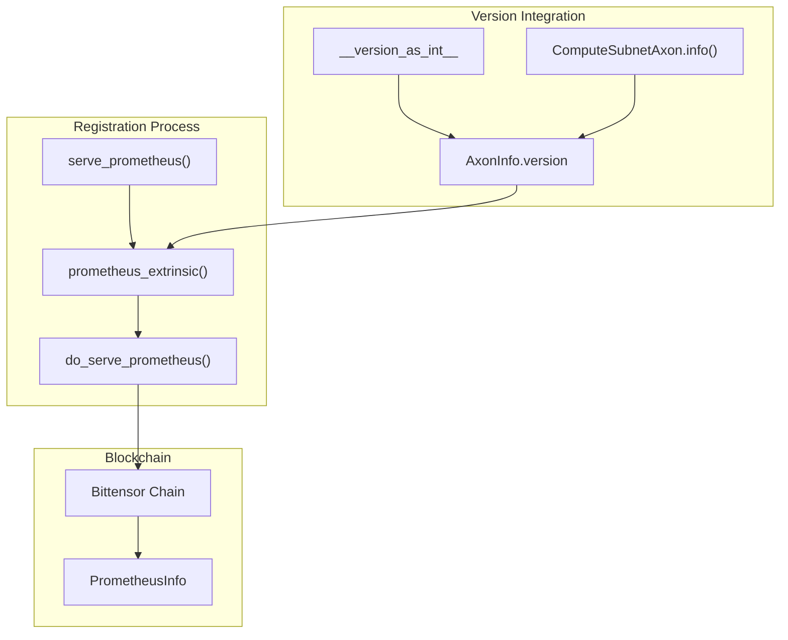
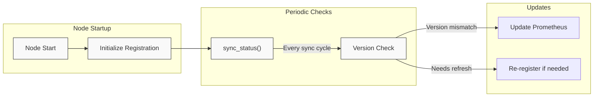
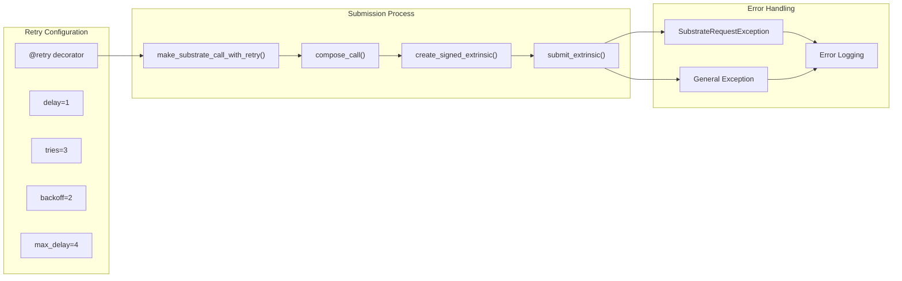

---

title: "Prometheus Metrics"

---


import CollapsibleAside from '@components/CollapsibleAside.astro';

import SourceLink from '@components/SourceLink.astro';


<CollapsibleAside title="Relevant Source Files">

  <SourceLink text="compute/axon.py" href="https://github.com/neuralinternet/SN27/blob/6261c454/compute/axon.py" />

</CollapsibleAside>


This document explains how the NI Compute system implements and utilizes Prometheus metrics for monitoring and observability. Prometheus is a popular open-source monitoring and alerting toolkit used to collect and query time-series metrics from various systems. In NI Compute, Prometheus metrics provide crucial insights into the performance and behavior of validators and miners in the decentralized GPU compute marketplace.

For information about general monitoring and integration with Weights & Biases, see [WandB Integration](/monitoring-and-metrics/wandb-integration#6.1).

## 1. Prometheus Metrics Architecture

Prometheus metrics in NI Compute are implemented through a specialized registration system that integrates with the Bittensor blockchain. This integration ensures that monitoring endpoints are discoverable by other network participants.



Sources: <SourceLink text="compute/axon.py:166-201" href="https://github.com/neuralinternet/SN27/blob/6261c454/compute/axon.py#L166-L201" />, <SourceLink text="compute/axon.py:49" href="https://github.com/neuralinternet/SN27/blob/6261c454/compute/axon.py#L49" />

## 2. Prometheus Registration Process

The registration process involves the validator registering its Prometheus metrics endpoint with the Bittensor blockchain, making it discoverable to other nodes and monitoring systems.



Sources: <SourceLink text="compute/axon.py:166-201" href="https://github.com/neuralinternet/SN27/blob/6261c454/compute/axon.py#L166-L201" />, <SourceLink text="compute/axon.py:203-283" href="https://github.com/neuralinternet/SN27/blob/6261c454/compute/axon.py#L203-L283" />

## 3. Prometheus Metrics Implementation

### 3.1 Registration Functions

The NI Compute system implements several key functions to handle Prometheus metrics registration:

#### ComputeSubnetSubtensor.serve_prometheus()

The `serve_prometheus()` method in the `ComputeSubnetSubtensor` class coordinates Prometheus metrics registration on the blockchain. This method:

- Accepts wallet, port, netuid, and wait parameters
- Calls the `prometheus_extrinsic()` function to handle the registration process
- Returns a boolean indicating success or failure
- Includes comprehensive error handling and logging

#### ComputeSubnetSubtensor.do_serve_prometheus()

The `do_serve_prometheus()` method handles the low-level blockchain interaction:

- Composes a substrate call to `SubtensorModule.serve_prometheus`
- Creates a signed extrinsic using the wallet hotkey
- Implements retry logic with exponential backoff (3 tries, 2x backoff, max 4s delay)
- Submits the extrinsic and processes the response
- Returns a tuple of (success: bool, error: Optional[dict])

#### prometheus_extrinsic()

The `prometheus_extrinsic()` function (imported from `compute.prometheus`) prepares the registration parameters and delegates to `do_serve_prometheus()`.

Sources: <SourceLink text="compute/axon.py:166-201" href="https://github.com/neuralinternet/SN27/blob/6261c454/compute/axon.py#L166-L201" />, <SourceLink text="compute/axon.py:203-283" href="https://github.com/neuralinternet/SN27/blob/6261c454/compute/axon.py#L203-L283" />, <SourceLink text="compute/axon.py:258-283" href="https://github.com/neuralinternet/SN27/blob/6261c454/compute/axon.py#L258-L283" />

### 3.2 Versioning and Auto-Update

The system uses version information from `__version_as_int__` for Prometheus metrics registration. The version is embedded in the axon info that gets registered on the blockchain.



Sources: <SourceLink text="compute/axon.py:47" href="https://github.com/neuralinternet/SN27/blob/6261c454/compute/axon.py#L47" />, <SourceLink text="compute/axon.py:376-388" href="https://github.com/neuralinternet/SN27/blob/6261c454/compute/axon.py#L376-L388" />

## 4. Substrate Call Structure

The Prometheus registration uses a substrate call to the `SubtensorModule.serve_prometheus` function. The call parameters structure is defined by the Bittensor substrate interface and includes:

| Parameter | Description | Implementation |
|-----------|-------------|----------------|
| `call_module` | Target module name | `"SubtensorModule"` |
| `call_function` | Target function name | `"serve_prometheus"` |
| `call_params` | Registration parameters | `PrometheusServeCallParams` |

The method creates a signed extrinsic using the wallet hotkey and submits it to the substrate interface with configurable wait options for inclusion and finalization.

Sources: <SourceLink text="compute/axon.py:260-267" href="https://github.com/neuralinternet/SN27/blob/6261c454/compute/axon.py#L260-L267" />, <SourceLink text="compute/axon.py:206" href="https://github.com/neuralinternet/SN27/blob/6261c454/compute/axon.py#L206" />

## 5. Blockchain Integration

### 5.1 ComputeSubnetSubtensor Extension

The `ComputeSubnetSubtensor` class extends Bittensor's base `Subtensor` class to add compute subnet-specific functionality:

```mermaid
classDiagram
    class Subtensor {
        <<Bittensor Core>>
        +substrate: SubstrateInterface
        +compose_call()
        +create_signed_extrinsic()
    }
    
    class ComputeSubnetSubtensor {
        +serve_prometheus(wallet, port, netuid)
        +do_serve_prometheus(wallet, call_params)
        -make_substrate_call_with_retry()
    }
    
    class prometheus_extrinsic {
        <<Function>>
        (wallet, port, netuid)
    }
    
    Subtensor <|-- ComputeSubnetSubtensor
    ComputeSubnetSubtensor --> prometheus_extrinsic : calls
```

### 5.2 Extrinsic Submission Flow

The registration process uses Bittensor's substrate interface for blockchain interaction:

1. **Call Composition**: Uses `substrate.compose_call()` to create the blockchain call
2. **Extrinsic Creation**: Creates a signed extrinsic with `substrate.create_signed_extrinsic()`
3. **Submission**: Submits via `substrate.submit_extrinsic()` with retry logic
4. **Response Processing**: Processes events and checks for success/failure

Sources: <SourceLink text="compute/axon.py:152-165" href="https://github.com/neuralinternet/SN27/blob/6261c454/compute/axon.py#L152-L165" />, <SourceLink text="compute/axon.py:260-283" href="https://github.com/neuralinternet/SN27/blob/6261c454/compute/axon.py#L260-L283" />

## 6. Using Prometheus Metrics

### 6.1 Accessing Metrics

Once registered, Prometheus metrics are available at:

```
http://<node_ip>:<prometheus_port>/metrics
```

The exact port is determined by the validator's configuration, typically using Bittensor's default axon port.

### 6.2 Common Metrics

While the specific metrics exposed aren't explicitly documented in the code provided, Prometheus in Bittensor networks typically provides metrics such as:

- Node operational status
- Request counts and latencies
- Resource utilization (CPU, memory, GPU)
- Network activity
- Validation and scoring information

### 6.3 Integration with Monitoring Systems

To monitor NI Compute nodes using Prometheus:

1. Configure a Prometheus server to scrape the registered endpoints
2. Set up appropriate recording rules and alerts
3. Use visualization tools like Grafana to create dashboards

## 7. Monitoring Lifecycle

The NI Compute system ensures continuous monitoring availability through its lifecycle management:



Sources: <SourceLink text="neurons/validator.py:428-446" href="https://github.com/neuralinternet/SN27/blob/6261c454/neurons/validator.py#L428-L446" />, <SourceLink text="compute/prometheus.py:80-95" href="https://github.com/neuralinternet/SN27/blob/6261c454/compute/prometheus.py#L80-L95" />

## 8. Error Handling and Reliability

### 8.1 Retry Logic Implementation

The `do_serve_prometheus()` method implements comprehensive retry logic for reliable blockchain communication:



### 8.2 Exception Management

The system handles multiple types of errors:

- **SubstrateRequestException**: Caught and logged with formatted error messages
- **General Exceptions**: Unexpected errors are logged with full stack traces
- **Response Processing**: Success/failure determined by response event processing

### 8.3 Comprehensive Logging

Error logging includes:
- Detailed exception information with `exc_info=True`
- Formatted error messages using `format_error_message()`
- Debug-level logging for successful operations

Sources: <SourceLink text="compute/axon.py:258-283" href="https://github.com/neuralinternet/SN27/blob/6261c454/compute/axon.py#L258-L283" />, <SourceLink text="compute/axon.py:244-256" href="https://github.com/neuralinternet/SN27/blob/6261c454/compute/axon.py#L244-L256" />, <SourceLink text="compute/axon.py:197-201" href="https://github.com/neuralinternet/SN27/blob/6261c454/compute/axon.py#L197-L201" />

## 9. Summary

Prometheus metrics in NI Compute provide essential observability into the decentralized GPU marketplace. The registration system ensures that metrics endpoints are discoverable through the Bittensor blockchain, allowing for comprehensive monitoring of validators and miners. Through version tracking and periodic updates, the system maintains monitoring capabilities even as the software evolves.