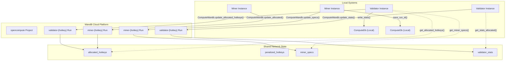
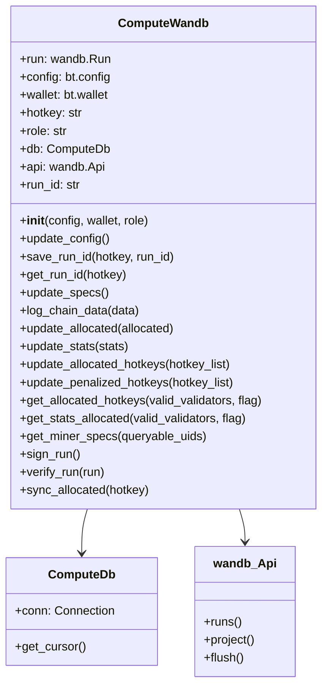
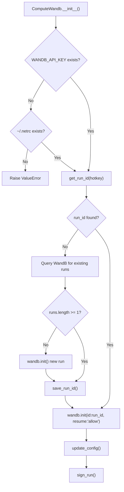
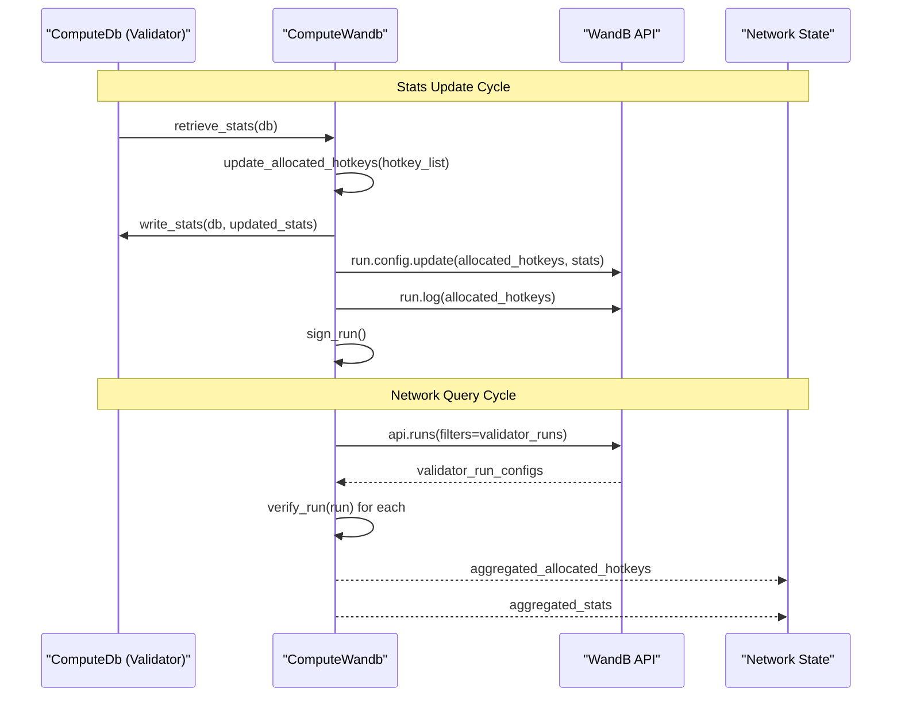
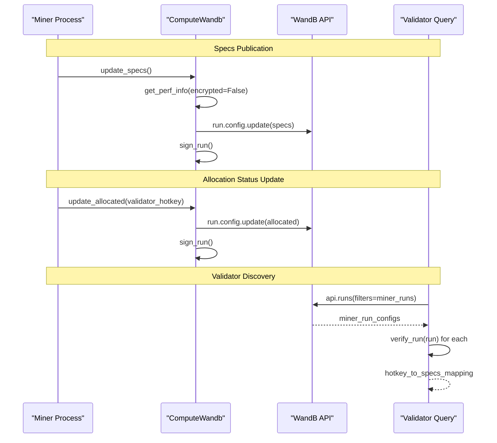
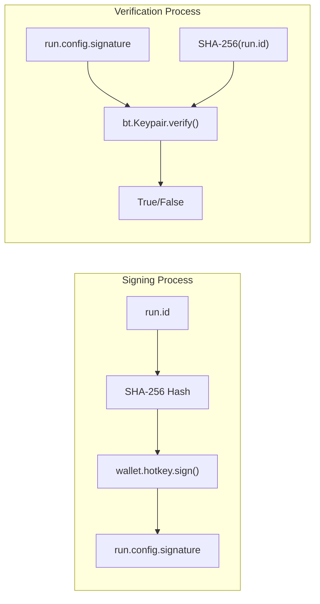

---

title: "WandB Integration"

---


import CollapsibleAside from '@components/CollapsibleAside.astro';

import SourceLink from '@components/SourceLink.astro';


<CollapsibleAside title="Relevant Source Files">

  <SourceLink text="compute/wandb/wandb.py" href="https://github.com/neuralinternet/SN27/blob/6261c454/compute/wandb/wandb.py" />

</CollapsibleAside>


The WandB Integration system provides distributed state management and experiment tracking across the NI Compute Subnet using Weights & Biases (WandB) as a centralized data store. This system enables validators and miners to share critical network state including hardware specifications, allocation status, performance metrics, and penalty information in a verifiable and tamper-resistant manner.

This document covers the technical implementation of WandB integration for network-wide data synchronization. For Prometheus-based local metrics collection, see [Prometheus Metrics](/monitoring-and-metrics/prometheus-metrics#6.2).

## Architecture Overview

The WandB integration operates as a distributed state management layer that sits between local database storage and network-wide coordination. Each validator and miner maintains its own WandB run that serves as both a data publication mechanism and a verification layer through cryptographic signatures.



**Sources:** <SourceLink text="compute/wandb/wandb.py:1-648" href="https://github.com/neuralinternet/SN27/blob/6261c454/compute/wandb/wandb.py#L1-L648" />

## Core Components

### ComputeWandb Class

The `ComputeWandb` class serves as the primary interface for all WandB operations within the compute subnet. It manages authentication, run lifecycle, data synchronization, and cryptographic verification.



**Sources:** <SourceLink text="compute/wandb/wandb.py:19-648" href="https://github.com/neuralinternet/SN27/blob/6261c454/compute/wandb/wandb.py#L19-L648" />

### Authentication and Run Management

The system manages WandB authentication through API keys and run persistence through local database storage. Each hotkey maintains a single persistent run across restarts.

| Configuration Parameter | Value | Purpose |
|------------------------|-------|---------|
| `PUBLIC_WANDB_NAME` | `"opencompute"` | Project name |
| `PUBLIC_WANDB_ENTITY` | `"neuralinternet"` | Organization entity |
| Run naming pattern | `"{role}-{hotkey}"` | Unique run identification |

The authentication flow handles multiple scenarios:



**Sources:** <SourceLink text="compute/wandb/wandb.py:22-88" href="https://github.com/neuralinternet/SN27/blob/6261c454/compute/wandb/wandb.py#L22-L88" />, <SourceLink text="compute/wandb/wandb.py:109-138" href="https://github.com/neuralinternet/SN27/blob/6261c454/compute/wandb/wandb.py#L109-L138" />

## Data Synchronization Patterns

### Validator Data Flow

Validators publish aggregated network statistics and maintain lists of allocated and penalized hotkeys. The synchronization ensures consistency between local database state and distributed WandB state.



**Sources:** <SourceLink text="compute/wandb/wandb.py:198-230" href="https://github.com/neuralinternet/SN27/blob/6261c454/compute/wandb/wandb.py#L198-L230" />, <SourceLink text="compute/wandb/wandb.py:291-332" href="https://github.com/neuralinternet/SN27/blob/6261c454/compute/wandb/wandb.py#L291-L332" />, <SourceLink text="compute/wandb/wandb.py:334-450" href="https://github.com/neuralinternet/SN27/blob/6261c454/compute/wandb/wandb.py#L334-L450" />

### Miner Data Flow

Miners publish hardware specifications and allocation status, enabling validators to discover available resources and verify capabilities.



**Sources:** <SourceLink text="compute/wandb/wandb.py:140-159" href="https://github.com/neuralinternet/SN27/blob/6261c454/compute/wandb/wandb.py#L140-L159" />, <SourceLink text="compute/wandb/wandb.py:168-184" href="https://github.com/neuralinternet/SN27/blob/6261c454/compute/wandb/wandb.py#L168-L184" />, <SourceLink text="compute/wandb/wandb.py:540-574" href="https://github.com/neuralinternet/SN27/blob/6261c454/compute/wandb/wandb.py#L540-L574" />

## Security and Verification

### Cryptographic Signature System

All WandB runs are signed using the participant's hotkey to prevent data tampering and ensure authenticity. The signature covers the run ID to prevent replay attacks.



The verification process validates both signature authenticity and validator authorization:

| Verification Check | Implementation | Purpose |
|-------------------|----------------|---------|
| Signature validity | `bt.Keypair(ss58_address=hotkey).verify()` | Prevents data tampering |
| Validator authorization | `hotkey in valid_validator_hotkeys` | Prevents unauthorized updates |
| Data existence | Config field presence checks | Ensures required data |

**Sources:** <SourceLink text="compute/wandb/wandb.py:576-616" href="https://github.com/neuralinternet/SN27/blob/6261c454/compute/wandb/wandb.py#L576-L616" />

## Configuration and Setup

### Environment Requirements

| Requirement | Configuration Method | Purpose |
|-------------|---------------------|---------|
| WandB API Key | `WANDB_API_KEY` environment variable | Authentication |
| WandB Login | `wandb login` command | Alternative authentication |
| Network file | `~/.netrc` | Credential storage |

### Run Configuration Schema

The system maintains a standardized configuration schema across all runs:

```json
{
  "hotkey": "ss58_address",
  "role": "validator|miner", 
  "config": "bt.config_object",
  "version": "version_integer",
  "specs": "hardware_specifications",
  "allocated": "boolean_or_hotkey",
  "allocated_hotkeys": ["hotkey_list"],
  "penalized_hotkeys": ["hotkey_list"],
  "stats": "uid_to_stats_mapping",
  "signature": "hex_signature"
}
```

### Database Integration

The system maintains local state persistence through the `wandb_runs` table in `ComputeDb`:

| Column | Type | Purpose |
|--------|------|---------|
| `hotkey` | TEXT | Participant identifier |
| `run_id` | TEXT | WandB run identifier |

**Sources:** <SourceLink text="compute/wandb/wandb.py:15-52" href="https://github.com/neuralinternet/SN27/blob/6261c454/compute/wandb/wandb.py#L15-L52" />, <SourceLink text="compute/wandb/wandb.py:90-108" href="https://github.com/neuralinternet/SN27/blob/6261c454/compute/wandb/wandb.py#L90-L108" />, <SourceLink text="compute/wandb/wandb.py:109-138" href="https://github.com/neuralinternet/SN27/blob/6261c454/compute/wandb/wandb.py#L109-L138" />