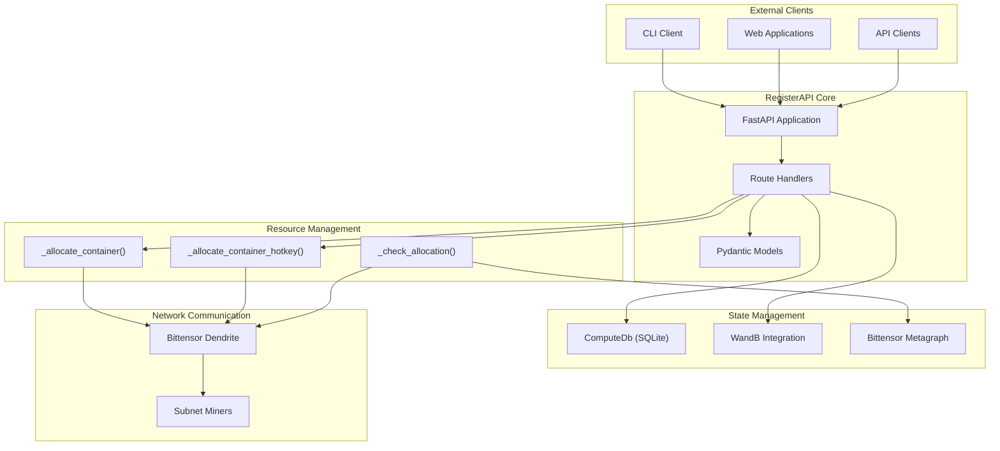
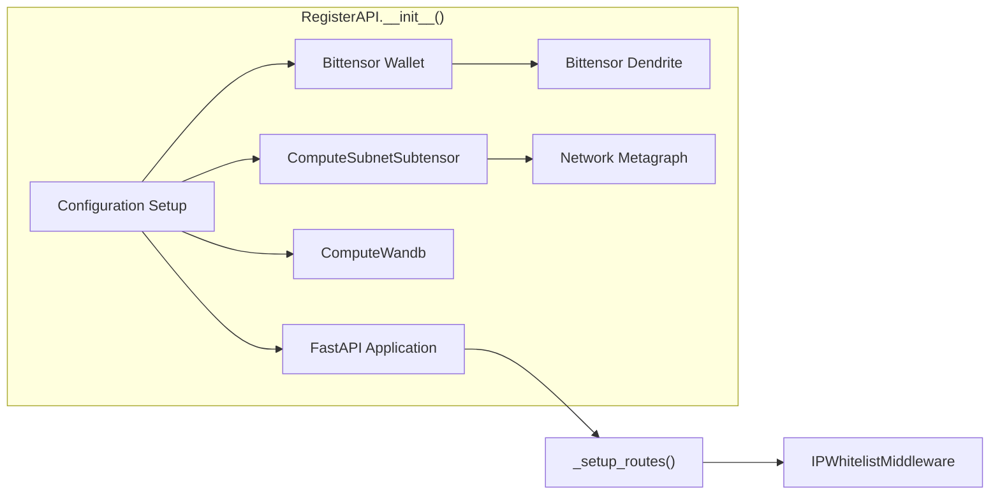
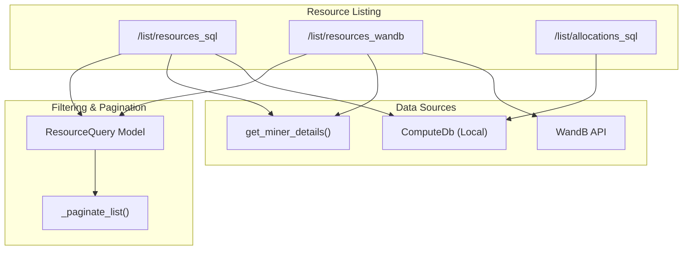
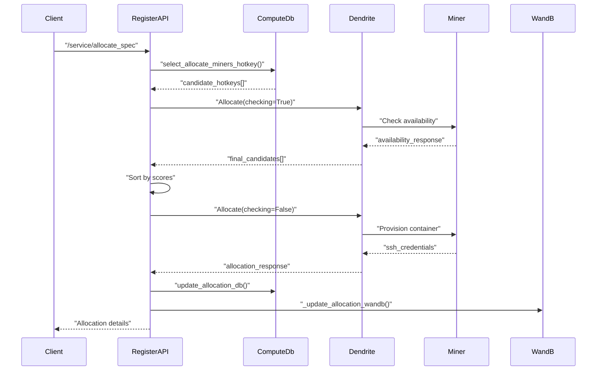

---

title: "Resource Allocation API"

---

import CollapsibleAside from '@components/CollapsibleAside.astro';

import SourceLink from '@components/SourceLink.astro';

<CollapsibleAside title="Relevant Source Files">

  <SourceLink text="neurons/register_api.py" href="https://github.com/neuralinternet/SN27/blob/6261c454/neurons/register_api.py" />

</CollapsibleAside>

## Purpose and Scope

The Resource Allocation API is a FastAPI-based web service that provides programmatic access to GPU compute resources within the NI Compute Subnet. It serves as the primary interface for external clients to discover, allocate, deallocate, and manage computational resources provided by subnet miners.

This system handles the complete lifecycle of resource allocation, from initial discovery through active management of allocated containers. For information about the underlying miner resource provisioning, see [Miner System](/miner-system#3). For details about the validation and scoring of these resources, see [Validator System](/validator-system#2).

## Architecture Overview

The Resource Allocation API is implemented as the `RegisterAPI` class in <SourceLink text="neurons/register_api.py:229-3251" href="https://github.com/neuralinternet/SN27/blob/6261c454/neurons/register_api.py#L229-L3251" />. It operates as a standalone FastAPI application that interfaces with the Bittensor network, local databases, and distributed state management systems.

Sources: <SourceLink text="neurons/register_api.py:229-3251" href="https://github.com/neuralinternet/SN27/blob/6261c454/neurons/register_api.py#L229-L3251" />

## Core Components

### FastAPI Application Setup

The `RegisterAPI` class initializes a FastAPI application with SSL support and middleware for IP whitelisting when enabled. The application runs on port 8903 by default and requires SSL certificates for secure communication.

Sources: <SourceLink text="neurons/register_api.py:229-342" href="https://github.com/neuralinternet/SN27/blob/6261c454/neurons/register_api.py#L229-L342" />, <SourceLink text="neurons/register_api.py:314-323" href="https://github.com/neuralinternet/SN27/blob/6261c454/neurons/register_api.py#L314-L323" />

### Request/Response Models

The API uses Pydantic models to define request and response structures:

| Model | Purpose | Key Fields |
|-------|---------|------------|
| `DeviceRequirement` | GPU resource specifications | `gpu_type`, `gpu_size`, `ram`, `timeline` |
| `DockerRequirement` | Container configuration | `base_image`, `ssh_key`, `dockerfile` |
| `Allocation` | Allocation response data | `hotkey`, `ssh_ip`, `ssh_port`, `uuid_key` |
| `Resource` | Resource information | `gpu_name`, `gpu_capacity`, `allocate_status` |
| `ResourceQuery` | Resource filtering | `gpu_name`, `cpu_count_min/max`, capacity ranges |

Sources: <SourceLink text="neurons/register_api.py:147-214" href="https://github.com/neuralinternet/SN27/blob/6261c454/neurons/register_api.py#L147-L214" />, <SourceLink text="neurons/register_api.py:156-168" href="https://github.com/neuralinternet/SN27/blob/6261c454/neurons/register_api.py#L156-L168" />

## API Endpoints

### Resource Allocation Endpoints

#### Allocate by Specification
- **Endpoint**: `POST /service/allocate_spec`
- **Handler**: <SourceLink text="neurons/register_api.py:434-547" href="https://github.com/neuralinternet/SN27/blob/6261c454/neurons/register_api.py#L434-L547" />
- **Purpose**: Allocates resources based on GPU specifications and requirements
- **Process**: Discovers suitable miners, validates availability, provisions container

#### Allocate by Hotkey
- **Endpoint**: `POST /service/allocate_hotkey`
- **Handler**: <SourceLink text="neurons/register_api.py:576-695" href="https://github.com/neuralinternet/SN27/blob/6261c454/neurons/register_api.py#L576-L695" />
- **Purpose**: Allocates a specific miner's resources by hotkey
- **Process**: Direct allocation to specified miner with container provisioning

#### Deallocate Resources
- **Endpoint**: `POST /service/deallocate`
- **Handler**: <SourceLink text="neurons/register_api.py:725-850" href="https://github.com/neuralinternet/SN27/blob/6261c454/neurons/register_api.py#L725-L850" />
- **Purpose**: Releases allocated resources and cleans up containers
- **Process**: Validates UUID, sends deallocation signal to miner, updates state

### Container Management Endpoints

The API provides Docker container lifecycle management:

| Endpoint | Purpose | Handler Location |
|----------|---------|-------------------|
| `/service/restart_docker` | Restart allocated container | <SourceLink text="neurons/register_api.py:920-1012" href="https://github.com/neuralinternet/SN27/blob/6261c454/neurons/register_api.py#L920-L1012" /> |
| `/service/pause_docker` | Pause container execution | <SourceLink text="neurons/register_api.py:1027-1114" href="https://github.com/neuralinternet/SN27/blob/6261c454/neurons/register_api.py#L1027-L1114" /> |
| `/service/unpause_docker` | Resume paused container | <SourceLink text="neurons/register_api.py:1129-1215" href="https://github.com/neuralinternet/SN27/blob/6261c454/neurons/register_api.py#L1129-L1215" /> |
| `/service/exchange_docker_key` | Update SSH keys | <SourceLink text="neurons/register_api.py:1230-1317" href="https://github.com/neuralinternet/SN27/blob/6261c454/neurons/register_api.py#L1230-L1317" /> |

### Resource Discovery Endpoints

Sources: <SourceLink text="neurons/register_api.py:1441-1644" href="https://github.com/neuralinternet/SN27/blob/6261c454/neurons/register_api.py#L1441-L1644" />, <SourceLink text="neurons/register_api.py:1847-2053" href="https://github.com/neuralinternet/SN27/blob/6261c454/neurons/register_api.py#L1847-L2053" />, <SourceLink text="neurons/register_api.py:1346-1419" href="https://github.com/neuralinternet/SN27/blob/6261c454/neurons/register_api.py#L1346-L1419" />

## Resource Management Logic

### Allocation Process

The allocation process involves candidate discovery, availability checking, and container provisioning:

Sources: <SourceLink text="neurons/register_api.py:2733-2805" href="https://github.com/neuralinternet/SN27/blob/6261c454/neurons/register_api.py#L2733-L2805" />, <SourceLink text="neurons/register_api.py:2807-2889" href="https://github.com/neuralinternet/SN27/blob/6261c454/neurons/register_api.py#L2807-L2889" />

### Health Monitoring

The `_check_allocation()` method continuously monitors allocated resources:

- **Frequency**: Every 180 seconds (`ALLOCATE_CHECK_PERIOD`)
- **Timeout Handling**: Deallocates after 20 consecutive failures (`ALLOCATE_CHECK_COUNT`)
- **Notifications**: Sends webhook notifications for status changes
- **Implementation**: <SourceLink text="neurons/register_api.py:3002-3100" href="https://github.com/neuralinternet/SN27/blob/6261c454/neurons/register_api.py#L3002-L3100" />

### State Synchronization

Resource state is maintained across multiple systems:

| System | Update Method | Purpose |
|--------|---------------|---------|
| Local SQLite | `update_allocation_db()` | Persistent allocation tracking |
| WandB | `_update_allocation_wandb()` | Distributed state sharing |
| Metagraph | `_refresh_metagraph()` | Network topology updates |

Sources: <SourceLink text="neurons/register_api.py:2891-2919" href="https://github.com/neuralinternet/SN27/blob/6261c454/neurons/register_api.py#L2891-L2919" />, <SourceLink text="neurons/register_api.py:2921-2929" href="https://github.com/neuralinternet/SN27/blob/6261c454/neurons/register_api.py#L2921-L2929" />

## Integration Points

### Bittensor Network Integration

The API integrates deeply with Bittensor network components:

- **Subtensor**: Uses `ComputeSubnetSubtensor` for blockchain interaction
- **Dendrite**: Communicates with miners via `Allocate` protocol messages
- **Metagraph**: Maintains current network state and miner information
- **Wallet**: Provides cryptographic identity for API operations

Sources: <SourceLink text="neurons/register_api.py:264-276" href="https://github.com/neuralinternet/SN27/blob/6261c454/neurons/register_api.py#L264-L276" />

### Database Operations

The API uses `ComputeDb` for local state persistence with the following key operations:

- Allocation tracking in `allocation` table
- Miner details retrieval via `get_miner_details()`
- Challenge statistics for miner filtering
- Implementation: <SourceLink text="neurons/Validator/database/allocate.py" href="https://github.com/neuralinternet/SN27/blob/6261c454/neurons/Validator/database/allocate.py" />

### WandB Integration

WandB serves as distributed state management:

- **Allocated Hotkeys**: Tracks resources across all validators
- **Miner Specifications**: Hardware details and availability
- **Penalized Hotkeys**: Blacklist management
- **Implementation**: Via `ComputeWandb` class integration

Sources: <SourceLink text="neurons/register_api.py:1646-1702" href="https://github.com/neuralinternet/SN27/blob/6261c454/neurons/register_api.py#L1646-L1702" />, <SourceLink text="neurons/register_api.py:1870-1872" href="https://github.com/neuralinternet/SN27/blob/6261c454/neurons/register_api.py#L1870-L1872" />

## Configuration and Security

### Authentication and Security

The API implements several security measures:

- **SSL/TLS**: Required certificates for HTTPS communication
- **IP Whitelisting**: Optional middleware for access control (`IPWhitelistMiddleware`)
- **RSA Encryption**: Key pair generation for secure miner communication
- **UUID Validation**: Prevents unauthorized resource access

Sources: <SourceLink text="neurons/register_api.py:120-134" href="https://github.com/neuralinternet/SN27/blob/6261c454/neurons/register_api.py#L120-L134" />, <SourceLink text="neurons/register_api.py:3214-3227" href="https://github.com/neuralinternet/SN27/blob/6261c454/neurons/register_api.py#L3214-L3227" />

### Constants and Configuration

Key configuration constants defined in the module:

| Constant | Value | Purpose |
|----------|--------|---------|
| `DEFAULT_API_PORT` | 8903 | Default API server port |
| `DATA_SYNC_PERIOD` | 600 | Metagraph refresh interval |
| `ALLOCATE_CHECK_PERIOD` | 180 | Health check frequency |
| `ALLOCATE_CHECK_COUNT` | 20 | Max failures before deallocation |
| `VALID_VALIDATOR_HOTKEYS` | Array | Authorized validator hotkeys |

Sources: <SourceLink text="neurons/register_api.py:86-116" href="https://github.com/neuralinternet/SN27/blob/6261c454/neurons/register_api.py#L86-L116" />

The API runs with SSL certificates located at `cert/server.key`, `cert/server.cer`, and `cert/ca.cer`, and terminates if these certificates are not found.