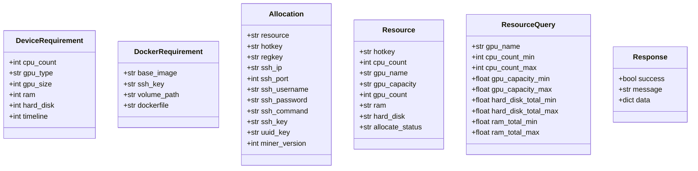
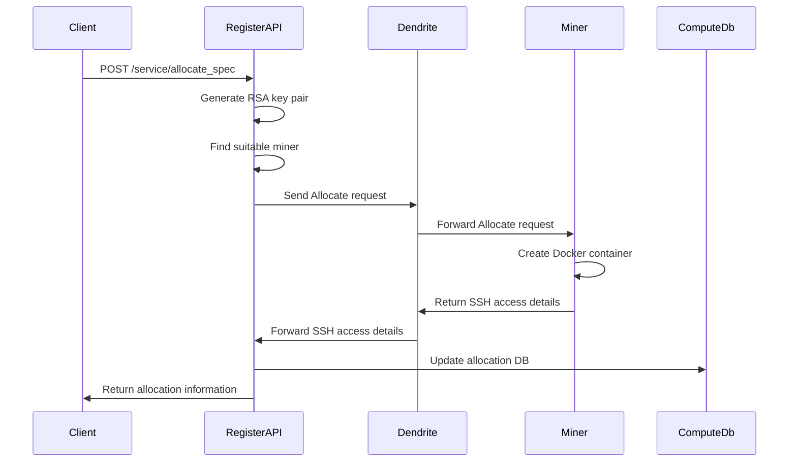
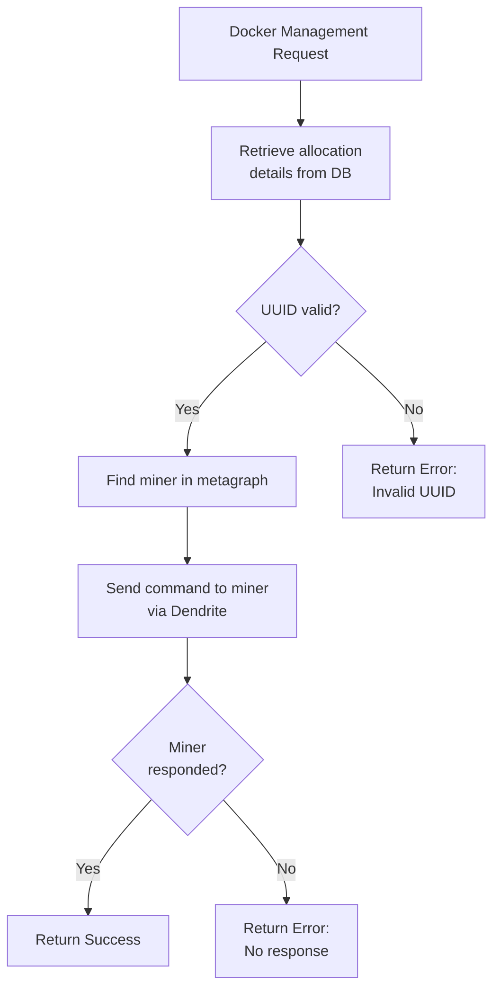
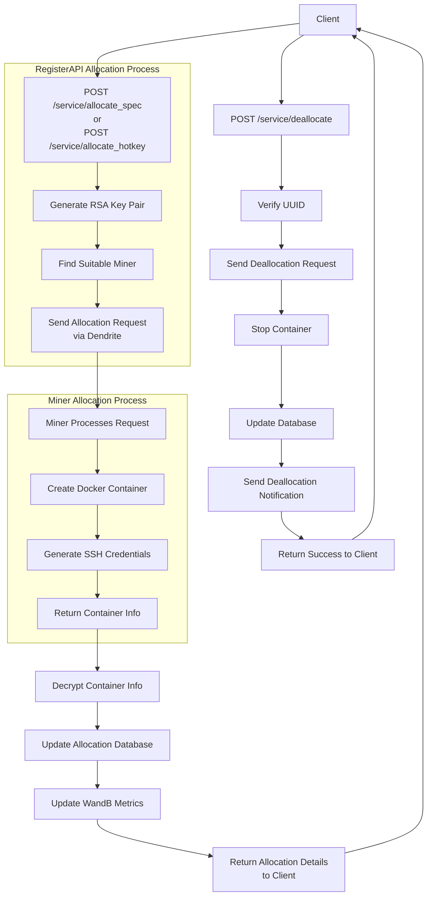
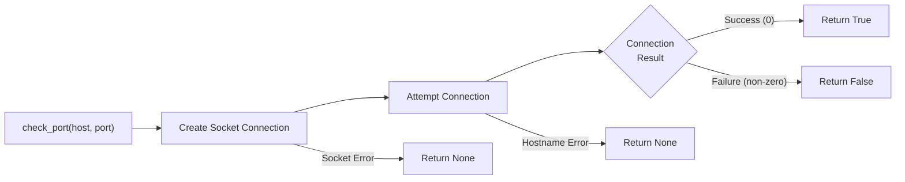

---

title: "API Endpoints"

---

import CollapsibleAside from '@components/CollapsibleAside.astro';

import SourceLink from '@components/SourceLink.astro';

<CollapsibleAside title="Relevant Source Files">

  <SourceLink text="neurons/register_api.py" href="https://github.com/neuralinternet/SN27/blob/6261c454/neurons/register_api.py" />

</CollapsibleAside>

## Overview

This document details the API endpoints available in the NI Compute (Subnet 27) RegisterAPI system. The API provides interfaces for allocating GPU resources, managing Docker containers, and retrieving information about available resources in the compute marketplace. For information about the overall resource management approach, see [Resource Management](/resource-allocation-api/resource-management#4.2).

The RegisterAPI runs as a FastAPI web service that exposes HTTP endpoints for client applications to interact with the compute subnet. It serves as the primary interface for allocating, deallocating, and checking the status of GPU resources.

Sources: <SourceLink text="neurons/register_api.py:228-342" href="https://github.com/neuralinternet/SN27/blob/6261c454/neurons/register_api.py#L228-L342" />

## API Architecture

The RegisterAPI is implemented using FastAPI and follows a RESTful design pattern. It provides endpoints for different operations categorized by functionality.

```mermaid
flowchart TD
    subgraph "RegisterAPI"
        direction TB
        API["FastAPI Service"]
        
        subgraph "Allocation Endpoints"
            AE1["POST /service/allocate_spec"]
            AE2["POST /service/allocate_hotkey"]
            AE3["POST /service/deallocate"]
        end
        
        subgraph "Management Endpoints"
            ME1["POST /service/check_miner_status"]
            ME2["POST /service/restart_docker"]
            ME3["POST /service/pause_docker"]
            ME4["POST /service/unpause_docker"]
            ME5["POST /service/exchange_docker_key"]
        end
        
        subgraph "Resource Listing Endpoints"
            RL1["POST /list/allocations_sql"]
            RL2["POST /list/resources_sql"]
            RL3["POST /list/resources_wandb"]
            RL4["POST /list/count_all_gpus"]
            RL5["POST /list/count_all_by_model"]
            RL6["POST /list/all_runs"]
        end
        
        API --> AE1 & AE2 & AE3
        API --> ME1 & ME2 & ME3 & ME4 & ME5
        API --> RL1 & RL2 & RL3 & RL4 & RL5 & RL6
    end
    
    DB[(ComputeDb)] <-- "Store/Retrieve" --> API
    WS["WebSocket\n/connect"] <-- "Status updates" --> API
    Metagraph["Bittensor\nMetagraph"] <-- "Retrieve miner info" --> API
    Dendrite["Bittensor\nDendrite"] <-- "Communicate with miners" --> API
    WandB["Weights & Biases"] <-- "Resource metrics" --> API
```

Sources: <SourceLink text="neurons/register_api.py:344-377" href="https://github.com/neuralinternet/SN27/blob/6261c454/neurons/register_api.py#L344-L377" />, <SourceLink text="neurons/register_api.py:400-406" href="https://github.com/neuralinternet/SN27/blob/6261c454/neurons/register_api.py#L400-L406" />

## Data Models

The API uses several data models to structure request and response data:

Sources: <SourceLink text="neurons/register_api.py:136-226" href="https://github.com/neuralinternet/SN27/blob/6261c454/neurons/register_api.py#L136-L226" />

## Allocation Endpoints

### Allocate by Specification

Allocates GPU resources based on hardware specifications.

**Endpoint:** `POST /service/allocate_spec`

**Request Parameters:**
- `requirements`: DeviceRequirement - Hardware specifications for the allocation
- `docker_requirement`: DockerRequirement - Docker container configuration

**Response:** 
- Success: Returns an Allocation object with SSH access details
- Error: Returns an error message if allocation fails

**Example Flow:**

Sources: <SourceLink text="neurons/register_api.py:407-547" href="https://github.com/neuralinternet/SN27/blob/6261c454/neurons/register_api.py#L407-L547" />

### Allocate by Hotkey

Allocates resources from a specific miner by its hotkey.

**Endpoint:** `POST /service/allocate_hotkey`

**Request Parameters:**
- `hotkey`: String - The miner's hotkey
- `ssh_key`: Optional[String] - SSH public key for secure access
- `docker_requirement`: Optional[DockerRequirement] - Docker container configuration

**Response:**
- Success: Returns an Allocation object with SSH access details
- Error: Returns an error message if allocation fails

Sources: <SourceLink text="neurons/register_api.py:549-695" href="https://github.com/neuralinternet/SN27/blob/6261c454/neurons/register_api.py#L549-L695" />

### Deallocate

Deallocates previously allocated GPU resources.

**Endpoint:** `POST /service/deallocate`

**Request Parameters:**
- `hotkey`: String - The miner's hotkey
- `uuid_key`: String - The UUID of the allocation
- `notify_flag`: Boolean - Whether to send a notification about deallocation

**Response:**
- Success: Confirmation of successful deallocation
- Error: Error message if deallocation fails

Sources: <SourceLink text="neurons/register_api.py:697-850" href="https://github.com/neuralinternet/SN27/blob/6261c454/neurons/register_api.py#L697-L850" />

## Management Endpoints

### Check Miner Status

Checks the status of specified miners.

**Endpoint:** `POST /service/check_miner_status`

**Request Parameters:**
- `hotkey_list`: List[String] - List of miner hotkeys to check
- `query_version`: Boolean - Whether to query miner version

**Response:**
- List of status objects for each miner, containing hotkey and status information

Sources: <SourceLink text="neurons/register_api.py:852-905" href="https://github.com/neuralinternet/SN27/blob/6261c454/neurons/register_api.py#L852-L905" />

### Docker Container Management

The following endpoints allow management of allocated Docker containers:

1. **Restart Docker:**
   - **Endpoint:** `POST /service/restart_docker`
   - **Parameters:** `hotkey`, `uuid_key`

2. **Pause Docker:**
   - **Endpoint:** `POST /service/pause_docker`
   - **Parameters:** `hotkey`, `uuid_key`

3. **Unpause Docker:**
   - **Endpoint:** `POST /service/unpause_docker`
   - **Parameters:** `hotkey`, `uuid_key`

4. **Exchange Docker SSH Key:**
   - **Endpoint:** `POST /service/exchange_docker_key`
   - **Parameters:** `hotkey`, `uuid_key`, `ssh_key`, `key_type`

All these endpoints follow a similar pattern:
1. Verify the allocation exists and the UUID matches
2. Send the appropriate command to the miner via Dendrite
3. Return success/failure response

Sources: <SourceLink text="neurons/register_api.py:907-1311" href="https://github.com/neuralinternet/SN27/blob/6261c454/neurons/register_api.py#L907-L1311" />

## Resource Listing Endpoints

### List Allocations

Lists all current resource allocations.

**Endpoint:** `POST /list/allocations_sql`

**Response:**
- List of Allocation objects describing currently allocated resources
- Error if retrieving allocations fails

Sources: <SourceLink text="neurons/register_api.py:1313-1413" href="https://github.com/neuralinternet/SN27/blob/6261c454/neurons/register_api.py#L1313-L1413" />

### List Resources

Lists available GPU resources from the SQLite database.

**Endpoint:** `POST /list/resources_sql`

**Request Parameters:**
- `query`: ResourceQuery - Optional filter criteria
- `stats`: Boolean - Return statistics instead of full list
- `page_size`: Optional[Integer] - Number of items per page
- `page_number`: Optional[Integer] - Page number to return

**Response:**
- List of Resource objects or statistics about available resources
- Error if retrieving resources fails

Sources: <SourceLink text="neurons/register_api.py:1415-1638" href="https://github.com/neuralinternet/SN27/blob/6261c454/neurons/register_api.py#L1415-L1638" />

### List Resources from W&B

Lists available GPU resources from Weights & Biases data.

**Endpoint:** `POST /list/resources_wandb`

**Request Parameters:**
- Same as `/list/resources_sql`

**Response:**
- Similar to `/list/resources_sql` but using W&B as data source

Sources: <SourceLink text="neurons/register_api.py:1822-2047" href="https://github.com/neuralinternet/SN27/blob/6261c454/neurons/register_api.py#L1822-L2047" />

### Count GPUs

Counts all available GPUs on the compute subnet.

**Endpoint:** `POST /list/count_all_gpus`

**Response:**
- Total count of GPUs available on the subnet

Sources: <SourceLink text="neurons/register_api.py:1698-1749" href="https://github.com/neuralinternet/SN27/blob/6261c454/neurons/register_api.py#L1698-L1749" />

### Count GPUs by Model

Counts GPUs of a specific model with optional filtering.

**Endpoint:** `POST /list/count_all_by_model`

**Request Parameters:**
- `model`: String - GPU model name
- `cpu_count`: Optional[Integer] - CPU count filter
- `ram_size`: Optional[Float] - RAM size filter

**Response:**
- Count of GPUs matching the specified criteria

Sources: <SourceLink text="neurons/register_api.py:1750-1819" href="https://github.com/neuralinternet/SN27/blob/6261c454/neurons/register_api.py#L1750-L1819" />

### List All Runs

Lists all running miners from Weights & Biases.

**Endpoint:** `POST /list/all_runs`

**Request Parameters:**
- `hotkey`: Optional[String] - Filter by specific hotkey
- `page_size`: Optional[Integer] - Number of items per page
- `page_number`: Optional[Integer] - Page number to return

**Response:**
- List of run information objects from W&B

Sources: <SourceLink text="neurons/register_api.py:2049-2154" href="https://github.com/neuralinternet/SN27/blob/6261c454/neurons/register_api.py#L2049-L2154" />

## Resource Allocation Flow

The following diagram illustrates the complete flow of the resource allocation process:

Sources: <SourceLink text="neurons/register_api.py:407-547" href="https://github.com/neuralinternet/SN27/blob/6261c454/neurons/register_api.py#L407-L547" />, <SourceLink text="neurons/register_api.py:549-695" href="https://github.com/neuralinternet/SN27/blob/6261c454/neurons/register_api.py#L549-L695" />, <SourceLink text="neurons/register_api.py:697-850" href="https://github.com/neuralinternet/SN27/blob/6261c454/neurons/register_api.py#L697-L850" />

## API Connection Validation

The RegisterAPI includes a utility function to check port availability and connectivity:

Sources: <SourceLink text="compute/utils/socket.py:1-18" href="https://github.com/neuralinternet/SN27/blob/6261c454/compute/utils/socket.py#L1-L18" />

## Authentication and Security

The RegisterAPI includes several security features:

1. **IP Whitelisting**: Optional middleware to restrict access to specific IP addresses
2. **UUID Validation**: All resource management endpoints require a valid UUID that matches the allocation record
3. **RSA Encryption**: Container access credentials are encrypted with RSA
4. **Miner Blacklist**: Prevents allocation to known problematic miners

When enabled, IP whitelisting restricts API access to a predefined list of IPs, with configuration available through environment variables.

Sources: <SourceLink text="neurons/register_api.py:85-97" href="https://github.com/neuralinternet/SN27/blob/6261c454/neurons/register_api.py#L85-L97" />, <SourceLink text="neurons/register_api.py:119-134" href="https://github.com/neuralinternet/SN27/blob/6261c454/neurons/register_api.py#L119-L134" />, <SourceLink text="neurons/register_api.py:321-322" href="https://github.com/neuralinternet/SN27/blob/6261c454/neurons/register_api.py#L321-L322" />

## Error Handling

The API implements custom error handling to provide clear, structured error responses:

1. **Validation Errors**: Returns details about which fields failed validation
2. **Not Found Errors**: When resources or allocations can't be found
3. **Authorization Errors**: When security checks fail
4. **General Errors**: For other unexpected failures

All error responses follow a consistent format with `success: false`, an error message, and optional details.

Sources: <SourceLink text="neurons/register_api.py:345-358" href="https://github.com/neuralinternet/SN27/blob/6261c454/neurons/register_api.py#L345-L358" />

## Background Tasks

The RegisterAPI maintains two background tasks:

1. **Metagraph Refresh**: Periodically updates the metagraph to keep miner information current
2. **Allocation Check**: Regularly checks allocated resources to ensure they're still available and properly managed

These tasks run asynchronously in the background while the API handles requests.

Sources: <SourceLink text="neurons/register_api.py:367-368" href="https://github.com/neuralinternet/SN27/blob/6261c454/neurons/register_api.py#L367-L368" />