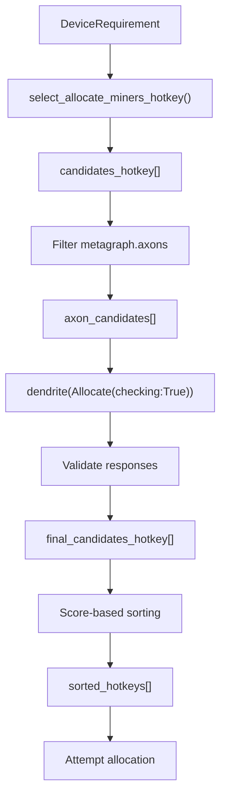
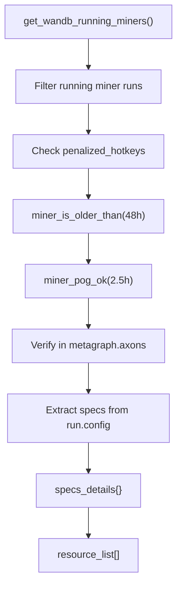
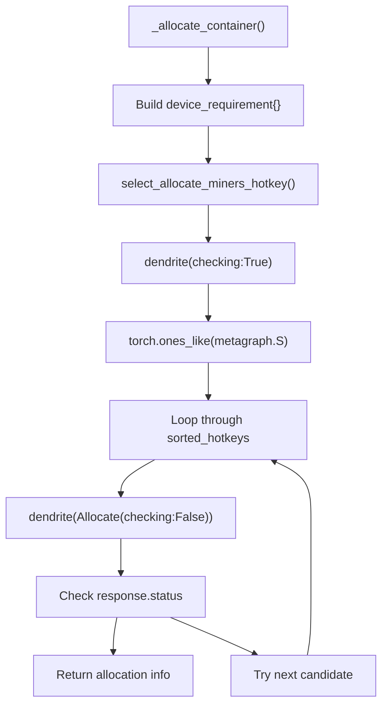
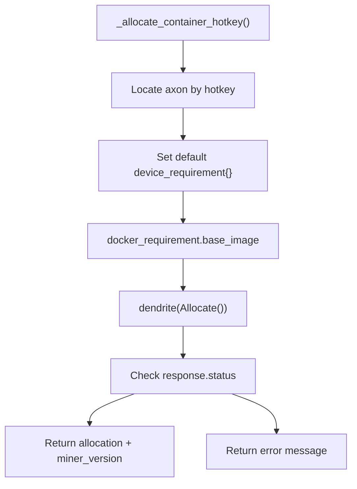
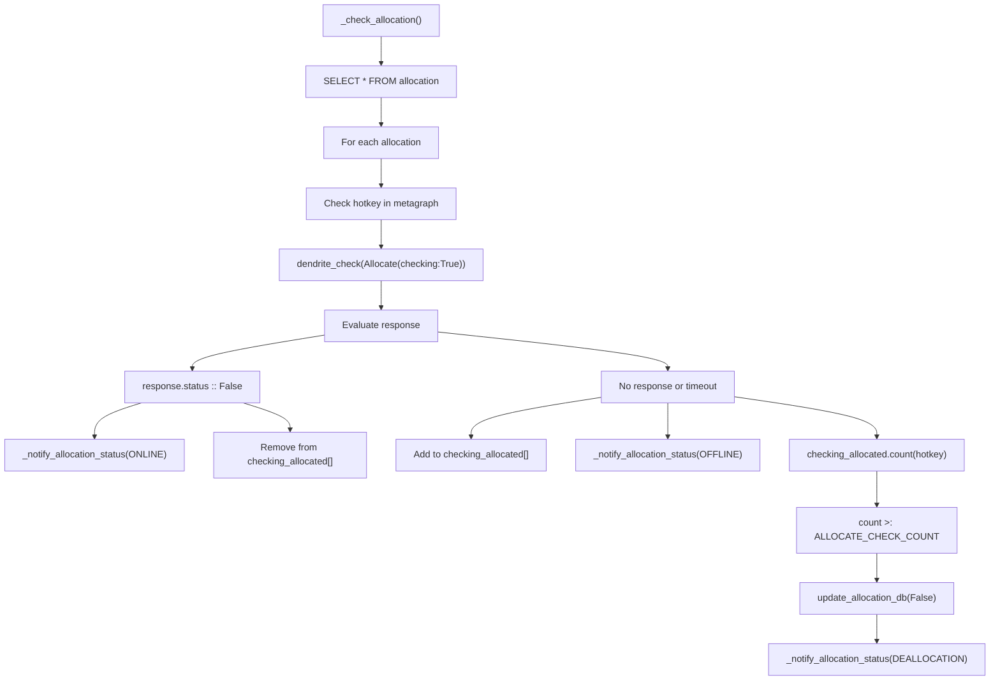
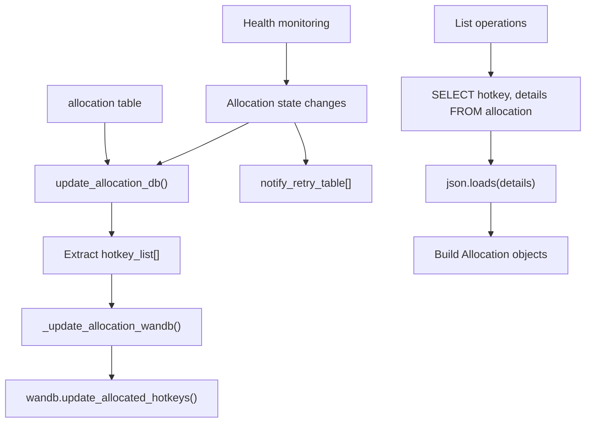
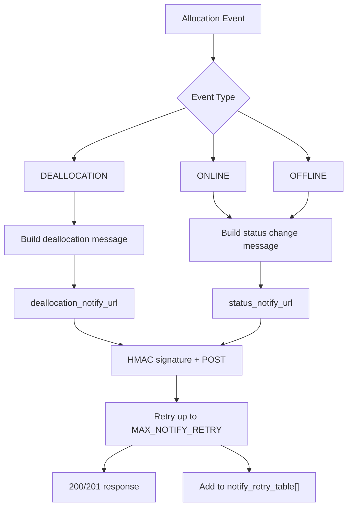
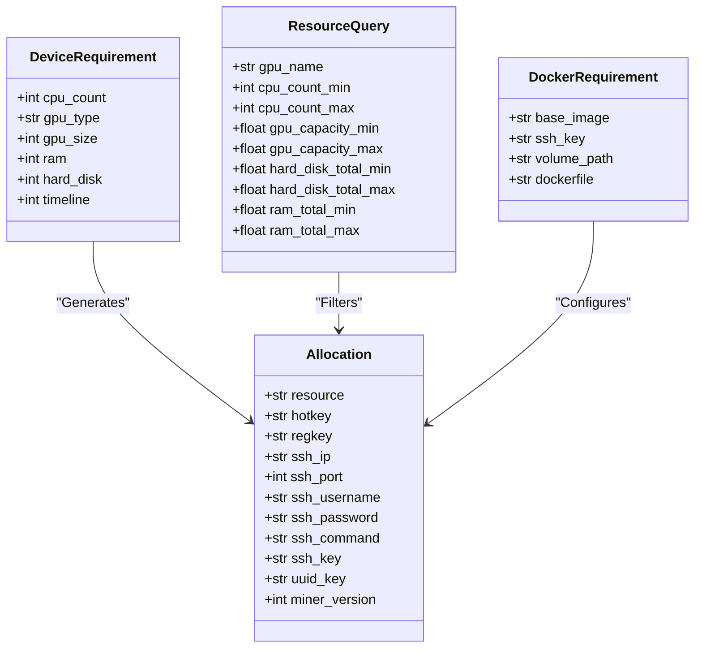

---

title: "Resource Management"

---

import CollapsibleAside from '@components/CollapsibleAside.astro';

import SourceLink from '@components/SourceLink.astro';

<CollapsibleAside title="Relevant Source Files">

  <SourceLink text="neurons/register_api.py" href="https://github.com/neuralinternet/SN27/blob/6261c454/neurons/register_api.py" />

</CollapsibleAside>

## Purpose and Scope

The Resource Management system implements the core allocation logic within the Resource Allocation API, handling resource discovery, allocation strategies, health monitoring, and state synchronization. This system operates within the `RegisterAPI` class and provides the intelligence for matching compute requirements with available miners, managing resource lifecycle, and maintaining distributed state.

For information about the API endpoints that expose these capabilities, see [API Endpoints](/resource-allocation-api/api-endpoints#4.1). For broader context about the validator system that validates miner capabilities, see [Validator System](/validator-system#2).

## Resource Discovery System

The resource discovery system identifies and evaluates candidate miners for allocation requests through a multi-stage process involving database queries, network validation, and scoring algorithms.

### Candidate Selection Process

**Candidate Discovery Flow**

Sources: <SourceLink text="neurons/register_api.py:2741-2805" href="https://github.com/neuralinternet/SN27/blob/6261c454/neurons/register_api.py#L2741-L2805" />

The system uses a two-phase approach for candidate selection:

1. **Database Filtering**: The `select_allocate_miners_hotkey()` function queries the local database to find miners matching hardware requirements
2. **Network Validation**: Available candidates are validated through the Bittensor network using `Allocate` synapse with `checking=True`
3. **Scoring and Prioritization**: Valid candidates are sorted by their network scores to prioritize higher-performing miners

### WandB-Based Resource Discovery

**WandB Resource Discovery Flow**

Sources: <SourceLink text="neurons/register_api.py:1646-1702" href="https://github.com/neuralinternet/SN27/blob/6261c454/neurons/register_api.py#L1646-L1702" />, <SourceLink text="neurons/register_api.py:1881-1884" href="https://github.com/neuralinternet/SN27/blob/6261c454/neurons/register_api.py#L1881-L1884" />

The system implements an alternative discovery mechanism using WandB for distributed miner information:

| Validation Check | Function | Purpose |
|------------------|----------|---------|
| Age Verification | `miner_is_older_than()` | Ensures miners have been active for 48+ hours |
| PoG Validation | `miner_pog_ok()` | Confirms recent Proof-of-GPU completion within 2.5 hours |
| Penalty Check | `get_penalized_hotkeys_checklist()` | Excludes blacklisted or penalized miners |
| Network Presence | `metagraph.axons` lookup | Verifies miner is active on network |

## Allocation Strategies

The system implements two primary allocation strategies: specification-based allocation and hotkey-specific allocation, each optimized for different use cases.

### Specification-Based Allocation

**Specification-Based Allocation Flow**

Sources: <SourceLink text="neurons/register_api.py:2733-2805" href="https://github.com/neuralinternet/SN27/blob/6261c454/neurons/register_api.py#L2733-L2805" />

The specification-based strategy processes `DeviceRequirement` objects containing:
- CPU count requirements
- GPU type and memory specifications  
- RAM and storage capacity needs
- Timeline duration for allocation

### Hotkey-Specific Allocation

**Hotkey-Specific Allocation Flow**

Sources: <SourceLink text="neurons/register_api.py:2807-2889" href="https://github.com/neuralinternet/SN27/blob/6261c454/neurons/register_api.py#L2807-L2889" />

This strategy targets specific miners by hotkey, bypassing the discovery phase and applying default resource requirements with configurable Docker base images.

## Health Monitoring System

The health monitoring system continuously tracks allocated resources and manages their lifecycle through automated checks and notifications.

### Allocation Health Check Process

**Health Monitoring Process Flow**

Sources: <SourceLink text="neurons/register_api.py:3002-3101" href="https://github.com/neuralinternet/SN27/blob/6261c454/neurons/register_api.py#L3002-L3101" />

The health monitoring system operates with the following parameters:

| Parameter | Value | Purpose |
|-----------|-------|---------|
| `ALLOCATE_CHECK_PERIOD` | 180 seconds | Interval between health checks |
| `ALLOCATE_CHECK_COUNT` | 20 | Maximum failed checks before deallocation |
| Health Check Timeout | 10 seconds | Maximum wait time for miner response |

### Status Transition Management

The system tracks miner status transitions and maintains allocation state through the `checking_allocated` list and database updates.

Sources: <SourceLink text="neurons/register_api.py:3039-3081" href="https://github.com/neuralinternet/SN27/blob/6261c454/neurons/register_api.py#L3039-L3081" />

## State Management

The Resource Management system maintains both local and distributed state through SQLite database operations and WandB synchronization.

### Database State Operations

**State Management Architecture**

Sources: <SourceLink text="neurons/register_api.py:2891-2919" href="https://github.com/neuralinternet/SN27/blob/6261c454/neurons/register_api.py#L2891-L2919" />, <SourceLink text="neurons/register_api.py:1346-1419" href="https://github.com/neuralinternet/SN27/blob/6261c454/neurons/register_api.py#L1346-L1419" />

### Distributed State Synchronization

The system maintains consistency across validators through WandB-based state sharing:

| State Component | Storage | Synchronization Method |
|-----------------|---------|----------------------|
| Active Allocations | SQLite `allocation` table | `_update_allocation_wandb()` |
| Allocated Hotkeys | WandB runs | `wandb.update_allocated_hotkeys()` |
| Retry Notifications | In-memory `notify_retry_table` | Periodic retry processing |

Sources: <SourceLink text="neurons/register_api.py:2915-2919" href="https://github.com/neuralinternet/SN27/blob/6261c454/neurons/register_api.py#L2915-L2919" />

## Notification System

The notification system provides external webhook integration for allocation lifecycle events and status changes.

### Notification Event Types

**Notification System Flow**

Sources: <SourceLink text="neurons/register_api.py:2940-3000" href="https://github.com/neuralinternet/SN27/blob/6261c454/neurons/register_api.py#L2940-L3000" />

### Notification Configuration

The notification system operates with these key parameters:

| Parameter | Value | Purpose |
|-----------|-------|---------|
| `MAX_NOTIFY_RETRY` | 3 | Maximum notification attempts |
| `NOTIFY_RETRY_PERIOD` | 15 seconds | Delay between retry attempts |
| Webhook Signature | HMAC-SHA256 | Request authentication |
| SSL Certificates | Required | Secure communication |

Sources: <SourceLink text="neurons/register_api.py:92-93" href="https://github.com/neuralinternet/SN27/blob/6261c454/neurons/register_api.py#L92-L93" />, <SourceLink text="neurons/register_api.py:2972-2976" href="https://github.com/neuralinternet/SN27/blob/6261c454/neurons/register_api.py#L2972-L2976" />

## Data Models and Configuration

The Resource Management system uses several key data models and configuration parameters to define resource requirements and allocation responses.

### Core Data Models

**Resource Management Data Models**

Sources: <SourceLink text="neurons/register_api.py:147-175" href="https://github.com/neuralinternet/SN27/blob/6261c454/neurons/register_api.py#L147-L175" />, <SourceLink text="neurons/register_api.py:156-167" href="https://github.com/neuralinternet/SN27/blob/6261c454/neurons/register_api.py#L156-L167" />, <SourceLink text="neurons/register_api.py:204-213" href="https://github.com/neuralinternet/SN27/blob/6261c454/neurons/register_api.py#L204-L213" />

### System Configuration Constants

The system behavior is controlled through key configuration constants:

| Constant | Value | Purpose |
|----------|-------|---------|
| `DATA_SYNC_PERIOD` | 600 seconds | Metagraph refresh interval |
| `ALLOCATE_CHECK_PERIOD` | 180 seconds | Health check frequency |
| `ALLOCATE_CHECK_COUNT` | 20 | Max timeout count before deallocation |
| `MAX_ALLOCATION_RETRY` | 3 | Maximum allocation attempt retries |
| `VALID_VALIDATOR_HOTKEYS` | Array of 19 hotkeys | Authorized validator addresses |

Sources: <SourceLink text="neurons/register_api.py:85-116" href="https://github.com/neuralinternet/SN27/blob/6261c454/neurons/register_api.py#L85-L116" />

The Resource Management system integrates these components to provide robust, scalable compute resource allocation with comprehensive monitoring and state management capabilities.