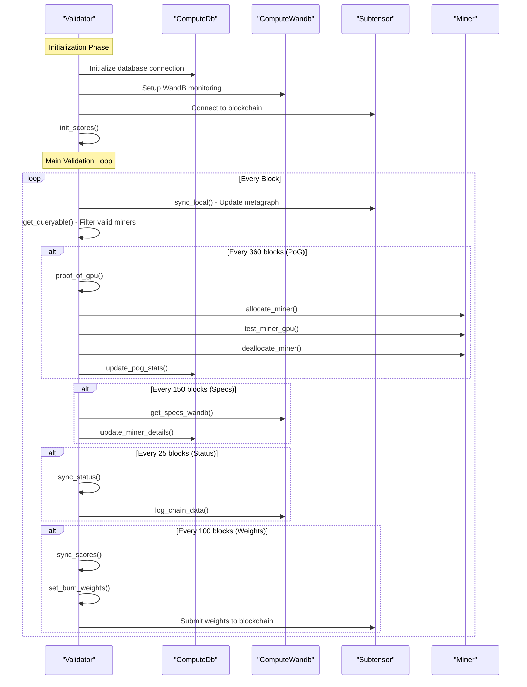
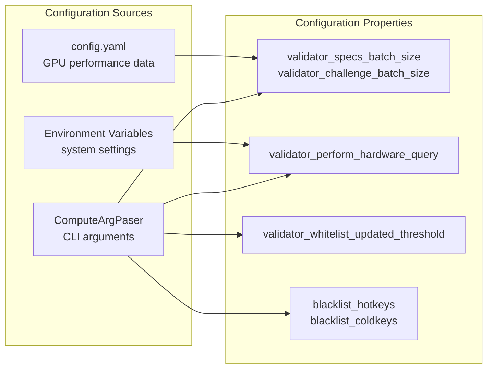
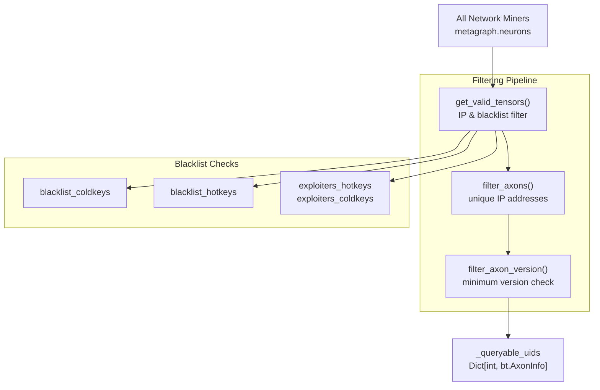
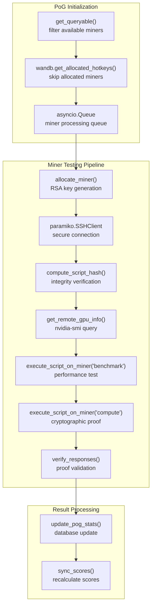
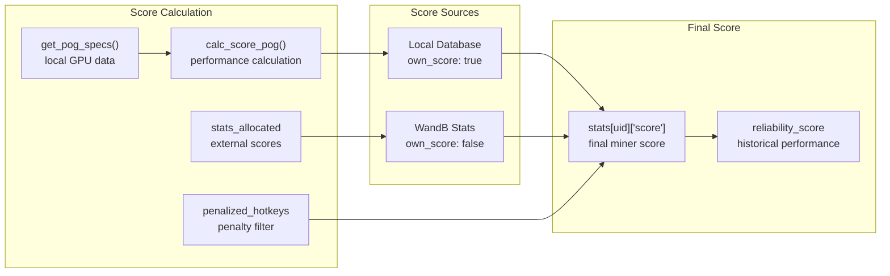
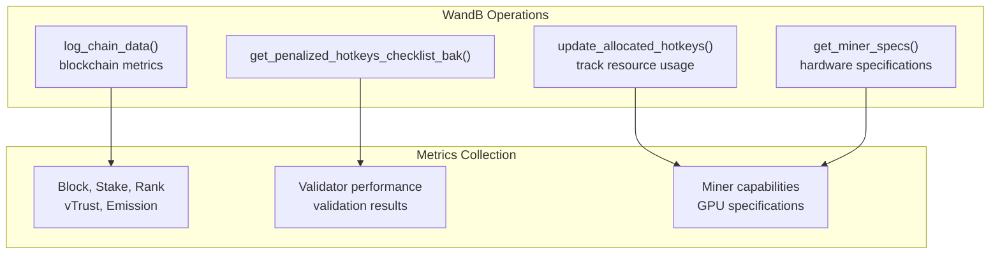
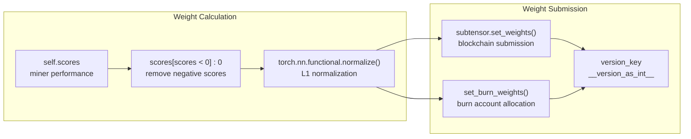

---

title: "Validator System"

---

import CollapsibleAside from '@components/CollapsibleAside.astro';

import SourceLink from '@components/SourceLink.astro';

<CollapsibleAside title="Relevant Source Files">

  <SourceLink text="neurons/validator.py" href="https://github.com/neuralinternet/SN27/blob/6261c454/neurons/validator.py" />

</CollapsibleAside>

The Validator System is the core component responsible for evaluating miner capabilities, performing proof-of-GPU validation, and setting network weights in the NI Compute Subnet. It orchestrates the entire validation process including hardware verification, performance scoring, and blockchain weight updates.

For information about the specific proof-of-GPU validation algorithms, see [Proof of GPU](/validator-system/proof-of-gpu#2.1). For details about the scoring mechanisms, see [Scoring System](/validator-system/scoring-system#2.2). For database schema and operations, see [Database Operations](/validator-system/database-operations#2.3).

## Architecture Overview

The validator system operates as a continuous validation loop that queries miners, validates their GPU capabilities, calculates performance scores, and updates network weights. The system is built around the `Validator` class which coordinates all validation activities.

### Validator System Components

```mermaid
graph TB
    subgraph "Validator Core"
        ValidatorClass["Validator Class<br/>neurons/validator.py"]
        Config["Configuration<br/>init_config()"]
        Prometheus["Prometheus Setup<br/>init_prometheus()"]
    end
    
    subgraph "Blockchain Interface"
        Subtensor["ComputeSubnetSubtensor<br/>subtensor connection"]
        Metagraph["bt.metagraph<br/>network state"]
        Wallet["bt.wallet<br/>validator identity"]
    end
    
    subgraph "Data Layer"
        ComputeDb["ComputeDb<br/>local database"]
        ComputeWandb["ComputeWandb<br/>metrics & monitoring"]
        ConfigData["config.yaml<br/>GPU performance data"]
    end
    
    subgraph "Validation Engine"
        PoGEngine["proof_of_gpu()<br/>GPU validation"]
        ScoringEngine["sync_scores()<br/>performance scoring"]
        WeightSetter["set_weights()<br/>blockchain updates"]
    end
    
    subgraph "Miner Communication"
        AllocateProtocol["Allocate Protocol<br/>resource allocation"]
        SpecsProtocol["Specs Protocol<br/>hardware queries"]
        ChallengeProtocol["Challenge Protocol<br/>PoW verification"]
    end
    
    ValidatorClass --> Config
    ValidatorClass --> Prometheus
    ValidatorClass --> Subtensor
    ValidatorClass --> Metagraph
    ValidatorClass --> Wallet
    ValidatorClass --> ComputeDb
    ValidatorClass --> ComputeWandb
    ValidatorClass --> ConfigData
    
    ValidatorClass --> PoGEngine
    ValidatorClass --> ScoringEngine
    ValidatorClass --> WeightSetter
    
    PoGEngine --> AllocateProtocol
    ValidatorClass --> SpecsProtocol
    ValidatorClass --> ChallengeProtocol
    
    ScoringEngine --> ComputeDb
    ScoringEngine --> ComputeWandb
    WeightSetter --> Subtensor
```

Sources: <SourceLink text="neurons/validator.py:70-209" href="https://github.com/neuralinternet/SN27/blob/6261c454/neurons/validator.py#L70-L209" />, <SourceLink text="neurons/validator.py:130-175" href="https://github.com/neuralinternet/SN27/blob/6261c454/neurons/validator.py#L130-L175" />

### Validation Process Flow

Sources: <SourceLink text="neurons/validator.py:1161-1273" href="https://github.com/neuralinternet/SN27/blob/6261c454/neurons/validator.py#L1161-L1273" />, <SourceLink text="neurons/validator.py:1192-1202" href="https://github.com/neuralinternet/SN27/blob/6261c454/neurons/validator.py#L1192-L1202" />, <SourceLink text="neurons/validator.py:1240-1247" href="https://github.com/neuralinternet/SN27/blob/6261c454/neurons/validator.py#L1240-L1247" />

## Core Components

### Validator Class

The `Validator` class is the main orchestrator that manages all validation activities. It maintains state for queryable miners, scores, and validation results.

| Property | Type | Description |
|----------|------|-------------|
| `scores` | `torch.Tensor` | Current performance scores for all miners |
| `stats` | `dict` | Detailed statistics for each miner |
| `_queryable_uids` | `Dict[int, bt.AxonInfo]` | Valid miners available for validation |
| `allocated_hotkeys` | `list` | Currently allocated miner hotkeys |
| `penalized_hotkeys` | `list` | Penalized miner hotkeys |

Sources: <SourceLink text="neurons/validator.py:70-91" href="https://github.com/neuralinternet/SN27/blob/6261c454/neurons/validator.py#L70-L91" />, <SourceLink text="neurons/validator.py:84-91" href="https://github.com/neuralinternet/SN27/blob/6261c454/neurons/validator.py#L84-L91" />

### Configuration Management

The validator uses multiple configuration sources to manage validation parameters:

Sources: <SourceLink text="neurons/validator.py:210-235" href="https://github.com/neuralinternet/SN27/blob/6261c454/neurons/validator.py#L210-L235" />, <SourceLink text="neurons/validator.py:132-147" href="https://github.com/neuralinternet/SN27/blob/6261c454/neurons/validator.py#L132-L147" />

### Queryable Miners Management

The validator maintains a filtered list of queryable miners based on multiple criteria:

Sources: <SourceLink text="neurons/validator.py:571-579" href="https://github.com/neuralinternet/SN27/blob/6261c454/neurons/validator.py#L571-L579" />, <SourceLink text="neurons/validator.py:487-515" href="https://github.com/neuralinternet/SN27/blob/6261c454/neurons/validator.py#L487-L515" />, <SourceLink text="neurons/validator.py:517-544" href="https://github.com/neuralinternet/SN27/blob/6261c454/neurons/validator.py#L517-L544" />

## Validation Process

### Proof-of-GPU Validation

The proof-of-GPU system allocates miners, tests their GPU capabilities, and verifies performance through cryptographic proofs:

Sources: <SourceLink text="neurons/validator.py:663-787" href="https://github.com/neuralinternet/SN27/blob/6261c454/neurons/validator.py#L663-L787" />, <SourceLink text="neurons/validator.py:799-948" href="https://github.com/neuralinternet/SN27/blob/6261c454/neurons/validator.py#L799-L948" />

### Scoring System

The scoring system calculates performance scores based on GPU specifications and reliability metrics:

Sources: <SourceLink text="neurons/validator.py:312-402" href="https://github.com/neuralinternet/SN27/blob/6261c454/neurons/validator.py#L312-L402" />, <SourceLink text="neurons/validator.py:360-386" href="https://github.com/neuralinternet/SN27/blob/6261c454/neurons/validator.py#L360-L386" />

## Database Operations

The validator uses `ComputeDb` for persistent storage of miner information, validation results, and statistics:

| Table | Purpose | Key Operations |
|-------|---------|----------------|
| `miners` | Miner registration data | `select_miners()`, `update_miners()`, `purge_miner_entries()` |
| `pog_stats` | Proof-of-GPU results | `get_pog_specs()`, `update_pog_stats()` |
| `stats` | Performance statistics | `retrieve_stats()`, `write_stats()` |
| `allocation` | Resource allocations | `update_miner_details()`, `get_miner_details()` |

Sources: <SourceLink text="neurons/validator.py:171-172" href="https://github.com/neuralinternet/SN27/blob/6261c454/neurons/validator.py#L171-L172" />, <SourceLink text="compute/utils/db.py" href="https://github.com/neuralinternet/SN27/blob/6261c454/compute/utils/db.py" />

## Monitoring and Metrics

### WandB Integration

The validator integrates with Weights & Biases for distributed state management and metrics collection:

Sources: <SourceLink text="neurons/validator.py:290-311" href="https://github.com/neuralinternet/SN27/blob/6261c454/neurons/validator.py#L290-L311" />, <SourceLink text="neurons/validator.py:594-661" href="https://github.com/neuralinternet/SN27/blob/6261c454/neurons/validator.py#L594-L661" />, <SourceLink text="neurons/validator.py:1229-1237" href="https://github.com/neuralinternet/SN27/blob/6261c454/neurons/validator.py#L1229-L1237" />

### Weight Setting

The validator periodically updates network weights based on calculated scores:

Sources: <SourceLink text="neurons/validator.py:1132-1153" href="https://github.com/neuralinternet/SN27/blob/6261c454/neurons/validator.py#L1132-L1153" />, <SourceLink text="neurons/validator.py:1101-1131" href="https://github.com/neuralinternet/SN27/blob/6261c454/neurons/validator.py#L1101-L1131" />