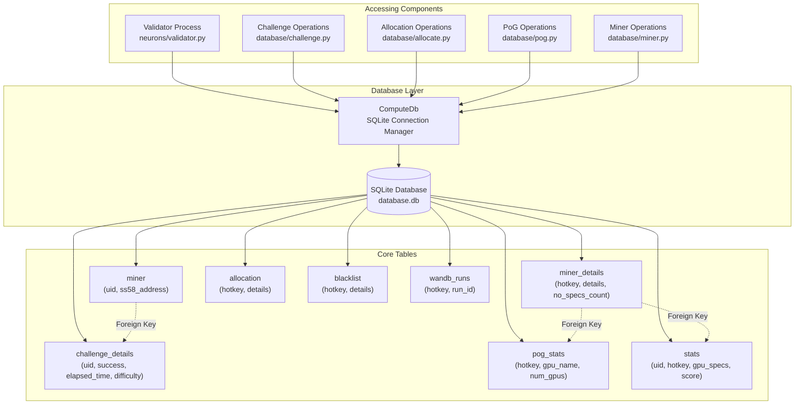
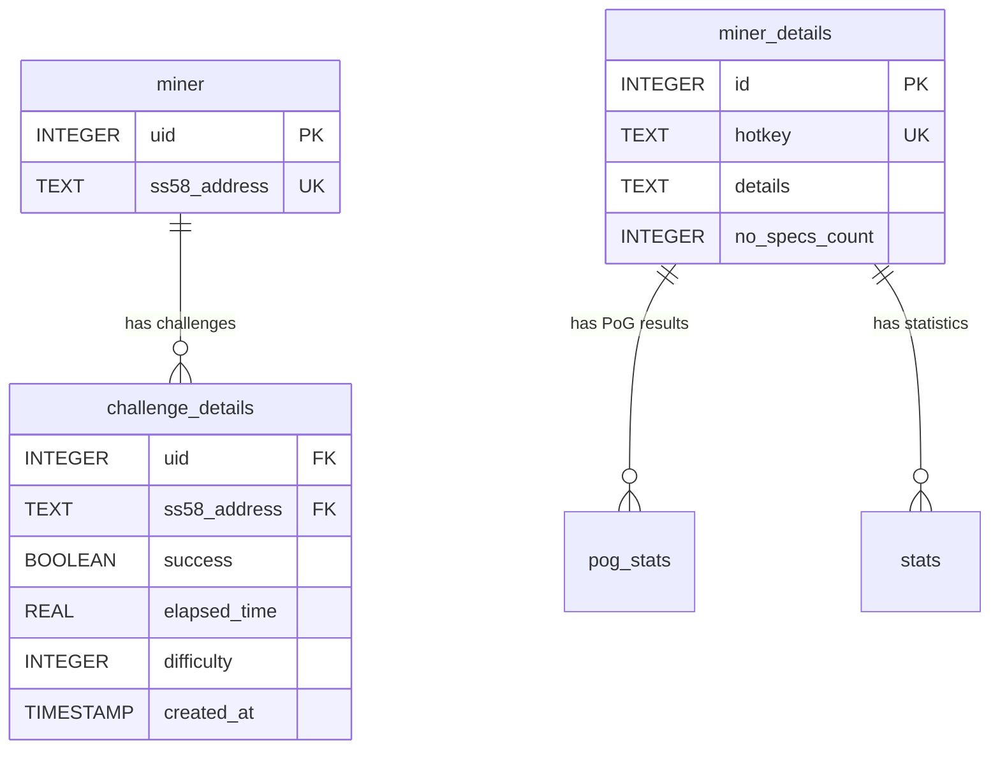
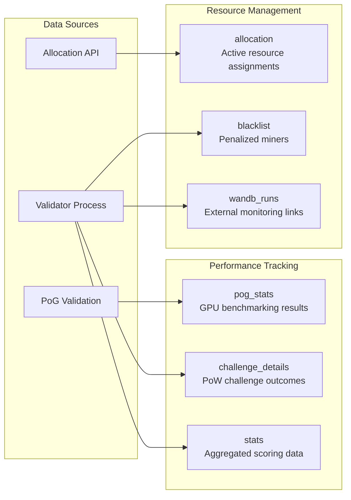
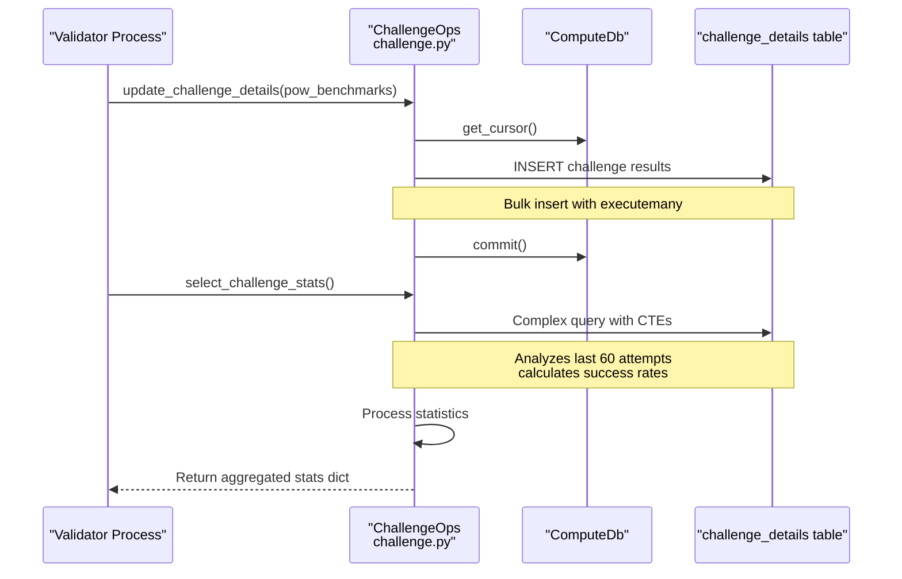
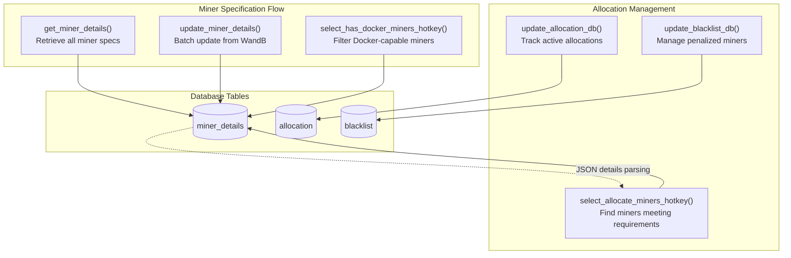
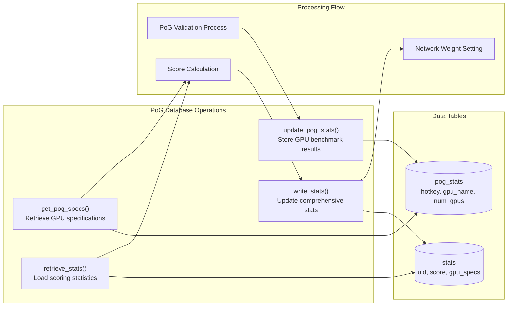
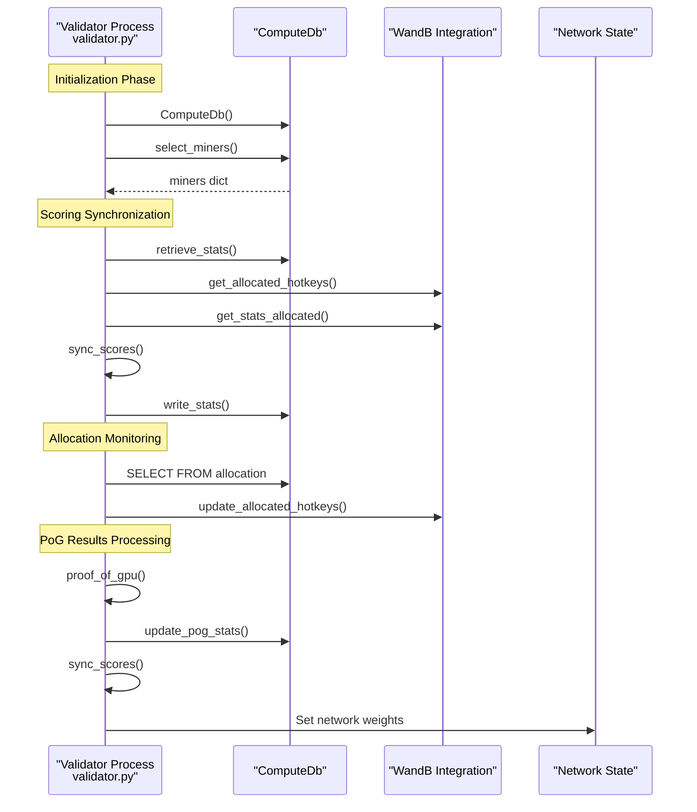

---

title: "Database Operations"

---

import CollapsibleAside from '@components/CollapsibleAside.astro';

import SourceLink from '@components/SourceLink.astro';

<CollapsibleAside title="Relevant Source Files">

  <SourceLink text="compute/utils/db.py" href="https://github.com/neuralinternet/SN27/blob/6261c454/compute/utils/db.py" />

  <SourceLink text="neurons/Validator/database/allocate.py" href="https://github.com/neuralinternet/SN27/blob/6261c454/neurons/Validator/database/allocate.py" />

  <SourceLink text="neurons/Validator/database/challenge.py" href="https://github.com/neuralinternet/SN27/blob/6261c454/neurons/Validator/database/challenge.py" />

  <SourceLink text="neurons/validator.py" href="https://github.com/neuralinternet/SN27/blob/6261c454/neurons/validator.py" />

</CollapsibleAside>

This document covers the database operations used by the NI Compute Subnet validator system to persist miner statistics, challenge results, allocation records, and proof-of-GPU data. The system uses SQLite for local data persistence with structured schemas for tracking network state and performance metrics.

For information about the scoring algorithms that use this data, see [Scoring System](/validator-system/scoring-system#2.2). For details about proof-of-GPU validation that writes to these tables, see [Proof of GPU](/validator-system/proof-of-gpu#2.1).

## Database Architecture

The compute subnet uses a centralized SQLite database managed by the `ComputeDb` class to store all validator-related data. The database serves as the primary persistence layer for validator operations, storing everything from miner registration details to performance benchmarks.

Sources: <SourceLink text="compute/utils/db.py:9-84" href="https://github.com/neuralinternet/SN27/blob/6261c454/compute/utils/db.py#L9-L84" />, <SourceLink text="neurons/validator.py:170-172" href="https://github.com/neuralinternet/SN27/blob/6261c454/neurons/validator.py#L170-L172" />

## Core Database Tables

The database schema consists of eight primary tables, each serving specific validator functions:

| Table Name | Primary Key | Purpose | Key Relationships |
|------------|-------------|---------|-------------------|
| `miner` | `uid` | Basic miner registration | Referenced by `challenge_details` |
| `miner_details` | `hotkey` | Hardware specifications and Docker status | Referenced by `pog_stats`, `stats` |
| `challenge_details` | Auto-increment | Proof-of-Work challenge results | Foreign keys to `miner` table |
| `allocation` | `hotkey` | Active resource allocations | Unique hotkey constraint |
| `pog_stats` | Auto-increment | Proof-of-GPU benchmark results | Foreign key to `miner_details` |
| `stats` | `uid` | Comprehensive miner scoring data | Foreign key to `miner_details` |
| `blacklist` | Auto-increment | Penalized miner hotkeys | Unique hotkey constraint |
| `wandb_runs` | `hotkey` | WandB run tracking | Links to external monitoring |

### Miner Registration Tables

The `miner` table stores basic network registration data, while `miner_details` contains comprehensive hardware specifications:

Sources: <SourceLink text="compute/utils/db.py:29-30" href="https://github.com/neuralinternet/SN27/blob/6261c454/compute/utils/db.py#L29-L30" />, <SourceLink text="compute/utils/db.py:30-31" href="https://github.com/neuralinternet/SN27/blob/6261c454/compute/utils/db.py#L30-L31" />, <SourceLink text="compute/utils/db.py:33-45" href="https://github.com/neuralinternet/SN27/blob/6261c454/compute/utils/db.py#L33-L45" />

### Performance and Allocation Tracking

The system maintains detailed performance metrics and resource allocation state through specialized tables:

Sources: <SourceLink text="compute/utils/db.py:53-62" href="https://github.com/neuralinternet/SN27/blob/6261c454/compute/utils/db.py#L53-L62" />, <SourceLink text="compute/utils/db.py:64-77" href="https://github.com/neuralinternet/SN27/blob/6261c454/compute/utils/db.py#L64-L77" />, <SourceLink text="compute/utils/db.py:46-47" href="https://github.com/neuralinternet/SN27/blob/6261c454/compute/utils/db.py#L46-L47" />

## Database Operations by Component

### Challenge Management Operations

The challenge system tracks proof-of-work validation results with comprehensive statistical analysis:

The `select_challenge_stats` function uses Common Table Expressions (CTEs) to analyze challenge performance over rolling windows, calculating success rates and average difficulties for the most recent 20 and 60 attempts.

Sources: <SourceLink text="neurons/Validator/database/challenge.py:24-125" href="https://github.com/neuralinternet/SN27/blob/6261c454/neurons/Validator/database/challenge.py#L24-L125" />, <SourceLink text="neurons/Validator/database/challenge.py:128-176" href="https://github.com/neuralinternet/SN27/blob/6261c454/neurons/Validator/database/challenge.py#L128-L176" />

### Miner Details and Allocation Management

Allocation operations manage hardware specifications and resource assignment state:

The `update_miner_details` function includes automatic schema migration logic to handle database structure changes while preserving existing data.

Sources: <SourceLink text="neurons/Validator/database/allocate.py:26-45" href="https://github.com/neuralinternet/SN27/blob/6261c454/neurons/Validator/database/allocate.py#L26-L45" />, <SourceLink text="neurons/Validator/database/allocate.py:93-176" href="https://github.com/neuralinternet/SN27/blob/6261c454/neurons/Validator/database/allocate.py#L93-L176" />, <SourceLink text="neurons/Validator/database/allocate.py:178-206" href="https://github.com/neuralinternet/SN27/blob/6261c454/neurons/Validator/database/allocate.py#L178-L206" />

### Proof-of-GPU Statistics Management

PoG operations maintain GPU benchmarking results and performance metrics:

Sources: <SourceLink text="neurons/Validator/database/pog.py" href="https://github.com/neuralinternet/SN27/blob/6261c454/neurons/Validator/database/pog.py" /> (referenced), <SourceLink text="neurons/validator.py:361-362" href="https://github.com/neuralinternet/SN27/blob/6261c454/neurons/validator.py#L361-L362" />, <SourceLink text="neurons/validator.py:402-403" href="https://github.com/neuralinternet/SN27/blob/6261c454/neurons/validator.py#L402-L403" />

## Data Persistence Workflow

### Validator Database Integration

The validator process integrates with the database through multiple synchronized operations:

The validator maintains a continuous cycle of data synchronization between local database state, distributed WandB state, and blockchain network state.

Sources: <SourceLink text="neurons/validator.py:170-172" href="https://github.com/neuralinternet/SN27/blob/6261c454/neurons/validator.py#L170-L172" />, <SourceLink text="neurons/validator.py:312-404" href="https://github.com/neuralinternet/SN27/blob/6261c454/neurons/validator.py#L312-L404" />, <SourceLink text="neurons/validator.py:663-787" href="https://github.com/neuralinternet/SN27/blob/6261c454/neurons/validator.py#L663-L787" />

### Database Transaction Management

All database operations use transaction-safe patterns with proper error handling:

| Operation Type | Transaction Pattern | Error Handling |
|----------------|-------------------|----------------|
| Single Inserts | `cursor.execute()` + `commit()` | `rollback()` on exception |
| Bulk Operations | `cursor.executemany()` + `commit()` | `rollback()` + logging |
| Complex Queries | Read-only, no transaction | Exception logging only |
| Schema Changes | DDL statements + `commit()` | `rollback()` + preservation |

The database connection uses `check_same_thread=False` to support multi-threaded validator operations while maintaining thread safety through proper cursor management.

Sources: <SourceLink text="compute/utils/db.py:13-17" href="https://github.com/neuralinternet/SN27/blob/6261c454/compute/utils/db.py#L13-L17" />, <SourceLink text="neurons/Validator/database/challenge.py:140-176" href="https://github.com/neuralinternet/SN27/blob/6261c454/neurons/Validator/database/challenge.py#L140-L176" />, <SourceLink text="neurons/Validator/database/allocate.py:211-229" href="https://github.com/neuralinternet/SN27/blob/6261c454/neurons/Validator/database/allocate.py#L211-L229" />