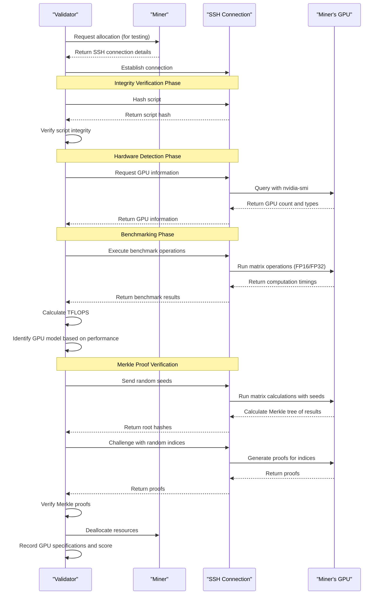
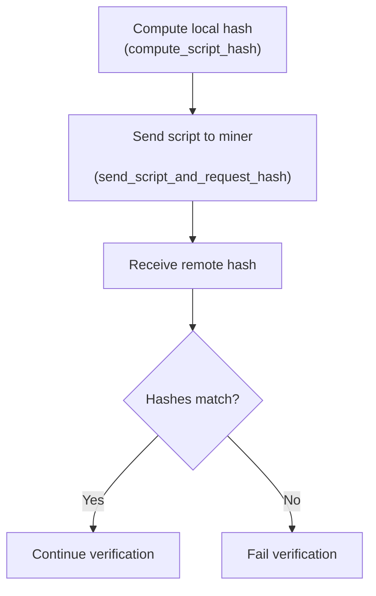
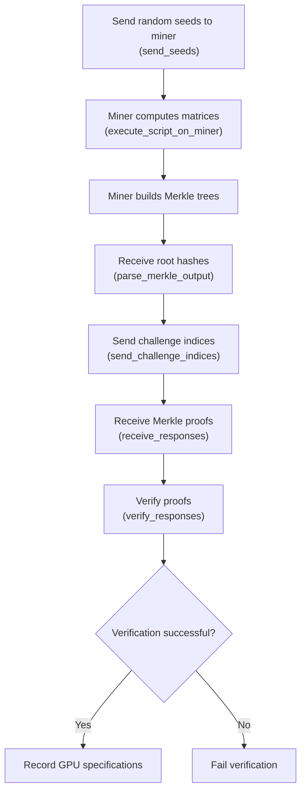
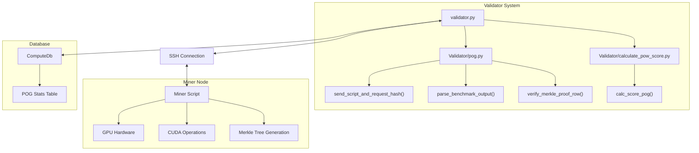
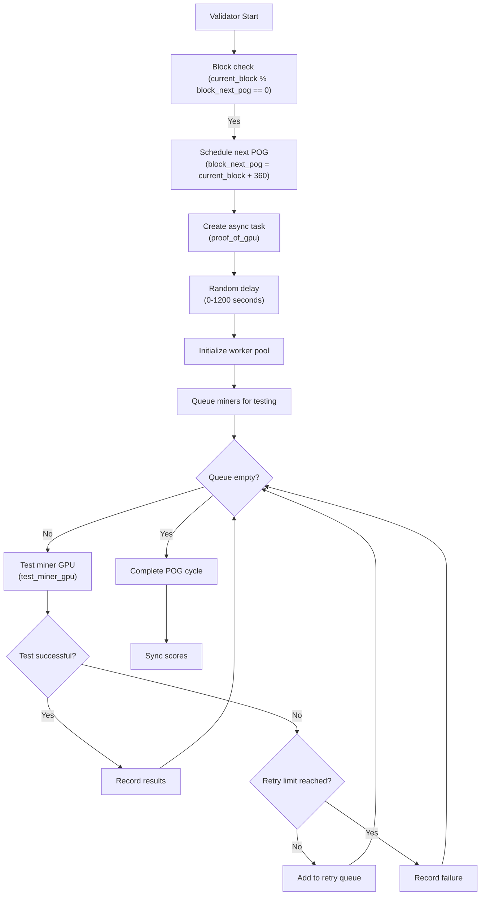

---

title: "Proof of GPU"

---

import CollapsibleAside from '@components/CollapsibleAside.astro';

import SourceLink from '@components/SourceLink.astro';

<CollapsibleAside title="Relevant Source Files">

  <SourceLink text="compute/utils/math.py" href="https://github.com/neuralinternet/SN27/blob/6261c454/compute/utils/math.py" />

  <SourceLink text="config.yaml" href="https://github.com/neuralinternet/SN27/blob/6261c454/config.yaml" />

  <SourceLink text="neurons/Miner/specs.py" href="https://github.com/neuralinternet/SN27/blob/6261c454/neurons/Miner/specs.py" />

  <SourceLink text="neurons/Validator/app_generator.py" href="https://github.com/neuralinternet/SN27/blob/6261c454/neurons/Validator/app_generator.py" />

  <SourceLink text="neurons/Validator/calculate_score.py" href="https://github.com/neuralinternet/SN27/blob/6261c454/neurons/Validator/calculate_score.py" />

  <SourceLink text="neurons/Validator/database/miner.py" href="https://github.com/neuralinternet/SN27/blob/6261c454/neurons/Validator/database/miner.py" />

  <SourceLink text="neurons/Validator/database/pog.py" href="https://github.com/neuralinternet/SN27/blob/6261c454/neurons/Validator/database/pog.py" />

  <SourceLink text="neurons/Validator/miner_script_m_merkletree.py" href="https://github.com/neuralinternet/SN27/blob/6261c454/neurons/Validator/miner_script_m_merkletree.py" />

  <SourceLink text="neurons/Validator/pog.py" href="https://github.com/neuralinternet/SN27/blob/6261c454/neurons/Validator/pog.py" />

  <SourceLink text="neurons/Validator/script.py" href="https://github.com/neuralinternet/SN27/blob/6261c454/neurons/Validator/script.py" />

  <SourceLink text="neurons/validator.py" href="https://github.com/neuralinternet/SN27/blob/6261c454/neurons/validator.py" />

</CollapsibleAside>

## Overview

Proof of GPU (PoG) is a critical verification mechanism in the NI Compute system (Subnet 27) that enables validators to verify the GPU hardware capabilities of miners in the network. This verification is essential to ensure miners possess the computational resources they claim, maintaining the integrity of the decentralized GPU marketplace.

This document details how validators implement Proof of GPU verification, the benchmarking process, and how these results affect miner scoring within the subnet.

*For information about how scores are calculated based on PoG results, see [Scoring System](/validator-system/scoring-system#2.2).*

## Core Concepts

Proof of GPU employs a series of technical tests to verify:

1. Actual existence of GPU hardware
2. Number of GPUs available on the miner
3. Type/model of GPUs (e.g., RTX 3090, A100, etc.)
4. Performance capabilities of the GPUs

The system uses a combination of direct hardware information queries, benchmarking performance tests, and cryptographic verification methods to ensure miners cannot falsify their hardware capabilities.

Sources: <SourceLink text="neurons/validator.py:638-762" href="https://github.com/neuralinternet/SN27/blob/6261c454/neurons/validator.py#L638-L762" />, <SourceLink text="neurons/Validator/pog.py" href="https://github.com/neuralinternet/SN27/blob/6261c454/neurons/Validator/pog.py" />

## Verification Process

The above diagram illustrates the complete PoG verification process between a validator and miner.

Sources: <SourceLink text="neurons/validator.py:774-923" href="https://github.com/neuralinternet/SN27/blob/6261c454/neurons/validator.py#L774-L923" />, <SourceLink text="neurons/Validator/pog.py" href="https://github.com/neuralinternet/SN27/blob/6261c454/neurons/Validator/pog.py" />

## Technical Implementation

### 1. Allocation and Connection

The validator first allocates the miner's resources temporarily for testing purposes:

1. The validator generates an RSA key pair for secure communication
2. It requests allocation from the miner with minimal resource requirements
3. If allocation succeeds, the validator receives SSH connection details
4. An SSH connection is established to the miner's container

This process ensures validators can perform tests in a controlled environment.

Sources: <SourceLink text="neurons/validator.py:924-987" href="https://github.com/neuralinternet/SN27/blob/6261c454/neurons/validator.py#L924-L987" />

### 2. Script Integrity Verification

To prevent miners from tampering with the benchmarking script:

1. The validator computes a hash of the local benchmarking script
2. The script is sent to the miner and a hash is computed remotely
3. The validator compares the local and remote hashes
4. If they don't match, the verification fails immediately

Sources: <SourceLink text="neurons/validator.py:820-827" href="https://github.com/neuralinternet/SN27/blob/6261c454/neurons/validator.py#L820-L827" />, <SourceLink text="neurons/Validator/pog.py" href="https://github.com/neuralinternet/SN27/blob/6261c454/neurons/Validator/pog.py" />

### 3. GPU Detection and Benchmarking

The validator performs direct hardware detection and benchmarking tests:

1. Query GPU information using NVIDIA tools on the miner
2. Execute matrix multiplication benchmarks in both FP16 and FP32 precision
3. Measure execution time and calculate TFLOPS (Tera Floating-Point Operations Per Second)
4. Identify GPU model based on performance metrics and reported hardware information

The benchmarking uses specially designed tests that:
- Must run on GPUs (cannot be efficiently faked with CPUs)
- Produce consistent results for specific GPU models
- Scale with the available GPU memory

Sources: <SourceLink text="neurons/validator.py:828-858" href="https://github.com/neuralinternet/SN27/blob/6261c454/neurons/validator.py#L828-L858" />, <SourceLink text="neurons/Validator/pog.py" href="https://github.com/neuralinternet/SN27/blob/6261c454/neurons/Validator/pog.py" />

### 4. Merkle Proof Verification

To cryptographically verify that the benchmarking was actually performed:

1. The validator sends random seeds to the miner
2. The miner computes large matrices using these seeds
3. The miner builds a Merkle tree from the computation results
4. The miner returns the Merkle root hashes
5. The validator requests proofs for random elements in the matrices
6. The miner provides Merkle proofs for these elements
7. The validator verifies the proofs against the root hashes

This cryptographic verification ensures the miner cannot precompute results or falsify benchmarks.

Sources: <SourceLink text="neurons/validator.py:859-908" href="https://github.com/neuralinternet/SN27/blob/6261c454/neurons/validator.py#L859-L908" />, <SourceLink text="neurons/Validator/pog.py" href="https://github.com/neuralinternet/SN27/blob/6261c454/neurons/Validator/pog.py" />

## System Architecture

The PoG system is implemented across several components in the codebase:

Sources: <SourceLink text="neurons/validator.py:638-762" href="https://github.com/neuralinternet/SN27/blob/6261c454/neurons/validator.py#L638-L762" />, <SourceLink text="neurons/Validator/pog.py" href="https://github.com/neuralinternet/SN27/blob/6261c454/neurons/Validator/pog.py" />, <SourceLink text="neurons/Validator/database/pog.py" href="https://github.com/neuralinternet/SN27/blob/6261c454/neurons/Validator/database/pog.py" />

## GPU Scoring and Identification

The system identifies GPU models based on their performance characteristics:

1. Benchmark results produce FP16 and FP32 TFLOPS measurements
2. VRAM capacity is detected and reported
3. These metrics are compared against known values for different GPU models
4. A tolerance system allows for some variation in benchmark results
5. The identified GPU type and count are stored in the database

The identification process uses a configuration file that defines performance expectations for different GPU models. The `identify_gpu` function matches the measured performance against these known profiles.

Sources: <SourceLink text="neurons/Validator/pog.py" href="https://github.com/neuralinternet/SN27/blob/6261c454/neurons/Validator/pog.py" />, <SourceLink text="neurons/Validator/calculate_pow_score.py" href="https://github.com/neuralinternet/SN27/blob/6261c454/neurons/Validator/calculate_pow_score.py" />

## Database Integration

Proof of GPU results are stored in a database for:

1. Persistent tracking of miner capabilities
2. Input into the scoring system
3. Historical analysis of network hardware

Key database functions:
- `get_pog_specs`: Retrieves stored GPU specifications for a specific miner
- `update_pog_stats`: Updates the database with new proof results
- `retrieve_stats`: Gets statistics for all miners

Sources: <SourceLink text="neurons/validator.py:343-349" href="https://github.com/neuralinternet/SN27/blob/6261c454/neurons/validator.py#L343-L349" />, <SourceLink text="neurons/Validator/database/pog.py" href="https://github.com/neuralinternet/SN27/blob/6261c454/neurons/Validator/database/pog.py" />

## Scheduling and Resource Management

The PoG system includes intelligent scheduling to avoid overwhelming the network:

1. Tests are performed periodically (approximately every ~360 blocks)
2. Random delays are added to prevent network congestion
3. Concurrent testing is limited to a configurable number of miners
4. Allocated miners are excluded from testing to avoid disrupting active services
5. Failed tests can be retried a configurable number of times

Sources: <SourceLink text="neurons/validator.py:638-762" href="https://github.com/neuralinternet/SN27/blob/6261c454/neurons/validator.py#L638-L762" />, <SourceLink text="neurons/validator.py:1169-1176" href="https://github.com/neuralinternet/SN27/blob/6261c454/neurons/validator.py#L1169-L1176" />

## Integration with Scoring System

The PoG results directly influence miner scoring:

1. Successful verification stores GPU type and count in the database
2. The scoring system retrieves this data when calculating miner scores
3. Miners with more powerful/numerous GPUs receive higher scores
4. These scores influence the weights set on the blockchain
5. Weights determine reward distribution in the subnet

If a miner fails PoG verification or has no GPUs detected, they receive a score of 0 for GPU capabilities.

Sources: <SourceLink text="neurons/validator.py:343-366" href="https://github.com/neuralinternet/SN27/blob/6261c454/neurons/validator.py#L343-L366" />, <SourceLink text="neurons/Validator/calculate_pow_score.py" href="https://github.com/neuralinternet/SN27/blob/6261c454/neurons/Validator/calculate_pow_score.py" />

## Security Considerations

The PoG system includes several security measures:

1. Script integrity verification prevents tampering with the benchmarking code
2. Random seeds prevent precomputation of results
3. Merkle proofs cryptographically verify computational results
4. Performance-based verification makes it difficult to simulate GPUs with CPUs
5. SSH connections are secured with proper authentication

These measures collectively ensure that miners cannot easily falsify their hardware capabilities.

Sources: <SourceLink text="neurons/validator.py:774-923" href="https://github.com/neuralinternet/SN27/blob/6261c454/neurons/validator.py#L774-L923" />, <SourceLink text="neurons/Validator/pog.py" href="https://github.com/neuralinternet/SN27/blob/6261c454/neurons/Validator/pog.py" />

## Table of GPU Identification Parameters

The following table illustrates examples of how different GPU models might be identified (actual values may vary):

| GPU Model | Typical FP16 TFLOPS | Typical FP32 TFLOPS | VRAM (GB) | Score Multiplier |
|-----------|---------------------|---------------------|-----------|------------------|
| RTX 3090  | 35-40               | 18-22               | 24        | High             |
| RTX 3080  | 28-33               | 14-18               | 10        | Medium-High      |
| A100      | 75-85               | 18-22               | 40/80     | Very High        |
| V100      | 55-65               | 14-18               | 16/32     | High             |
| T4        | 8-12                | 4-6                 | 16        | Medium           |
| K80       | 4-6                 | 2-3                 | 12        | Low              |

The system uses tolerance pairs to account for variations in benchmark results across different environments and configurations.

Sources: <SourceLink text="neurons/Validator/calculate_pow_score.py" href="https://github.com/neuralinternet/SN27/blob/6261c454/neurons/Validator/calculate_pow_score.py" />, <SourceLink text="neurons/validator.py:856-858" href="https://github.com/neuralinternet/SN27/blob/6261c454/neurons/validator.py#L856-L858" />

## Conclusion

Proof of GPU is a critical component of the NI Compute subnet that provides cryptographic assurance of miners' hardware capabilities. By combining hardware detection, performance benchmarking, and cryptographic verification, the system maintains the integrity of the marketplace and ensures that rewards are distributed fairly based on actual GPU resources contributed to the network.