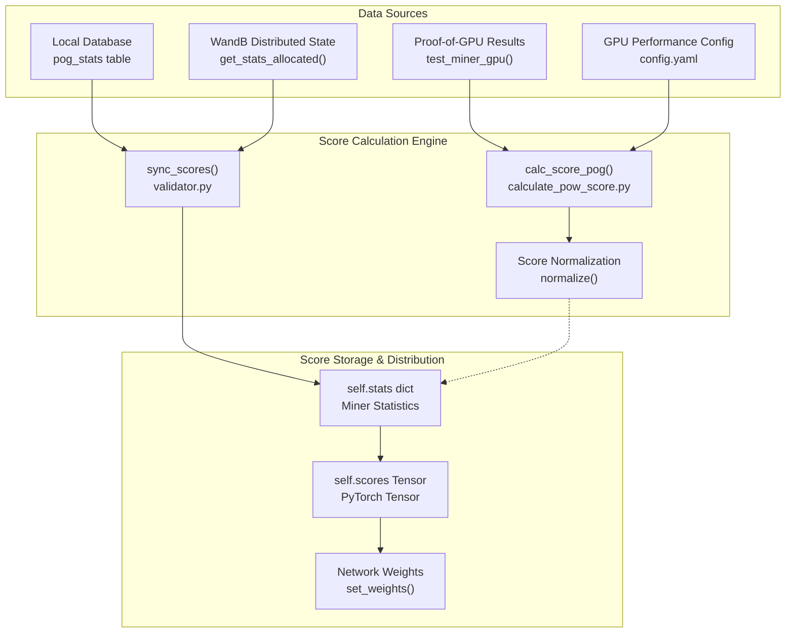
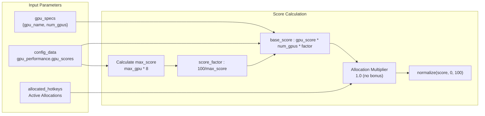
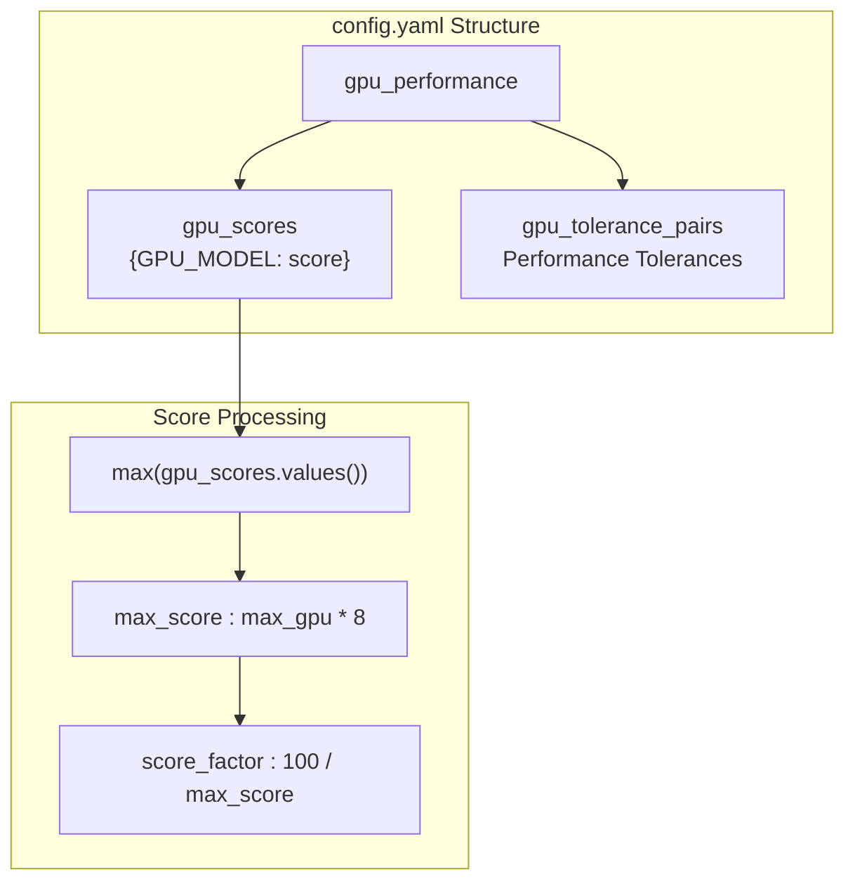
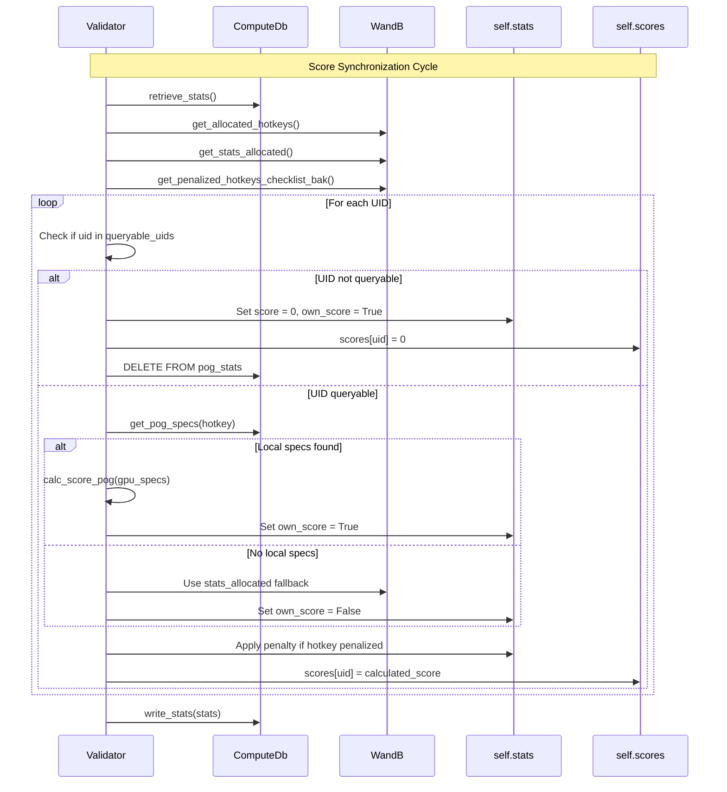
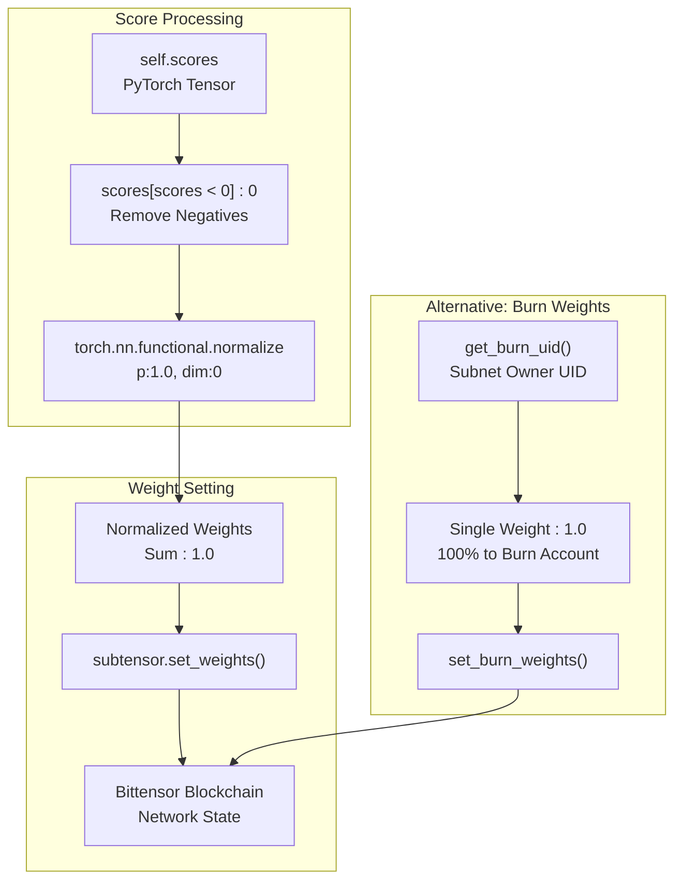
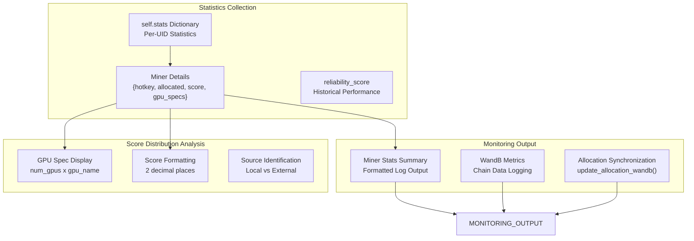

---

title: "Scoring System"

---


import CollapsibleAside from '@components/CollapsibleAside.astro';

import SourceLink from '@components/SourceLink.astro';


<CollapsibleAside title="Relevant Source Files">

  <SourceLink text="neurons/Validator/calculate_pow_score.py" href="https://github.com/neuralinternet/SN27/blob/6261c454/neurons/Validator/calculate_pow_score.py" />

  <SourceLink text="neurons/validator.py" href="https://github.com/neuralinternet/SN27/blob/6261c454/neurons/validator.py" />

</CollapsibleAside>


The scoring system evaluates miner performance based on their GPU capabilities and proof verification results. It calculates normalized scores that determine each miner's weight in the network's incentive mechanism. The system integrates Proof-of-GPU validation results with configurable GPU performance metrics to assign fair scores across the network.

For information about the Proof-of-GPU validation process that generates the data used in scoring, see [Proof of GPU](/validator-system/proof-of-gpu#2.1). For details about how scores are stored and retrieved, see [Database Operations](/validator-system/database-operations#2.3).

## Score Calculation Architecture

The scoring system operates through several interconnected components that collect GPU performance data, calculate scores, and synchronize results across the network.



**Score Calculation Flow**
The system processes GPU specifications through multiple stages to produce final network weights that determine miner rewards.

Sources: <SourceLink text="neurons/validator.py:312-442" href="https://github.com/neuralinternet/SN27/blob/6261c454/neurons/validator.py#L312-L442" />, <SourceLink text="neurons/Validator/calculate_pow_score.py:35-63" href="https://github.com/neuralinternet/SN27/blob/6261c454/neurons/Validator/calculate_pow_score.py#L35-L63" />

## GPU Performance Scoring

The core scoring mechanism evaluates miners based on their GPU hardware capabilities using predefined performance benchmarks and real-time validation results.

### Score Calculation Formula

The `calc_score_pog` function implements the primary scoring algorithm:



**GPU Score Calculation Pipeline**
The scoring formula normalizes GPU performance against the maximum possible score in the network.

| Parameter | Description | Range |
|-----------|-------------|-------|
| `gpu_name` | GPU model identifier | String key from config |
| `num_gpus` | Number of GPUs (capped) | 1-8 |
| `gpu_score` | Base performance score | From config.yaml |
| `score_factor` | Normalization factor | 100/max_possible_score |

Sources: <SourceLink text="neurons/Validator/calculate_pow_score.py:35-63" href="https://github.com/neuralinternet/SN27/blob/6261c454/neurons/Validator/calculate_pow_score.py#L35-L63" />

### GPU Performance Configuration

The system uses a configuration-driven approach to define GPU performance scores:



**Configuration-Based Scoring**
GPU performance scores are defined in configuration files and used to normalize miner capabilities.

Sources: <SourceLink text="neurons/Validator/calculate_pow_score.py:37-42" href="https://github.com/neuralinternet/SN27/blob/6261c454/neurons/Validator/calculate_pow_score.py#L37-L42" />

## Score Synchronization Process

The validator synchronizes scores across multiple data sources to maintain consistent network state and handle distributed validation scenarios.



**Score Synchronization Sequence**
The validator coordinates between local database, WandB distributed state, and in-memory score tracking.

Sources: <SourceLink text="neurons/validator.py:312-442" href="https://github.com/neuralinternet/SN27/blob/6261c454/neurons/validator.py#L312-L442" />

### Local vs External Score Sources

The system handles both local Proof-of-GPU results and external score data from other validators:

| Score Source | Priority | Indicator | Data Source |
|--------------|----------|-----------|-------------|
| Local PoG Results | High | `own_score: True` | Local `pog_stats` table |
| External Validator Data | Low | `own_score: False` | WandB `stats_allocated` |
| Penalized Miners | Override | `score: 0` | WandB penalized list |
| Non-queryable Miners | Override | `score: 0` | Filtered queryable set |

Sources: <SourceLink text="neurons/validator.py:360-382" href="https://github.com/neuralinternet/SN27/blob/6261c454/neurons/validator.py#L360-L382" />

## Weight Setting and Network Integration

The scoring system converts calculated scores into network weights that determine miner rewards in the Bittensor incentive mechanism.



**Weight Setting Architecture**
The system converts scores to blockchain weights through normalization and clamping operations.

### Weight Setting Process

The validator implements two weight setting strategies:

1. **Standard Weight Setting** (`set_weights`):
   - Clamps negative scores to zero
   - L1-normalizes scores to sum to 1.0
   - Distributes weights across all miners

2. **Burn Weight Setting** (`set_burn_weights`):
   - Assigns 100% weight to subnet owner (burn account)
   - Used as alternative to standard distribution

Sources: <SourceLink text="neurons/validator.py:1132-1154" href="https://github.com/neuralinternet/SN27/blob/6261c454/neurons/validator.py#L1132-L1154" />, <SourceLink text="neurons/validator.py:1101-1131" href="https://github.com/neuralinternet/SN27/blob/6261c454/neurons/validator.py#L1101-L1131" />

### Weight Update Schedule

Weights are updated periodically based on the `weights_rate_limit` configuration:

| Event | Block Interval | Description |
|-------|----------------|-------------|
| Weight Setting | `weights_rate_limit` | Update network weights |
| Score Sync | Every weight update | Recalculate all scores |
| Block Tracking | Continuous | Prevent duplicate operations |

The validator tracks the last update block and ensures weights are only set once per interval to comply with network rate limits.

Sources: <SourceLink text="neurons/validator.py:1240-1247" href="https://github.com/neuralinternet/SN27/blob/6261c454/neurons/validator.py#L1240-L1247" />

## Score Statistics and Monitoring

The system provides comprehensive statistics and monitoring for score calculation and distribution across the network.



**Statistics and Monitoring Pipeline**
The system provides detailed visibility into score calculation and distribution across miners.

### Statistics Structure

Each miner's statistics include comprehensive performance and allocation data:

```python
self.stats[uid] = {
    "hotkey": hotkey,
    "allocated": hotkey in allocated_hotkeys,
    "own_score": bool,  # True if local PoG, False if external
    "score": calculated_score * 100,  # Scaled to 0-100
    "gpu_specs": gpu_specifications,
    "reliability_score": historical_performance
}
```

The system outputs formatted statistics showing miner performance across the network with fixed-width columns for easy reading.

Sources: <SourceLink text="neurons/validator.py:406-442" href="https://github.com/neuralinternet/SN27/blob/6261c454/neurons/validator.py#L406-L442" />